# Universidad Peruana de Ciencias Aplicadas

# Ingeniería de Software

### Periodo: UG-2do Semestre 2026 Pregrado

### Curso: Desarrollo de Aplicaciones Open Source

### NRC: 7800

### Docente: Robles Fernández, Iván

## Informe del Trabajo Final

### Startup: Vantara

### Producto: Hatarium

### Integrantes:

| Código     | Apellidos y Nombres                |
|------------|------------------------------------|
| U20241B645 | Linares Rodríguez, Franco Orlando   |
| U20241A860 | Ayllón Pauccar, Juan David          | 
| u20241D483 | Taza Curay, Eduardo Miguel          | 
| u202416272 | Asmat Alminco, Martín              | 
| u202516291 | Meza Tataje, David                 | 

### Agosto 2026-20

---

# Registro de Versiones del Informe

| Versión | Fecha    | Autor                              | Descripción Modificada                        |
|---------|----------|------------------------------------|----------------------------------------------|
|  0.1   | 28/08/26  |      Meza Tataje David             | Creación del documento                       |

# Project Report Collaboration Insights

- Link del repositorio del informe: [https://github.com/upc-pre-202620-1asi0729-7800-vantara/vantara-report.git](https://github.com/upc-pre-202620-1asi0729-7800-vantara/vantara-report.git)
- Link del repositorio de la Landing Page: [https://github.com/upc-pre-202620-1asi0729-7800-vantara/vantara-website.git](https://github.com/upc-pre-202620-1asi0729-7800-vantara/vantara-website.git)
- Link del repositorio del BackEnd: 

A lo largo del proyecto, el equipo ha estado comprometido en la creación del informe en diferentes fases. Las tareas principales que se han abarcado
- La realización de una investigación del negocio y la problemática a resolver, recopilando información relevante de fuentes confiables que nos permitieron comprender mejor el sector y las necesidades de los usuarios.
- La redacción de los capítulos del informe, incluyendo la descripción de la startup, el perfil de la solución, los segmentos objetivo, los competidores, las entrevistas, el needfinding, la especificación de requerimientos y el diseño del producto.

# Contenido

## Tabla de contenidos

* [Capítulo I: Introducción](#capítulo-i-introducción)
    * [1.1. Startup Profile](#11-startup-profile)
        * [1.1.1. Descripción de la Startup](#111-descripción-de-la-startup)
        * [1.1.2. Perfiles de integrantes del equipo](#112-perfiles-de-integrantes-del-equipo)
    * [1.2. Solution Profile](#12-solution-profile)
        * [1.2.1. Antecedentes y problemática](#121-antecedentes-y-problemática)
        * [1.2.2. Lean UX Process](#122-lean-ux-process)
            * [1.2.2.1. Lean UX Problem Statements](#1221-lean-ux-problem-statements)
            * [1.2.2.2. Lean UX Assumptions](#1222-lean-ux-assumptions)
            * [1.2.2.3. Lean UX Hypothesis Statements](#1223-lean-ux-hypothesis-statements)
            * [1.2.2.4. Lean UX Canvas](#1224-lean-ux-canvas)
    * [1.3. Segmentos objetivo](#13-segmentos-objetivo)
* [Capítulo II: Requirements Elicitation & Analysis](#capítulo-ii-requirements-elicitation--analysis)
    * [2.1. Competidores](#21-competidores)
        * [2.1.1. Análisis competitivo](#211-análisis-competitivo)
        * [2.1.2. Estrategias y tácticas frente a competidores](#212-estrategias-y-tácticas-frente-a-competidores)
    * [2.2. Entrevistas](#22-entrevistas)
        * [2.2.1. Diseño de entrevistas](#221-diseño-de-entrevistas)
        * [2.2.2. Registro de entrevistas](#222-registro-de-entrevistas)
        * [2.2.3. Análisis de entrevistas](#223-análisis-de-entrevistas)
    * [2.3. Needfinding](#23-needfinding)
        * [2.3.1. User Personas](#231-user-personas)
        * [2.3.2. User Task Matrix](#232-user-task-matrix)
        * [2.3.3. User Journey Mapping](#233-user-journey-mapping)
        * [2.3.4. Empathy Mapping](#234-empathy-mapping)
    * [2.4. Big Picture Event Storming](#24-big-picture-event-storming)
    * [2.5. Ubiquitous Language](#25-ubiquitous-language)
* [Capítulo III: Requirements Specification](#capítulo-iii-requirements-specification)
    * [3.1. User Stories](#31-user-stories)
    * [3.2. Impact Mapping](#32-impact-mapping)
    * [3.3. Product Backlog](#33-product-backlog)
* [Capítulo IV: Product Design](#capítulo-iv-product-design)
    * [4.1. Style Guidelines](#41-style-guidelines)
        * [4.1.1. General Style Guidelines](#411-general-style-guidelines)
        * [4.1.2. Web Style Guidelines](#412-web-style-guidelines)
    * [4.2. Information Architecture](#42-information-architecture)
        * [4.2.1. Organization Systems](#421-organization-systems)
        * [4.2.2. Labeling Systems](#422-labeling-systems)
        * [4.2.3. SEO Tags and Meta Tags](#423-seo-tags-and-meta-tags)
        * [4.2.4. Searching Systems](#424-searching-systems)
        * [4.2.5. Navigation Systems](#425-navigation-systems)
    * [4.3. Landing Page UI Design](#43-landing-page-ui-design)
        * [4.3.1. Landing Page Wireframe](#431-landing-page-wireframe)
        * [4.3.2. Landing Page Mock-up](#432-landing-page-mock-up)
    * [4.4. Web Applications UX/UI Design](#44-web-applications-uxui-design)
        * [4.4.1. Web Applications Wireframes](#441-web-applications-wireframes)
        * [4.4.2. Web Applications Wireflow Diagrams](#442-web-applications-wireflow-diagrams)
        * [4.4.3. Web Applications Mock-ups](#443-web-applications-mock-ups)
        * [4.4.4. Web Applications User Flow Diagrams](#444-web-applications-user-flow-diagrams)
    * [4.5. Web Applications Prototyping](#45-web-applications-prototyping)
    * [4.6. Domain-Driven Software Architecture](#46-domain-driven-software-architecture)
        * [4.6.1. Design-Level Event Storming](#461-design-level-event-storming)
        * [4.6.2. Software Architecture Context Diagram](#462-software-architecture-context-diagram)
        * [4.6.3. Software Architecture Container Diagrams](#463-software-architecture-container-diagrams)
        * [4.6.4. Software Architecture Components Diagrams](#464-software-architecture-components-diagrams)
    * [4.7. Software Object-Oriented Design](#47-software-object-oriented-design)
        * [4.7.1. Class Diagrams](#471-class-diagrams)
    * [4.8. Database Design](#48-database-design)
        * [4.8.1. Database Diagrams](#481-database-diagrams)
* [Capítulo V: Product Implementation, Validation & Deployment](#capítulo-v-product-implementation-validation--deployment)
    * [5.1. Software Configuration Management](#51-software-configuration-management)
        * [5.1.1. Software Development Environment Configuration](#511-software-development-environment-configuration)
        * [5.1.2. Source Code Management](#512-source-code-management)
        * [5.1.3. Source Code Style Guide & Conventions](#513-source-code-style-guide--conventions)
        * [5.1.4. Software Deployment Configuration](#514-software-deployment-configuration)
    * [5.2. Landing Page, Services & Applications Implementation](#52-landing-page-services--applications-implementation)
        * [5.2.1. Sprint 1](#521-sprint-1)
            * [5.2.1.1. Sprint Planning 1](#5211-sprint-planning-1)
            * [5.2.1.2. Aspect Leaders and Collaborators](#5212-aspect-leaders-and-collaborators)
            * [5.2.1.3. Sprint Backlog 1](#5213-sprint-backlog-1)
            * [5.2.1.4. Development Evidence for Sprint Review](#5214-development-evidence-for-sprint-review)
            * [5.2.1.5. Execution Evidence for Sprint Review](#5215-execution-evidence-for-sprint-review)
            * [5.2.1.6. Services Documentation Evidence for Sprint Review](#5216-services-documentation-evidence-for-sprint-review)
            * [5.2.1.7. Software Deployment Evidence for Sprint Review](#5217-software-deployment-evidence-for-sprint-review)
            * [5.2.1.8. Team Collaboration Insights during Sprint](#5218-team-collaboration-insights-during-sprint)
    * [5.3. Validation Interviews](#53-validation-interviews)
        * [5.3.1. Diseño de Entrevistas](#531-diseño-de-entrevistas)
        * [5.3.2. Registro de Entrevistas](#532-registro-de-entrevistas)
        * [5.3.3. Evaluaciones según heurísticas](#533-evaluaciones-según-heurísticas)
    * [5.4. Video About-the-Product](#54-video-about-the-product)

# Student Outcome
**Criterio:** La capacidad de adquirir y aplicar nuevos conocimientos según sea
necesario, utilizando estrategias de aprendizaje apropiadas.

En el siguiente cuadro se describe las acciones realizadas y enunciados de conclusiones
por parte del grupo, que permiten sustentar el haber alcanzado el logro del ABET �?"
EAC - Student Outcome 7.

## ABET �?" EAC �?" Student Outcome 7

**Criterio:** *La capacidad de adquirir y aplicar nuevos conocimientos según sea necesario, utilizando estrategias de aprendizaje apropiadas.*

En el siguiente cuadro se describe las acciones realizadas y enunciados de conclusiones por parte del grupo, que permiten sustentar el haber alcanzado el logro del ABET �?" EAC �?" Student Outcome 7.

| **Criterio específico** | **Acciones realizadas** | **Conclusiones** |
| :--- | :--- | :--- |
| **Actualiza conceptos y conocimientos necesarios para su desarrollo profesional y en especial para su proyecto en soluciones de software.** | **Meza Tataje, David** - **AV1:** Investigué los patrones tácticos de Domain-Driven Design (DDD) y la diagramación UML para la especificación del dominio ganadero. Adquirí conocimientos en gestión ágil y control de versiones bajo Git Flow con Conventional Commits. Estudié la maquetación responsiva HTML5/CSS3 y la lógica de navegación dinámica en JavaScript para la construcción del Header y Navbar de la Landing Page de Hatarium.  **Linares Rodríguez, Franco Orlando** - **AV1:** Investigué técnicas de investigación cualitativa (5W's y 2H's) para estructurar el análisis de antecedentes y la problemática del sector ganadero en el Capítulo I. Adquirí conocimientos en maquetación web responsiva para el desarrollo de las secciones Hero Banner y About Us de la Landing Page de Hatarium. Estudié la metodología BDD para la especificación de pruebas de aceptación en formato Gherkin.  **Ayllón Pauccar, Juan David** - **AV1:** Adquirí conocimientos en prototipado de alta fidelidad y sistemas de diseño utilizando Figma. Investigué técnicas de maquetación CSS Grid y Flexbox para implementar la sección de Producto y Módulos de Servicios (Ganaderos y Veterinarios) en la Landing Page. Estudié metodologías de análisis de dominio (Needfinding, User Personas, Empathy Maps) para el Capítulo II.  **Taza Curay, Eduardo Miguel** - **AV1:** Investigué sobre la metodología Event Storming (Domain Events, Commands, Actors) e Impact Mapping para estructurar el alcance funcional del proyecto en el Capítulo III. Adquirí conocimientos en desarrollo web para implementar la sección de Contacto y la configuración bilingüe en `index-en.html`. Estudié técnicas de validación de formularios web.  **Asmat Alminco, Martín** - **AV1:** Investigué sobre el Modelo C4 (Nivel de Contexto) para la especificación de la arquitectura de software en el Capítulo IV. Adquirí conocimientos en prácticas DevOps para la configuración del repositorio central en GitHub bajo Git Flow. Estudié las estrategias de despliegue continuo en GitHub Pages y maqueté la sección de Equipo, Video y Footer responsivo. | **AV1:** El equipo Vantara incorporó un conjunto amplio y diverso de metodologías y herramientas para el desarrollo de la solución SaaS Hatarium, abarcando desde el análisis del dominio del problema (Lean UX, 5W's y 2H's, Needfinding, Event Storming) hasta el diseño arquitectónico de la solución (DDD estratégico y táctico, Modelo C4) y la maquetación web (HTML5, CSS3, JS, Git Flow, GitHub Pages). Cada integrante identificó proactivamente las brechas en su conocimiento y tomó acciones concretas para cubrirlas mediante el estudio de documentación técnica, bibliografía especializada y recursos en línea. |
| **Reconoce la necesidad del aprendizaje permanente para el desempeño profesional y el desarrollo de proyectos en soluciones de software.** | **Meza Tataje, David** - **AV1:** Reconocí que el liderazgo técnico y el modelado táctico bajo DDD exigen una actualización continua para garantizar arquitecturas escalables y mantenibles en proyectos SaaS. Identifiqué que los estándares de diseño y maquetación web evolucionan rápidamente, lo que me motivó a profundizar en guías de estilos CSS y buenas prácticas de desarrollo frontend.  **Linares Rodríguez, Franco Orlando** - **AV1:** Comprendí que la definición de propuestas de valor y la estructuración de criterios de aceptación Gherkin requieren un aprendizaje constante para traducir necesidades de negocio en especificaciones técnicas claras. Reconocí que el desarrollo frontend responsivo exige mantenerse al día en estándares de maquetación e inspección web.  **Ayllón Pauccar, Juan David** - **AV1:** Identifiqué que el diseño de interfaces (UI/UX) para usuarios del sector agropecuario requiere comprender profundamente sus necesidades mediante el estudio constante de metodologías de investigación cualitativa. Valoré la importancia de actualizarme en herramientas de prototipado como Figma para acelerar la validación visual antes del desarrollo.  **Taza Curay, Eduardo Miguel** - **AV1:** Reconocí que el modelado del dominio mediante Event Storming y la especificación de requerimientos requieren formación permanente para evitar ambigüedades en la arquitectura del software. Comprendí que la implementación de formularios web con validación en tiempo real demanda la adopción constante de buenas prácticas de usabilidad.  **Asmat Alminco, Martín** - **AV1:** Acepté que las prácticas de integración y despliegue continuo (DevOps) evolucionan rápidamente, exigiendo un estudio ininterrumpido para mantener productos de software listos para producción. Reconocí que el diseño de arquitecturas con el Modelo C4 es un pilar profesional que debo seguir fortaleciendo a lo largo de mi carrera. | **AV1:** El equipo Vantara reconoce de manera colectiva que la construcción de una solución SaaS de calidad como Hatarium exige una actitud de aprendizaje permanente y proactivo. A lo largo de esta entrega, cada integrante identificó de forma autónoma las áreas de conocimiento que debía fortalecer �?"desde el análisis de usuarios e investigación de dominio hasta la especificación de arquitectura y despliegue cloud�?", demostrando capacidad de adaptación continua frente a los estándares de la industria del software. |

# Capítulo I: Introducción

## 1.1. Startup Profile
En este capítulo se presenta la información general de Vantara como startup, incluyendo su descripción, misión, visión y los perfiles de los integrantes del equipo. Asimismo, se expone el perfil de la solución propuesta, que abarca el análisis de antecedentes y la problemática identificada, el proceso Lean UX aplicado, y la definición de los segmentos objetivo.
### 1.1.1. Descripción de Startup
Vantara es una startup peruana de tecnología agropecuaria fundada por un equipo de estudiantes de
Ingeniería de Software de la Universidad Peruana de Ciencias Aplicadas(UPC). Nace como respuesta a una
problemática real y urgente en el sector ganadero peruano: la ausencia de herramientas digitales accesibles que
permitan a los productores, tanto independientes como empresariales, gestionar su ganado de manera
eficiente, trazable y sostenible.

| Misión                                                                                                                                                                                                                                                                                                                                                                                       | Visión                                                                                                                                                      |
|----------------------------------------------------------------------------------------------------------------------------------------------------------------------------------------------------------------------------------------------------------------------------------------------------------------------------------------------------------------------------------------------|-------------------------------------------------------------------------------------------------------------------------------------------------------------|
| Empoderar a los ganaderos peruanos con una plataforma tecnológica accesible que simplifique la gestión de su ganado, mejore su productividad y promueva una ganadería sostenible y responsable. | Ser la plataforma de gestión ganadera líder en Latinoamérica, impulsando la transformación digital del sector agropecuario con tecnología innovadora al servicio del bienestar animal y el desarrollo rural. |

### 1.1.2. Perfiles de integrantes del equipo
|                                                                                     |Integrantes del equipo|Código de estudiante| Carrera | Conocimientos/Habilidades                                                                                                                                                                                                                                                      |
|-------------------------------------------------------------------------------------| --- | --- | --- |--------------------------------------------------------------------------------------------------------------------------------------------------------------------------------------------------------------------------------------------------------------------------------|
|  | Franco Orlando Linares Rodríguez | U20241B645 | Ingeniería de Software |Soy Franco Linares, estudiante de Ingeniería de Software en el 5 ciclo. Desde el primer momento que elegí mi carrera sabía que había tomado una buena decisión. En los últimos 3 años he aprendido lo apasionado que soy con la programación, específicamente con el lenguaje programación C++ donde he desarrollado mis habilidades durante la carrera. También cuento con conocimientos en básicos en HTML5, CCS3 y JavaScript, además de conocimientos en lenguajes de consulta de bases de datos como SQL. Me considero respetuoso, solidario, trabajador y bueno trabajando en equipo.|
|  | Juan David Ayllón Pauccar | U20241A860 | Ingeniería de Software | Estudiante de 6to ciclo de Ingeniería de Software en la UPC. Cuento con conocimientos técnicos avanzados en desarrollo con C++, SQL, Python Intermedio, HTML, CSS. Me distingo por ser un integrante responsable y con gran capacidad de comunicación, facilitando la coordinación y el flujo de trabajo dentro del equipo. |
|  | Taza Curay, Eduardo Miguel| U20241D483 | Ingeniería de Software |  Soy Eduardo Taza Curay estudiante de Ingeniería de Software, tengo 19 años, los lenguajes que tengo conocimiento son c++, phyton, HTML, CSS, JavaScript y SQL. Me considero una persona colaboradora, empática, responsable y justa. En busca de aprender siempre más y a trabajar en equipo para lograr los objetivos del proyecto. |
|  | Asmat Alminco, Martín Alejandro | U202416272 | Ingeniería de Software | Soy estudiante de sexto ciclo de la carrera de Ingeniería de Software. Cuento con experiencia en lenguajes de programación como Python y C++ para proyectos enfocados en el desarrollo de habilidades computacionales, las cuales apliqué en proyectos académicos enfocados en solucionar un problema a través de procesos de documentación de Ingeniería de software.Dentro del equipo, cumplo el rol de un full stack al realizar actividades de documentación y programación a un nivel medio. Considero que soy una persona responsable y adaptable a distintas situaciones con buen time-management.                                                                                          |
|  | Meza Tataje, David | U202516291 | Ingeniería de Software | Soy David Meza estudiante de Ingeniería de Software, tengo 21 años, con conocimientos en C++, Java y C# a nivel intermedio, además de experiencia básica en el desarrollo de aplicaciones web con HTML, CSS, JavaScript y SQL. Me considero una persona colaboradora y responsable, siempre dispuesto a aprender y a trabajar en equipo para lograr los objetivos del proyecto.                                                                                                                                                                                                                                                                               |

## 1.2. Solution Profile
### 1.2. Solution Profile

#### 1.2.1. Antecedentes y problemática

El sector ganadero peruano representa una actividad económica importante para miles de familias rurales. Según EY Perú (2024), el sector agrario aportó el 3,6 % del PBI nacional en 2023 y empleó aproximadamente al 24 % de la Población Económicamente Activa. Sin embargo, muchos productores ganaderos aún gestionan información mediante registros manuales o herramientas poco centralizadas, dificultando el control de datos relacionados con salud, reproducción, vacunación y producción animal. Esta situación se relaciona con las brechas de digitalización existentes en las zonas rurales de América Latina, señaladas por la CEPAL y FAO (2021).

Ante esta problemática, diferentes investigaciones han demostrado la utilidad de las aplicaciones web en la gestión ganadera y veterinaria. Amado Dávila (2021) desarrolló un sistema web para gestionar procesos como registro de animales, preñez, partos, enfermedades y vacunaciones, facilitando el acceso a la información y la toma de decisiones. Asimismo, Ruiz Villanueva y Escobar Saldaña (2024) evidenciaron mejoras en el registro y consulta de información mediante un sistema web para la gestión veterinaria. De manera similar, Machado et al. (2010) demostraron que las plataformas web pueden apoyar el análisis y la toma de decisiones en sistemas de producción ganadera.

Finalmente, el crecimiento de la conectividad rural favorece la implementación de este tipo de soluciones. Según OSIPTEL (2024), el acceso a internet en hogares rurales del Perú aumentó de 41,5 % en 2019 a cerca del 83 % en 2024, generando mejores condiciones para la adopción de herramientas digitales orientadas a productores ganaderos y médicos veterinarios.

Aplicando la técnica de las 5W's y 2H's, se identificaron los siguientes aspectos clave del problema.

### 1.2.1. Antecedentes y problemática

> What(¿Qué?): Los productores ganaderos y médicos veterinarios en el Perú carecen de una plataforma web centralizada e integrada que les permita gestionar, analizar y consultar en tiempo real el historial clínico, reproducción, vacunación y trazabilidad de sus hatos. Esta ausencia de herramientas digitales accesibles provoca un manejo fragmentado de la información, usualmente relegado a cuadernos de notas o archivos dispersos, lo que obstaculiza la toma de decisiones oportunas y estratégicas sobre el rendimiento productivo y la salud animal.

> Who (¿Quién?): Los principales afectados son, por un lado, los productores ganaderos independientes y empresas agropecuarias que requieren supervisar indicadores de producción, ciclos reproductivos y trazabilidad de su ganado desde paneles informativos, y por otro lado, los médicos veterinarios especializados que necesitan un portal de trabajo accesible para consultar historiales clínicos detallados, registrar diagnósticos y auditar campañas de vacunación.

> Where (¿Dónde?): La problemática se sitúa en las regiones ganaderas y zonas rurales productivas del Perú. Sin embargo, con la expansión sostenida de la infraestructura de conectividad rural, la cual alcanzó una penetración de internet en cerca del 83 % de hogares rurales según OSIPTEL (2024), existe el escenario idóneo para implementar una plataforma web responsive accesible desde computadoras de escritorio, laptops y tabletas a través de cualquier navegador estándar.

> When (¿Cuándo?): Se trata de una necesidad continua que se presenta durante todo el ciclo productivo anual, manifestándose diariamente al momento de registrar eventos biológicos como partos, secados y destetes, durante las inspecciones sanitarias periódicas de los veterinarios y al momento de realizar consolidaciones de datos o reportes de producción.

> Why (¿Por qué?): La dependencia de métodos manuales o no centralizados incrementa el margen de error en el registro de datos, propicia la pérdida de historiales veterinarios críticos y retrasa el diagnóstico de afecciones reproductivas o epidemias. Esta falta de visibilidad analítica genera pérdidas económicas sustanciales, reduce la rentabilidad del negocio ganadero y compromete la sostenibilidad del sector en el país.

> How (¿Cómo?): Se aborda mediante el diseño e implementación de una plataforma web abierta (Open Source) construida con una arquitectura orientada al dominio (Domain-Driven Design), la cual integra paneles de administración para analítica de datos, módulos de gestión de registros ganaderos, seguimiento de historiales clínicos y herramientas de interacción fluida entre el ganadero y el veterinario a través de navegadores web.

> How Much (¿Cuánto?): Para los usuarios representa una reducción significativa de las pérdidas económicas provocadas por errores de trazabilidad o diagnósticos tardíos, optimizando los tiempos de gestión administrativa y mejorando la productividad del hato, mientras que para la solución se plantea un modelo de sostenibilidad escalable basado en un esquema SaaS web de bajo costo adaptado al sector agropecuario regional.

### 1.2.2. Lean UX Process

### 1.2.2.1. Lean UX Problem Statements
**Domain:** Gestión tecnológica del sector ganadero peruano.

**Customer Segments:** Productores ganaderos peruanos (independientes y empresariales) que buscan digitalizar y optimizar la gestión de su ganado desde una plataforma web centralizada, y veterinarios especializados que requieren herramientas para brindar seguimiento clínico remoto y oportuno a sus pacientes.

**Pain points:** 
* Los ganaderos independientes llevan registros manuales dispersos en cuadernos o Excel, lo que genera pérdida de información, desorganización y demoras en la atención animal.
* Las empresas ganaderas enfrentan dificultades para coordinar personal, gestionar grandes volúmenes de datos y mantener la trazabilidad del ganado de manera eficiente a través de sistemas no centralizados.
* Ambos segmentos sufren por la falta de un canal unificado y accesible para intercambiar historiales clínicos y coordinar atención veterinaria oportuna.
* La reducida disponibilidad de software especializado accesible vía web limita el análisis avanzado de datos productivos y de salud en el sector.

**Gap:** Existe una brecha significativa entre las necesidades de gestión del sector ganadero peruano y la oferta de plataformas web abiertas, accesibles, adaptadas al navegador y orientadas a la sostenibilidad y el bienestar animal.

**Visión / Strategy:** Desarrollar una plataforma web intuitiva y *responsive*, que centralice la gestión ganadera, optimice el trabajo del veterinario y empodere a los productores con paneles de analítica en tiempo real para tomar decisiones fundamentadas.

**Initial Segment:** Productores ganaderos y médicos veterinarios del Perú, mayores de 18 años, ubicados en zonas rurales o periurbanas, que buscan mejorar la organización y control de sus operaciones con herramientas digitales accesibles desde cualquier navegador.

---

### 1.2.2.2. Lean UX Assumptions
#### User Assumptions:
1. Los ganaderos, independientemente de su nivel tecnológico, adoptarán una plataforma web si es fácil de usar, intuitiva y les resuelve problemas concretos de su día a día.

2. Los usuarios están dispuestos a incorporar tecnología si perciben beneficios tangibles en ahorro de tiempo, reducción de pérdidas y mejora en la salud de sus animales.

3. Los ganaderos y veterinarios utilizarán la plataforma web si esta es compatible con los dispositivos que poseen actualmente (computadoras, tablets o smartphones) y permite acceder fácilmente a la información almacenada.

4. Los usuarios confiarán en la plataforma si garantiza la privacidad e integridad de su información productiva y veterinaria.

5. Las funciones más utilizadas deben estar accesibles en pocos clics, ya que los ganaderos priorizan soluciones prácticas y rápidas.

6. Los veterinarios especializados adoptarán la plataforma si les permite hacer seguimiento clínico de sus pacientes de forma remota, registrar tratamientos y coordinar citas de manera organizada.

#### Business Assumptions:
1. Si digitalizamos los registros del ganado en una plataforma web centralizada, los usuarios mejorarán significativamente la organización y trazabilidad de su inventario animal.

2. Si proporcionamos herramientas de seguimiento sanitario y registro de controles veterinarios, los ganaderos podrán detectar oportunamente problemas de salud en sus animales y reducir pérdidas económicas asociadas a enfermedades prevenibles.

3. Si proporcionamos herramientas de planificación alimentaria, los productores optimizarán el uso de recursos y reducirán desperdicios.

4. Si permitimos el seguimiento reproductivo eficiente, los ganaderos incrementarán la productividad de sus hatos.

5. Si desarrollamos una plataforma web accesible desde distintos dispositivos y con una interfaz sencilla, los ganaderos y veterinarios podrán gestionar la información del ganado de manera eficiente, favoreciendo su adopción tecnológica.

6. Si aseguramos la privacidad y seguridad de los datos mediante buenas prácticas de desarrollo web, los usuarios confiarán en la plataforma y estarán dispuestos a almacenar información crítica en ella.

7. Si integramos un módulo para veterinarios que les permita gestionar historiales clínicos y coordinar atención, incrementaremos la confianza de los ganaderos en la plataforma y fidelizaremos a ambos segmentos simultáneamente.

---

### 1.2.2.3. Lean UX Hypothesis Statements
1. **Creemos que** los usuarios (ganaderos y veterinarios) valorarán un portal web con navegación clara y diseño *responsive* porque podrán consultar y registrar información en tiempo real desde cualquier dispositivo con navegador. **Sabremos que tuvimos éxito cuando** al menos el 75% de los nuevos usuarios registrados cree su cuenta y registre su primer hato o ficha clínica en su primera sesión sin requerir asistencia técnica.

2. **Creemos que** la implementación de paneles de administración (*dashboards*) para analítica de datos acelerará la gestión administrativa de las empresas y productores ganaderos. **Sabremos que tuvimos éxito cuando** el tiempo promedio invertido en la generación de reportes de producción y salud se reduzca en un 40% en comparación con los métodos manuales.

3. **Creemos que** al ofrecer un módulo web exclusivo para médicos veterinarios, estos adoptarán la plataforma para el seguimiento de sus clientes. **Sabremos que tuvimos éxito cuando** al menos el 60% de los veterinarios registrados emita diagnósticos o valide historiales sanitarios dentro del portal de manera mensual.

4. **Creemos que** la visibilidad centralizada del historial clínico en la web reducirá las pérdidas por tratamientos tardíos o mal aplicados. **Sabremos que tuvimos éxito cuando** los productores usando la plataforma reporten una disminución del 25% en incidencias sanitarias no controladas tras seis meses de uso.

5. **Creemos que** la garantía de una plataforma web transparente y segura incentivará la migración de datos desde métodos tradicionales a la nube. **Sabremos que tuvimos éxito cuando** menos del 5% de los usuarios manifieste inquietudes sobre la privacidad o pérdida de sus datos en las evaluaciones de usabilidad y encuestas.

### 1.2.2.4. Lean UX Canvas

## 1.3. Segmentos objetivo

Hatarium ha sido diseñada considerando la diversidad del ecosistema ganadero peruano. A partir del análisis del dominio del problema, se identificaron dos segmentos objetivo con necesidades, motivaciones y características diferenciadas.

### Segmento 1: Productores Ganaderos (Independientes y Empresariales)
Este segmento agrupa a los actores del sector ganadero peruano que se dedican a la crianza, manejo y comercialización de animales, abarcando desde pequeños productores independientes con rebaños reducidos hasta empresas ganaderas de mediana y gran escala.

**Características demográficas:**
* **País:** Perú, con foco principal en zonas rurales y periurbanas de la sierra, selva y costa.
* **Género:** Femenino y masculino.
* **Edad:** Mayores de 18 años, en etapa productiva activa.
* **Ocupación:** Ganaderos independientes, administradores o gestores de empresas ganaderas.
* **Estado civil:** Todos los estados civiles.
* **Nivel socioeconómico:** Todos los niveles, con mayor concentración en NSE C y D para productores independientes, y NSE B y C para empresas ganaderas.

**Datos estadísticos de sustento:**
* Se estima que al menos el 15% de las muertes animales en granjas peruanas se relaciona con la falta de acceso oportuno a atención veterinaria, generando pérdidas equivalentes a aproximadamente el 20% de los ingresos anuales del productor.
* Alrededor del 60% de las operaciones ganaderas empresariales en el Perú enfrenta deficiencias en el seguimiento constante de estándares de bienestar animal.
* Cerca del 70% de los establecimientos ganaderos presenta una gestión inadecuada de registros e inventarios físicos, dificultando la trazabilidad y la toma de decisiones oportunas.
* La expansión sostenida del acceso a internet en zonas rurales del Perú (alcanzando cerca del 83% de hogares según OSIPTEL) habilita el uso de aplicaciones web *responsive* ejecutables desde navegadores en computadoras, tablets y smartphones.

---

### Segmento 2: Veterinarios Especializados
Este segmento comprende a profesionales de la medicina veterinaria con especialización o experiencia en ganado bovino, ovino, caprino u otras especies de producción, que brindan servicios de atención clínica, preventiva y reproductiva a productores del sector.

**Características demográficas:**
* **País:** Perú, con presencia tanto en zonas urbanas (clínicas, laboratorios y consultorios) como en zonas rurales (atención técnica y veterinaria en campo).
* **Género:** Femenino y masculino.
* **Edad:** Entre 23 y 55 años, en etapa profesional activa.
* **Ocupación:** Médicos veterinarios independientes o adscritos a empresas ganaderas, clínicas veterinarias e instituciones del agro.
* **Nivel de educación:** Educación superior completa, con título profesional en Medicina Veterinaria o Zootecnia.
* **Nivel socioeconómico:** NSE B y C.

**Datos estadísticos de sustento:**
* Según el Colegio Médico Veterinario del Perú, el país cuenta con miles de profesionales colegiados, de los cuales una parte relevante se orienta a la producción pecuaria y medicina de grandes animales.
* La escasa presencia continua de veterinarios en zonas rurales explica gran parte de la mortalidad animal evitable, demostrando la necesidad de un portal web que organice y centralice el contacto y la gestión remota con los productores.
* La digitalización de historiales clínicos y registros de tratamientos es aún incipiente en el país, lo que representa una oportunidad directa para que **Hatarium** se posicione como la herramienta web de referencia para este segmento.

# Capítulo II: Requirements Elicitation & Analysis

## 2.1. Competidores

En esta sección se analiza el panorama competitivo relacionado con las plataformas digitales orientadas a la gestión ganadera. El análisis permite identificar las principales características, fortalezas, debilidades y estrategias de soluciones existentes en el mercado, con el propósito de determinar oportunidades de diferenciación para Vantara.

### 2.1.1. Análisis competitivo

#### Competitive Analysis Landscape

<table border="1" cellspacing="0" cellpadding="7" width="100%">

<tr>
<th colspan="6" align="left">
Competitive Analysis Landscape
</th>
</tr>

<tr>
<th colspan="2" rowspan="2" align="left" valign="middle">
¿Por qué realizar este análisis?
</th>

<th colspan="4" align="left">
Escriba en el recuadro la pregunta que busca responder o el objetivo de este análisis.
</th>
</tr>

<tr>
<td colspan="4" align="left">
El objetivo del análisis es identificar las principales brechas existentes entre las soluciones digitales de gestión ganadera disponibles en el mercado, con el propósito de reconocer oportunidades de diferenciación que permitan posicionar a Vantara como una plataforma accesible y adaptada a las necesidades de los ganaderos y veterinarios del Perú.
</td>
</tr>

<tr>

<th colspan="2" align="left" valign="middle">
(En la cabecera colocar por cada competidor nombre y logo)
</th>

<th align="center" valign="middle">
Hatarium
  

</th>

<th align="center" valign="middle">
CattleMax
  

</th>

<th align="center" valign="middle">
Herdwatch
  

</th>

<th align="center" valign="middle">
Farmbrite
  

</th>

</tr>

<tr>

<th rowspan="2" align="center" valign="top">
Perfil
</th>

<th align="center" valign="middle">
Overview
</th>

<td valign="top">
Plataforma web agropecuaria enfocada en digitalizar y centralizar la gestión ganadera mediante una plataforma web para productores y veterinarios.
</td>

<td valign="top">
Software especializado en gestión de ganado bovino, orientado al registro y control de información productiva, sanitaria y reproductiva.
</td>

<td valign="top">
Plataforma de gestión ganadera orientada al uso en campo, permitiendo registrar animales, salud, reproducción y productividad.
</td>

<td valign="top">
Plataforma integral para la administración agrícola y ganadera, con herramientas para animales, producción, finanzas e inventarios.
</td>

</tr>

<tr>

<th align="center" valign="middle">
Ventaja competitiva
</th>

<td valign="top">
Adaptación al contexto peruano e integración de ganaderos y veterinarios dentro de una plataforma web centralizada.
</td>

<td valign="top">
Alta especialización en ganado bovino y amplia profundidad en registros reproductivos, productivos y genealógicos.
</td>

<td valign="top">
Facilidad de uso directamente en campo y posibilidad de trabajar en situaciones de conectividad limitada.
</td>

<td valign="top">
Amplia variedad de funcionalidades agrícolas y ganaderas integradas dentro de un mismo sistema.
</td>

</tr>

<tr>

<th rowspan="2" align="center" valign="top">
Perfil de Marketing
</th>

<th align="center" valign="middle">
Mercado Objetivo
</th>

<td valign="top">
Productores ganaderos independientes, empresas ganaderas y médicos veterinarios del Perú.
</td>

<td valign="top">
Productores y criadores de ganado bovino que requieren un control detallado de sus animales.
</td>

<td valign="top">
Pequeños, medianos y grandes productores ganaderos que realizan actividades directamente en campo.
</td>

<td valign="top">
Productores agrícolas y ganaderos de distintos tamaños y con diferentes especies.
</td>

</tr>

<tr>

<th align="center" valign="middle">
Estrategias de Marketing
</th>

<td valign="top">
Posicionamiento basado en accesibilidad, simplicidad, enfoque local y adaptación a las necesidades del sector ganadero peruano.
</td>

<td valign="top">
Promoción de su experiencia en el sector, soporte especializado, capacitación y planes según las necesidades del productor.
</td>

<td valign="top">
Diferenciación mediante facilidad de uso, trabajo en campo y acceso desde distintos dispositivos.
</td>

<td valign="top">
Planes escalonados, recursos educativos y promoción de una solución integral para la administración agropecuaria.
</td>

</tr>

<tr>

<th rowspan="3" align="center" valign="top">
Perfil de Productos
</th>

<th align="center" valign="middle">
Productos y servicios
</th>

<td valign="top">
Registro de ganado. 
Historial sanitario. 
Vacunas y tratamientos. 
Seguimiento reproductivo. 
Gestión de alimentación. 
Reportes. 
Gestión veterinaria.
</td>

<td valign="top">
Inventario bovino. 
Salud y tratamientos. 
Reproducción. 
Partos y destete. 
Pedigrí. 
Pasturas. 
Registros productivos.
</td>

<td valign="top">
Registro de animales. 
Salud y tratamientos. 
Reproducción. 
Partos. 
Control de peso. 
Pasturas. 
Reportes.
</td>

<td valign="top">
Gestión multiespecie. 
Salud. 
Reproducción. 
Alimentación. 
Inventarios. 
Finanzas. 
Reportes y analítica.
</td>

</tr>

<tr>

<th align="center" valign="middle">
Precios y costos
</th>

<td valign="top">
Modelo SaaS de bajo costo orientado al mercado peruano. Precio pendiente de validación.
</td>

<td valign="top">
Planes de suscripción que varían según el número de animales y las necesidades de la operación.
</td>

<td valign="top">
Cuenta con opciones gratuitas y planes de pago según las funcionalidades y tamaño de la explotación.
</td>

<td valign="top">
Planes de suscripción escalonados según las funcionalidades y capacidades requeridas.
</td>

</tr>

<tr>

<th align="center" valign="middle">
Canales de distribución
</th>

<td valign="top">
Plataforma web accesible mediante navegador desde computadoras, laptops, tablets y dispositivos compatibles.
</td>

<td valign="top">
Plataforma web en la nube y acceso mediante dispositivos móviles.
</td>

<td valign="top">
Acceso desde teléfonos, tablets y computadoras.
</td>

<td valign="top">
Plataforma web y aplicaciones para dispositivos móviles.
</td>

</tr>

<tr>

<th rowspan="4" align="center" valign="top">
Análisis SWOT
</th>

<th align="center" valign="middle">
Fortalezas
</th>

<td valign="top">
Adaptación al Perú. 
Integración ganadero-veterinario. 
Información centralizada. 
Interfaz sencilla.
</td>

<td valign="top">
Experiencia en el mercado. 
Especialización bovina. 
Registros detallados. 
Gestión reproductiva avanzada.
</td>

<td valign="top">
Facilidad de uso. 
Trabajo en campo. 
Acceso multiplataforma. 
Soporte para baja conectividad.
</td>

<td valign="top">
Amplia cobertura funcional. 
Soporte multiespecie. 
Gestión financiera. 
Reportes y analítica.
</td>

</tr>

<tr>

<th align="center" valign="middle">
Debilidades
</th>

<td valign="top">
Marca nueva. 
Bajo reconocimiento inicial. 
Menor madurez frente a soluciones consolidadas.
</td>

<td valign="top">
Principalmente orientado a bovinos. 
Poca adaptación específica al mercado peruano.
</td>

<td valign="top">
Orientación principalmente a mercados internacionales. 
Poca adaptación específica al Perú.
</td>

<td valign="top">
Mayor complejidad por su cantidad de funciones. 
Puede resultar excesivo para pequeños productores.
</td>

</tr>

<tr>

<th align="center" valign="middle">
Oportunidades
</th>

<td valign="top">
Digitalización del sector ganadero peruano. 
Mayor conectividad rural. 
Necesidad de centralizar información sanitaria. 
Integración entre productores y veterinarios.
</td>

<td valign="top">
Expansión hacia nuevos mercados. 
Integración con tecnologías de monitoreo ganadero.
</td>

<td valign="top">
Expansión hacia Latinoamérica. 
Crecimiento de la digitalización del trabajo de campo.
</td>

<td valign="top">
Crecimiento de la gestión agropecuaria digital. 
Expansión hacia nuevos mercados y tipos de explotación.
</td>

</tr>

<tr>

<th align="center" valign="middle">
Amenazas
</th>

<td valign="top">
Competidores internacionales. 
Resistencia al cambio tecnológico. 
Limitaciones económicas de algunos productores.
</td>

<td valign="top">
Soluciones más económicas. 
Plataformas multiespecie. 
Nuevos competidores regionales.
</td>

<td valign="top">
Plataformas locales mejor adaptadas. 
Competidores con herramientas analíticas avanzadas.
</td>

<td valign="top">
Soluciones especializadas exclusivamente en ganadería. 
Competidores de menor costo y mayor simplicidad.
</td>

</tr>

</table>

### 2.1.2. Estrategias y tácticas frente a competidores

**1. Estrategia de Cercanía y Confianza**  
Generar confianza inicial mostrando acompañamiento directo y humano, reduciendo la curva de aprendizaje tecnológica en el entorno web.

* **Tácticas:**
  * Ofrecer sesiones 1:1 gratuitas de inducción y demostración del portal web para cada nuevo cliente o asociación ganadera.
  * Crear un servicio de soporte directo vía WhatsApp/Telegram con tiempos de respuesta cortos y asistencia en el uso del sistema web.

**2. Estrategia de Transparencia y Justicia en Costos**  
Posicionar a **Hatarium** como una marca honesta, justa y alineada a la realidad económica de los productores locales y médicos veterinarios.

* **Tácticas:**
  * Diseñar un esquema de precios SaaS simple y transparente (modelo "lo que ves es lo que pagas" con opción freemium).
  * Publicar comparativas abiertas en la Landing Page frente a competidores globales costosos, destacando el valor diferencial de la plataforma web.
  * Elaborar campañas de comunicación que destaquen el compromiso con la transparencia, la accesibilidad y el desarrollo local del sector pecuario.

**3. Estrategia de Comunidad y Educación Tecnológica**  
Transformar a los usuarios en promotores de la digitalización mediante una comunidad activa e informada sobre herramientas web.

* **Tácticas:**
  * Crear la **Comunidad Hatarium AgroTech** con foros de discusión, webinars sobre gestión ganadera y espacios de intercambio técnico.
  * Publicar guías prácticas, tutoriales de uso del portal y casos de éxito de productores y veterinarios peruanos.
  * Organizar eventos virtuales e híbridos para compartir aprendizajes sobre la gestión digital de hatos y promover la innovación colaborativa.

**4. Estrategia de Adaptación a la Cultura y Contexto Peruano**  
Diferenciar a **Hatarium** al construir una experiencia de uso profundamente conectada con el contexto, la terminología y los flujos de trabajo locales.

* **Tácticas:**
  * Desarrollar contenidos de capacitación con ejemplos y casos de uso de sectores ganaderos típicos de las regiones del Perú.
  * Usar un lenguaje amigable y cercano en la interfaz del portal web y en los canales de atención.
  * Buscar alianzas con instituciones y asociaciones pecuarias locales para respaldar el cumplimiento normativo y promover la adopción digital en el campo.

## 2.2. Entrevistas

### 2.2.1. Diseño de entrevistas

#### Segmento 1: Productores Ganaderos (Independientes y Empresariales)
Hatarium ha desarrollado preguntas específicas para conocer las necesidades, experiencias y expectativas de los productores ganaderos, tanto independientes como empresariales. Se busca ayudarlos a gestionar sus operaciones, optimizar el cuidado de sus animales y evaluar su impacto productivo y comercial. A través de una plataforma web intuitiva, Hatarium ofrece herramientas que mejoran la eficiencia, el control sanitario y la toma de decisiones, simplificando los procesos diarios del productor.

**Preguntas para las entrevistas:**
1. ¿Cuántos animales maneja actualmente en su operación ganadera y cómo varía esa cantidad durante el año?
2. Si tuviera acceso a una plataforma web centralizada para la gestión ganadera, ¿qué funciones considera indispensables para mejorar la eficiencia productiva?
3. ¿Cuáles son los mayores retos que enfrenta en el registro y seguimiento de la información ganadera y cómo los aborda hoy en día?
4. En su día a día, ¿cuáles son los datos de su ganado que más revisa o que considera más importantes para saber si su negocio está yendo bien? 
5. ¿Qué funcionalidades le gustaría tener dentro de un panel web para facilitar la planificación de tareas y asignación de actividades al personal?
6. ¿Qué tipo de informes o análisis visuales (gráficos de producción, reproductivos o sanitarios) considera importantes para evaluar el desempeño de su local donde se encuentra su ganado?
7. ¿Cómo le gustaría interactuar y compartir información del ganado con médicos veterinarios o consultores externos a través de un portal web?
8. ¿Qué tan importante es que una plataforma web como Hatarium se adapte a los flujos de trabajo actuales de su empresa sin requerir instalaciones complejas?
9. ¿Qué aspectos de la gestión ganadera considera que deberían ser completamente personalizables dentro de los paneles de la plataforma?
10. ¿Qué mejoras operativas y económicas espera obtener al integrar una solución web como Hatarium en su gestión ganadera diaria?

---

#### Segmento 2: Veterinarios Especializados
Hatarium ha formulado un conjunto de preguntas orientadas a comprender los métodos de trabajo, los desafíos de campo y las necesidades técnicas de los veterinarios especializados. El propósito es facilitar la gestión del historial clínico, el seguimiento reproductivo y el control de tratamientos en los rebaños atendidos. Mediante un portal web colaborativo, Hatarium busca agilizar el registro de diagnósticos y optimizar la comunicación directa con los productores.

**Preguntas para las entrevistas:**
1. ¿Cómo registra y gestiona actualmente los historiales clínicos y fichas médicas de los animales que atiende?
2. ¿Qué información clínica o antecedentes del paciente le suelen faltar al momento de realizar una consulta o diagnostico en campo?
3. ¿Cómo se comunica y coordina habitualmente con los productores ganaderos para hacer seguimiento a los tratamientos emitidos?
4. ¿Qué datos previos del animal considera obligatorios antes de realizar una evaluación clínica o reproductiva?
5. ¿Cómo lleva el control y recordatorio de los calendarios de vacunación y desparasitación de sus clientes?
6. ¿Qué dificultades enfrenta actualmente al consolidar notas de campo en sus registros médicos definitivos?
7. ¿De qué manera le beneficiaría tener acceso a una plataforma web donde pueda consultar y actualizar la ficha médica del paciente en tiempo real?
8. ¿Qué tres herramientas o módulos serían indispensables para usted dentro de un portal web de trabajo veterinario?
9. ¿Cómo le resultaría más cómodo emitir, revisar y controlar las recetas médicas o indicaciones de tratamiento para los ganaderos?
10. ¿Cuál considera que sería el mayor beneficio profesional al adoptar una plataforma web abierta como Hatarium para la gestión de sus clientes?

### 2.2.2. Registro de entrevistas

**Segmento 1: Productores Ganaderos (Independiente y Empresariales)**

Entrevista 1

**Entrevistado:** Josué laurente Castrejón

**Edad:** 28

**Distrito:** San juan de Lurigancho

**Link de la entrevista:** [Entrevista](https://upcedupe-my.sharepoint.com/:v:/g/personal/u20241d483_upc_edu_pe/IQAkxq-nDKg-TI95qZUo43qeAWcHD3C9twIEflsHV5i2uDo?nav=eyJyZWZlcnJhbEluZm8iOnsicmVmZXJyYWxBcHAiOiJPbmVEcml2ZUZvckJ1c2luZXNzIiwicmVmZXJyYWxBcHBQbGF0Zm9ybSI6IldlYiIsInJlZmVycmFsTW9kZSI6InZpZXciLCJyZWZlcnJhbFZpZXciOiJNeUZpbGVzTGlua0NvcHkifX0&e=KdTcux)

**Resumen:** En la entrevista, el productor ganadero explica cómo actualmente gestiona la información de sus animales mediante registros manuales y herramientas digitales, como hojas de cálculo y el celular. Entre las principales dificultades menciona mantener organizada la información relacionada con la salud, vacunación, reproducción y producción del ganado. Frente a estas necesidades, considera beneficioso contar con una plataforma web como Vantara, donde pueda centralizar la información de su ganado, consultar historiales, organizar tareas y recibir recordatorios. Finalmente, destaca que una herramienta de este tipo podría ayudarle a ahorrar tiempo, reducir errores en los registros y mantener un mayor control sobre la gestión de sus animales.

Entrevista 2

**Entrevistado:** Fernando Güere Calero

**Edad:** 21

**Link de la entrevista:** [Entrevista](https://upcedupe-my.sharepoint.com/:v:/g/personal/u20241a860_upc_edu_pe/IQCQpil_VSW7R4MvEA7hu3-NAVlPq4y7z1F8C8Vl0e8Ksik?nav=eyJyZWZlcnJhbEluZm8iOnsicmVmZXJyYWxBcHAiOiJPbmVEcml2ZUZvckJ1c2luZXNzIiwicmVmZXJyYWxBcHBQbGF0Zm9ybSI6IldlYiIsInJlZmVycmFsTW9kZSI6InZpZXciLCJyZWZlcnJhbFZpZXciOiJNeUZpbGVzTGlua0NvcHkifX0&e=dQOkwq)

**Resumen:** En la entrevista, el productor ganadero explica que actualmente maneja aproximadamente 70 cabezas de ganado junto con su padre. La cantidad de animales varía durante el año debido a los periodos de reproducción y a la temporada seca o de escasez, cuando suelen vender algunos animales para reducir los gastos de alimentación. Entre las funciones indispensables para una plataforma web, considera el registro individual de cada animal, su fecha de nacimiento, genealogía, vacunas, tratamientos y estado reproductivo, además de alertas para próximas vacunaciones y partos. Asimismo, señala que uno de los principales problemas actuales es la desorganización y pérdida de información en los registros físicos, ya que los formatos pueden mancharse, mojarse o extraviarse. Aunque en ocasiones intenta trasladar los datos a Excel, la falta de tiempo provoca que termine dependiendo de su memoria y la de sus trabajadores, lo que puede generar errores. Para evaluar el desempeño de su operación, considera importantes el índice de preñez, la mortalidad, la ganancia de peso y, cuando corresponde, la producción diaria de leche. Finalmente, destaca que la plataforma debe funcionar directamente desde un navegador, tanto en el celular como en una laptop antigua, sin instalaciones complejas ni equipos especiales. También considera necesario poder crear grupos personalizados de animales según la edad, el propósito o el sector donde se encuentren. Entre los principales beneficios esperados menciona el ahorro de tiempo administrativo, la reducción del estrés y la identificación rápida de los animales que no resultan rentables para tomar decisiones de venta.

Entrevista 3

**Entrevistado:** Harold Benji

**Edad:** 23

**Segmento:** Ganadero

**Link de la entrevista:** Pendiente

**Resumen:** Harold es un profesional de 23 años el cual ha estado en este rubro por un par de años en el mercado. Considera importante el uso de una aplicación que le ahorre el tiempo, sin embargo, cree que es un poco complicado debido a que el control con respecto a vacunas y contacto con profesionales como podría ser veterinarios es un poco tedioso y al ser una solución un poco ambiciosa cree que requiere bastante trabajo para que esté bien implementado. Por otro lado, considera que es una buena oportunidad de mejora, ya que normalmente utilizaban hojas de cálculo para registros e incluso escrituras de hoja a mano para recuerdos breves.

**Segmento 2: Veterinarios Especializados**

Entrevista 1

**Entrevistado:** Silvia Cecilia Rebaza Rosas

**Edad:** 22

**Distrito:** Santiago de Surco

**Link de la entrevista:** [Entrevista](https://upcedupe-my.sharepoint.com/:v:/g/personal/u20241b645_upc_edu_pe/IQDjJ1AJEoN9RoUmc-FRGPIiAW9hdNFEv_dCkrFlJzxrtVw?nav=eyJyZWZlcnJhbEluZm8iOnsicmVmZXJyYWxBcHAiOiJPbmVEcml2ZUZvckJ1c2luZXNzIiwicmVmZXJyYWxBcHBQbGF0Zm9ybSI6IldlYiIsInJlZmVycmFsTW9kZSI6InZpZXciLCJyZWZlcnJhbFZpZXciOiJNeUZpbGVzTGlua0NvcHkifX0&e=7SmNTc)

**Resumen:** En la entrevista, el veterinario explica cómo actualmente gestiona la atención de los animales mediante fichas físicas, archivos digitales y notas tomadas durante las visitas de campo. Entre las principales dificultades se encuentra la falta de información clínica relevante al momento de realizar un diagnóstico, como antecedentes médicos, vacunaciones, desparasitaciones y tratamientos previos. Asimismo, el seguimiento con los productores ganaderos se realiza principalmente mediante llamadas y WhatsApp, lo que puede ocasionar que información importante se pierda o quede desorganizada. También señala dificultades para consolidar posteriormente las notas tomadas en campo, ya que deben ser transcritas a los registros definitivos y pueden quedar incompletas. Frente a esta situación, considera beneficioso contar con una plataforma web como Hatarium que permita centralizar y actualizar los historiales clínicos, controlar tratamientos y medicamentos, y gestionar recordatorios de vacunación y desparasitación. Finalmente, destaca la importancia de poder generar y compartir indicaciones médicas de manera organizada, manteniendo un registro de los tratamientos para mejorar el seguimiento y brindar un servicio veterinario más eficiente.

Entrevista 2

**Entrevistado:** Angélica Abarca Véliz

**Edad:** 24

**Distrito:** San Juan de Lurigancho

**Link de la entrevista:** [Entrevista](https://upcedupe-my.sharepoint.com/:v:/g/personal/u20241d483_upc_edu_pe/IQAc6MiIDXpNTYQOD6Tt4X1RAfrv_kV2OtpM1RmdN4k2Dn8?nav=eyJyZWZlcnJhbEluZm8iOnsicmVmZXJyYWxBcHAiOiJPbmVEcml2ZUZvckJ1c2luZXNzIiwicmVmZXJyYWxBcHBQbGF0Zm9ybSI6IldlYiIsInJlZmVycmFsTW9kZSI6InZpZXciLCJyZWZlcnJhbFZpZXciOiJNeUZpbGVzTGlua0NvcHkifX0&e=qOoFII)

**Resumen:** En la entrevista, la veterinaria explica que actualmente gestiona la información clínica de los animales mediante anotaciones, archivos digitales y comunicación directa con los productores. Entre las principales dificultades menciona la falta de antecedentes completos de los animales y la organización del seguimiento de vacunas, tratamientos y controles reproductivos.

Frente a estas necesidades, considera útil contar con una plataforma web como Vantara que permita centralizar los historiales clínicos, registrar tratamientos y facilitar el seguimiento de los animales. También destaca que una herramienta de este tipo podría mejorar la comunicación con los productores y hacer más eficiente su trabajo veterinario.

### Entrevista 3

**Entrevistado:** Carlos Mendoza Ramos

**Edad:** 30

**Distrito:** Los Olivos

**Link de la entrevista:** [Entrevista](https://upcedupe-my.sharepoint.com/:v:/g/personal/u202516291_upc_edu_pe/IQBak1UMR0r5S6eGRClIBDkGAQGiBR58b0leDMZCOfGtOnA?e=c95f8d&nav=eyJyZWZlcnJhbEluZm8iOnsicmVmZXJyYWxBcHAiOiJTdHJlYW1XZWJBcHAiLCJyZWZlcnJhbFZpZXciOiJTaGFyZURpYWxvZy1MaW5rIiwicmVmZXJyYWxBcHBQbGF0Zm9ybSI6IldlYiIsInJlZmVycmFsTW9kZSI6InZpZXcifX0%3D)

**Resumen:** En la entrevista, el médico veterinario Carlos Mendoza Ramos, con 6 años de experiencia en sanidad de ganado bovino, explica que actualmente gestiona las fichas e historiales médicos mediante anotaciones en libretas de papel en el establo, las cuales intenta traspasar a tablas de Excel al llegar a casa. Entre los principales problemas de este proceso manual destaca el deterioro del papel por humedad o barro, la pérdida de detalles clave, la fatiga de consolidar datos en el ordenador y la falta de conectividad móvil en fincas muy alejadas. Asimismo, señala que frecuentemente falta información sobre tratamientos o antibióticos aplicados previamente por los propios ganaderos, fechas exactas entre celos y partos, y la verificación del cumplimiento real de las dosis e indicaciones recetadas. Como datos indispensables previa evaluación considera el número de identificación (arete), la edad, el número de partos, el estado reproductivo actual y los antecedentes de vacunación. Para la comunicación y coordinación utiliza llamadas y WhatsApp, respaldándose en agendas físicas y alarmas en su celular para programar los ciclos sanitarios. Entre las herramientas o módulos indispensables para una plataforma web veterinaria (como Atariun), considera fundamentales una ficha sanitaria integrada con historial clínico y tratamientos, un módulo de control reproductivo para el seguimiento de inseminaciones, palpaciones, gestación y partos, y un calendario específico de fármacos con alertas sanitarias y periodos de retiro de leche. Adicionalmente, prefiere un formulario web rápido para emitir recetas digitales con cronogramas de aplicación y notificaciones automáticas para los productores. Finalmente, resalta como principales beneficios esperados la optimización del tiempo en las consultas de campo, la toma de decisiones clínicas rápidas e informadas, la reducción de errores por interacciones farmacológicas, el fortalecimiento de la trazabilidad sanitaria y la proyección de una imagen más estructurada que genere confianza y profesionalismo en sus clientes.

### 2.2.3. Análisis de entrevistas

### 2.2.3. Análisis de entrevistas

A continuación, se presenta un análisis detallado de cada una de las sesiones de validación realizadas. En este apartado se describen los comportamientos detectados, los puntos de dolor específicos de cada sector, las limitaciones operativas actuales y la recepción de la propuesta de valor de la plataforma (Vantara).

**Segmento 1: Productores Ganaderos (Independientes y Empresariales)**

**1. Josué Laurente Castrejón**  
Josué, de 28 años y residente en San Juan de Lurigancho, es un productor ganadero que actualmente gestiona la información de sus animales combinando registros manuales, hojas de cálculo y el uso de su celular. Su principal punto de dolor es la dificultad para mantener organizada la información vital de su ganado, especialmente los datos de salud, vacunación, reproducción y producción. Al presentarle la propuesta, Josué considera muy beneficioso contar con una plataforma web centralizada que le permita consultar historiales de forma rápida, organizar tareas y recibir recordatorios. Destaca que la principal ventaja de la solución sería el ahorro de tiempo, la reducción de errores humanos en los registros y la obtención de un mayor control gerencial sobre sus animales.

**2. Fernando Güere Calero**  
Fernando, de 21 años, maneja junto a su padre un hato de aproximadamente 70 cabezas de ganado, cuya cantidad fluctúa según la temporada del año. Actualmente, sufre graves deficiencias con sus registros físicos, los cuales suelen mancharse, mojarse o extraviarse en el entorno de trabajo. Aunque intenta usar Excel, la falta de tiempo lo obliga a depender de su memoria y la de sus trabajadores, generando errores costosos. Para Fernando, una plataforma ideal debe ofrecer un registro individual detallado (genealogía, vacunas, tratamientos), alertas de partos y métricas clave como índices de preñez y mortalidad. Su principal requisito técnico es la accesibilidad: la plataforma debe funcionar sin instalaciones complejas directamente desde un navegador, siendo compatible tanto con celulares como con laptops antiguas.

**3. Harold Benji**  
La entrevista con Harold, joven profesional del sector ganadero, revela la necesidad de optimizar los tiempos de gestión y la oportunidad de mejora frente al uso tradicional de hojas de cálculo y apuntes a mano. Si bien la idea de una aplicación le parece importante y valiosa, resalta los retos operativos en su sector, tales como el control detallado de vacunas y la interacción con profesionales como veterinarios. Desde su perspectiva, al tratarse de un sistema con funcionalidades ambiciosas, requerirá de un desarrollo minucioso para garantizar que su implementación se adapte correctamente a las tareas tediosas y específicas que enfrentan a diario.

**Segmento 2: Veterinarios Especializados**

**3. Silvia Cecilia Rebaza Rosas**  
Silvia, de 22 años y residente en Santiago de Surco, es una veterinaria que gestiona sus atenciones de campo mediante fichas físicas, algunos archivos digitales y notas rápidas. Su mayor frustración profesional es la "ceguera clínica" al momento de realizar un diagnóstico, ya que a menudo carece de los antecedentes médicos, tratamientos previos o calendarios de vacunación del animal. Además, coordina los seguimientos médicos vía llamadas o WhatsApp, lo que provoca desorganización y pérdida de datos. Silvia percibe un inmenso valor en la plataforma propuesta, destacando como funcionalidades vitales la centralización de historiales clínicos en tiempo real, el control de medicamentos y la capacidad de emitir y compartir indicaciones médicas de manera estructurada con el productor.

**4. Angélica Abarca Véliz**  
Angélica, de 24 años y residente en San Juan de Lurigancho, es una especialista veterinaria cuyo flujo de trabajo actual depende fuertemente de anotaciones sueltas y comunicación verbal y directa con los productores. Comparte el mismo desafío crítico que sus colegas: la falta de antecedentes clínicos completos antes de intervenir a un animal, así como la enorme dificultad para organizar el seguimiento de controles reproductivos y tratamientos a largo plazo. Para ella, adoptar una plataforma web unificada solucionaría estos vacíos, permitiéndole registrar tratamientos de forma permanente y, sobre todo, facilitando una comunicación mucho más transparente y eficiente con los dueños del ganado.

**Síntesis de hallazgos (Insights principales)**

*   **Insight 1 (Vulnerabilidad y desorganización de los registros físicos):** Tanto los productores ganaderos como los veterinarios coinciden en que los sistemas de registro tradicionales (cuadernos, fichas de papel o la memoria misma) son altamente ineficientes en el entorno de campo. La pérdida de información por daños físicos (clima, humedad) o por transcripciones incompletas es el principal causante de errores operativos y diagnósticos deficientes.
*   **Insight 2 (Necesidad de accesibilidad web sin fricciones tecnológicas):** Existe un fuerte rechazo a las instalaciones complejas o a la necesidad de adquirir hardware especializado. El productor ganadero requiere que el sistema sea un software ligero (SaaS) que funcione directamente desde el navegador, adaptándose a las limitaciones tecnológicas del campo, como el uso de teléfonos móviles estándar o computadoras antiguas.
*   **Insight 3 (Ruptura en la comunicación Productor-Veterinario):** Se ha identificado un vacío crítico en el flujo de información entre el dueño del ganado y el especialista de la salud. Las coordinaciones actuales dependen de canales informales como WhatsApp o llamadas telefónicas, lo que impide al veterinario acceder a antecedentes previos al llegar al campo, y al ganadero hacer un seguimiento correcto de las recetas médicas. La centralización de este historial compartido es el principal gatillador de interés en la plataforma.

## 2.3. Needfinding

### 2.3.1. User Personas
En esta sección se presentan las fichas de User Persona desarrolladas para los dos segmentos clave de Vantara. La creación de estos arquetipos no es arbitraria; surge directamente del análisis de las entrevistas realizadas a los productores y veterinarios. 

De las entrevistas, identificamos que la principal fricción es la dependencia de registros manuales (cuadernos que se mojan o pierden) y la desconexión de la información clínica, lo que nos llevó a priorizar la accesibilidad web sin fricciones tecnológicas. Para la elaboración de estos artefactos, se utilizó la estructura de la herramienta UXPressia, asegurando que cada ficha incluya dimensiones demográficas, contexto, metas, frustraciones y el entorno tecnológico del usuario.

#### Segmento 1: Productores Ganaderos (Independientes y Empresariales)
Fernando representa nuestro segmento de productores en campo. Es el tomador de decisiones diario que busca optimizar su producción sin enredarse en sistemas tecnológicos complejos, priorizando la accesibilidad y el control de su ganado.

---

#### Segmento 2: Veterinarios Especializados
Silvia representa nuestro segmento clínico especializado. Su necesidad no radica en la gestión de un solo establo, sino en la capacidad de tener historiales médicos portátiles, confiables y organizados para múltiples clientes ganaderos.

### 2.3.2. User Task Matrix

En esta sección se presenta el User Task Matrix, una herramienta que permite mapear las actividades críticas que nuestros arquetipos realizan para alcanzar sus objetivos operacionales, productivos y sanitarios. Este artefacto es el resultado directo de la síntesis entre el análisis de las entrevistas a profundidad y el estudio del dominio ganadero, permitiéndonos identificar qué procesos son rutinarios y cuáles son de vital importancia para el éxito del negocio y la salud del hato.

Para este análisis, consideramos a nuestros dos segmentos objetivo representados por:

*   **Fernando Guere:** Productor Ganadero (Segmento 1: Productores Ganaderos Independientes y Empresariales).
*   **Silvia Rebaza:** Médica Veterinaria de campo (Segmento 2: Veterinarios Especializados).

A continuación, se detallan las tareas identificadas, evaluando su Frecuencia (F) y su Importancia (I) en una escala de Bajo, Medio y Alto.

| Tareas (Tasks) | Fernando: Frecuencia | Fernando: Importancia | Silvia: Frecuencia | Silvia: Importancia |
| :--- | :---: | :---: | :---: | :---: |
| Registro e identificación individual del ganado (nacimientos, arete, genealogía) | Alta | Alta | Media | Alta |
| Registro y control de vacunación y desparasitación | Media | Alta | Alta | Alta |
| Seguimiento reproductivo (celos, inseminaciones, diagnósticos de gestación y partos) | Alta | Alta | Media | Alta |
| Monitoreo de producción diaria (pesaje y/o litros de leche) | Alta | Alta | Baja | Media |
| Consulta de antecedentes e historial clínico individual | Media | Alta | Alta | Alta |
| Emisión y registro de diagnósticos, tratamientos y recetas médicas | Baja | Media | Alta | Alta |
| Planificación y asignación de tareas diarias al personal de campo | Alta | Alta | Baja | Baja |
| Generación y análisis de reportes e indicadores (preñez, mortalidad, rentabilidad) | Media | Alta | Baja | Media |
| Categorización y organización de animales por lotes o sectores | Media | Media | Baja | Baja |
| Compartido de fichas médicas y coordinación directa ganadero-veterinario | Media | Alta | Alta | Alta |

#### Explicación del Cuadro

Al analizar la matriz, se observan coincidencias estratégicas y diferencias operativas marcadas por el rol y la responsabilidad de cada arquetipo en el entorno pecuario:

*   **Tareas Críticas (Coincidencias):** El *Registro e identificación individual*, el *Control de vacunas/desparasitaciones*, el *Seguimiento reproductivo* y la *Consulta de historiales clínicos* representan las tareas con mayor coincidencia en alta importancia para ambos perfiles. Esto valida que el núcleo funcional de Vantara debe ser el expediente único digital por animal, garantizando la trazabilidad desde su nacimiento hasta su producción o descarte.
*   **Diferencias en Frecuencia y Enfoque:** Para Fernando (productor), el *Monitoreo de producción diaria* y la *Planificación de tareas al personal* son de alta frecuencia e importancia, ya que impactan directamente en el flujo de caja diario y la operatividad de su hato. En cambio, para Silvia (veterinaria), la tarea de mayor frecuencia e importancia es la *Emisión de diagnósticos y tratamientos* junto con la *Consulta rápida de antecedentes clínicos* antes de intervenir médicamente a un animal.
*   **Puntos de Dolor e Intersección Operativa:** La tarea de *Compartido de fichas médicas y coordinación directa* posee una frecuencia e importancia Alta para la veterinaria y Media/Alta para el ganadero. Este punto de contacto es crítico: actualmente se realiza de forma desorganizada mediante llamadas o mensajes de WhatsApp. Vantara resuelve esta fricción al actuar como un canal centralizado donde el veterinario registra la indicación médica y el productor la recibe y ejecuta en campo sin pérdida de información.

### 2.3.3. User Journey Mapping

En esta sección se presentan los User Journey Maps para los dos arquetipos de usuario definidos en Vantara: Fernando Guere (Productor Ganadero) y Silvia Rebaza (Médica Veterinaria). Estos mapas detallan la experiencia del usuario a lo largo de cuatro fases clave: **Descubrimiento**, **Registro / Onboarding**, **Uso Diario** y **Fidelización / Crecimiento**, analizando sus metas, procesos, puntos de dolor, estado emocional y las oportunidades de diseño para la plataforma.

---

#### A. User Journey Map: Fernando Güere (Segmento Productor Ganadero)

---

#### B. User Journey Map: Silvia Rebaza (Segmento Veterinario Especializado)

### 2.3.4. Empathy Mapping

En esta sección se presentan los mapas de empatía para los arquetipos principales de Vantara: **Fernando Guere** (Productor Ganadero) y **Silvia Rebaza** (Médica Veterinaria). Estos artefactos permiten sintetizar el entorno psicográfico, comportamientos, necesidades y puntos de dolor de ambos usuarios frente a la gestión ganadera tradicional.

---

#### A. Empathy Map: Fernando Güere (Segmento Productor Ganadero)

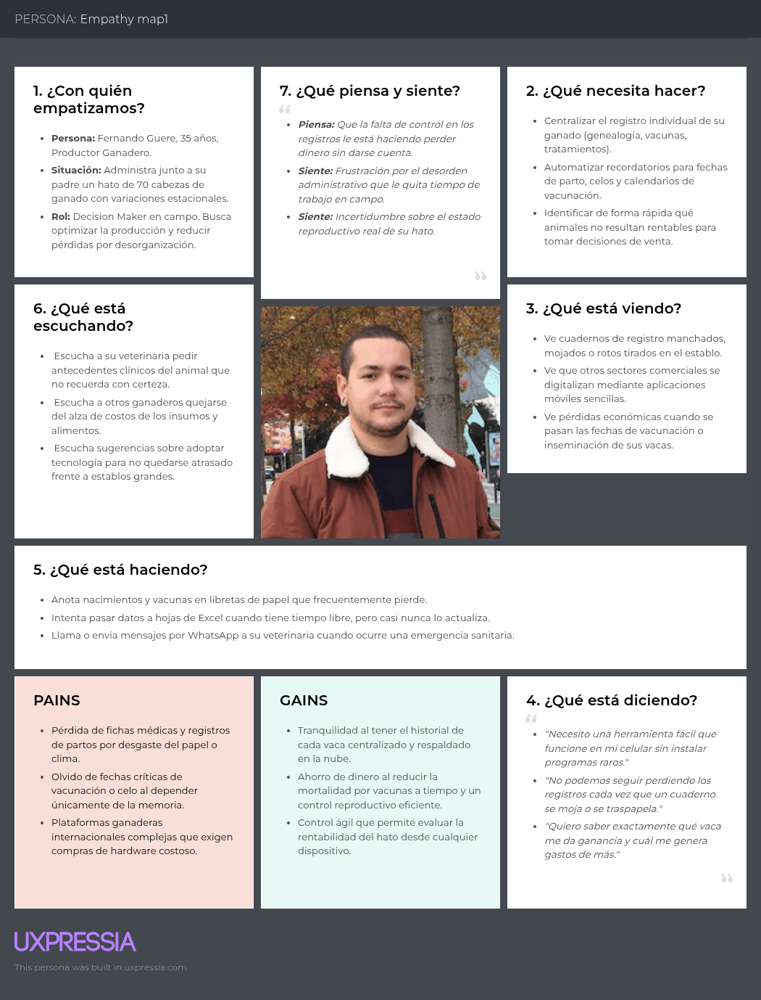

---

#### B. Empathy Map: Silvia Rebaza (Segmento Veterinario Especializado)

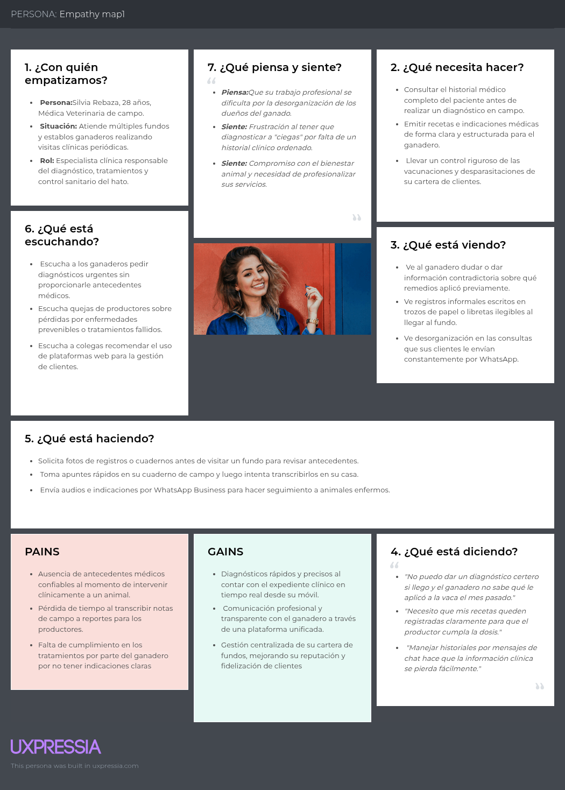

## 2.4. Big Picture Event Storming

Con el fin de plantear una aproximación del modelado de nivel general para el dominio del problema, se aplicó la técnica de EventStorming. Este proceso permitió al equipo comprender el flujo de eventos que ocurren dentro del dominio y definir las interacciones principales entre los actores, comandos y políticas del sistema.

Pasos del proceso:
  1. Eventos de Dominio (Tormenta de ideas): Identificar qué ha sucedido en el negocio, usando notas adhesivas naranjas escritas en pasado.
  

  2. Ordenar Eventos: Organizar los eventos cronológicamente de izquierda a derecha, eliminando duplicados.
  

  3.  Identificar Comandos (Acciones): Añadir notas azules que representan acciones que provocan los eventos.
  

  4. Actores y Sistemas: Determinar quién realiza la acción (persona) o qué sistema externo (API, pago) participa.
  

  5. Políticas (Reglas de Negocio): Identificar reacciones automáticas o reglas que siguen a un evento, usando notas moradas.
  

  6. Agregados y Contextos Delimitados: Agrupar comandos y eventos relacionados para definir límites lógicos o microservicios.

  

## 2.5. Ubiquitous Language

El lenguaje ubicuo define los términos que serán utilizados de manera consistente por los productores ganaderos, médicos veterinarios y el equipo de desarrollo de Vantara. Su propósito es evitar ambigüedades entre el negocio y el sistema, especialmente en los procesos de identificación del ganado, seguimiento sanitario, control reproductivo y comunicación entre usuarios. Estos conceptos se obtuvieron del análisis competitivo, las entrevistas, la matriz de tareas y el Event Storming realizado para Hatarium.

| Término | Definición dentro del dominio |
| :--- | :--- |
| **Productor ganadero** | Usuario responsable de administrar el ganado, registrar actividades del hato, consultar indicadores y coordinar atenciones veterinarias. |
| **Médico veterinario** | Profesional que consulta historiales autorizados, registra diagnósticos, tratamientos, vacunas y recomendaciones para los animales. |
| **Animal** | Unidad individual de ganado identificada mediante un arete o código único, sobre la cual se registran datos sanitarios, reproductivos y productivos. |
| **Hato** | Conjunto de animales administrados por un productor dentro de una operación ganadera. |
| **Lote** | Grupo de animales organizado según criterios definidos por el productor, como edad, ubicación, propósito productivo o estado reproductivo. |
| **Ficha del animal** | Registro principal que contiene la identificación, fecha de nacimiento, genealogía, estado actual y demás información relevante de un animal. |
| **Historial clínico** | Conjunto cronológico de consultas, diagnósticos, tratamientos, vacunas y observaciones asociadas a un animal. |
| **Evento sanitario** | Situación relacionada con la salud del animal, como una vacunación, desparasitación, diagnóstico, tratamiento o control médico. |
| **Evento reproductivo** | Situación relacionada con la reproducción, como celo, inseminación, diagnóstico de gestación, parto, destete o periodo de secado. |
| **Tratamiento** | Indicaciones médicas destinadas a atender una enfermedad o condición específica, incluyendo medicamento, dosis, frecuencia y duración. |
| **Receta o indicación médica** | Instrucción registrada por el veterinario para orientar al productor sobre la aplicación de un tratamiento. |
| **Alerta** | Notificación generada por el sistema para recordar una actividad pendiente o próxima, como una vacuna, parto, tratamiento o periodo de retiro. |
| **Periodo de retiro** | Tiempo que debe transcurrir después de aplicar un medicamento antes de utilizar o comercializar productos derivados del animal, como la leche. |
| **Cita o visita veterinaria** | Atención programada entre el productor y el médico veterinario para evaluar uno o más animales. |
| **Registro productivo** | Información relacionada con el rendimiento del ganado, como peso, producción diaria de leche, mortalidad o rentabilidad. |
| **Indicador ganadero** | Medida utilizada para evaluar el estado o desempeño del hato, como índice de preñez, ganancia de peso o tasa de mortalidad. |
| **Usuario autorizado** | Persona que cuenta con permisos para consultar o modificar información dentro de la plataforma, según su rol y relación con el hato. |

En el sistema, el **animal** constituye el eje principal de la información. Cada evento sanitario, reproductivo o productivo debe asociarse a su ficha y conservar la fecha, el responsable y los detalles correspondientes. De esta manera, el productor puede mantener el control operativo del hato y el veterinario puede acceder a antecedentes confiables para realizar un diagnóstico y dar seguimiento a sus indicaciones.

Asimismo, se recomienda utilizar siempre los términos **médico veterinario**, **productor ganadero**, **ficha del animal**, **historial clínico**, **evento**, **tratamiento** y **alerta** en los requisitos, diseños, diagramas y pantallas de Hatarium. La unificación de este vocabulario facilitará la trazabilidad entre las necesidades identificadas, las historias de usuario, el modelo de datos y las funcionalidades que se implementen posteriormente.

# Capítulo III: Requirements Specification

## 3.1. User Stories

## 3.1. User Stories

<table border="1" cellspacing="0" cellpadding="8">
  <tr>
    <th>Epic / Story ID</th>
    <th>Título</th>
    <th>Descripción</th>
    <th>Criterios de Aceptación</th>
    <th>Relacionado con (Epic ID)</th>
  </tr>

  <!-- ======================= EP001 ======================= -->

  <tr>
    <td><strong>EP001</strong></td>
    <td>Informarse sobre el Producto</td>
    <td>Como visitante, deseo explorar la landing page de Hatarium para conocer las funcionalidades, beneficios y servicios que ofrece la plataforma para la gestión ganadera.</td>
    <td></td>
    <td></td>
  </tr>

  <tr>
    <td><strong>US001</strong></td>
    <td>Explorar Landing Page</td>
    <td>Como visitante, quiero explorar la landing page para conocer las funcionalidades, características y beneficios que ofrece Hatarium.</td>
    <td>
      <strong>E01: Visualización de contenido principal</strong> 
      Dado que el visitante accede a la landing page. 
      Cuando navega por las diferentes secciones. 
      Entonces el sistema muestra información clara y organizada sobre Hatarium.
      

      <strong>E02: Navegación responsiva</strong> 
      Dado que el visitante utiliza distintos dispositivos. 
      Cuando accede a la landing page. 
      Entonces el contenido se adapta correctamente al tamaño de pantalla.
      

      <strong>E03: Navegación entre secciones</strong> 
      Dado que el visitante interactúa con el menú de navegación. 
      Cuando selecciona una sección específica. 
      Entonces el sistema desplaza correctamente hacia la sección correspondiente.
    </td>
    <td>EP001 (Informarse sobre el Producto)</td>
  </tr>

  <tr>
    <td><strong>US002</strong></td>
    <td>Visualización de Funcionalidades y Servicios</td>
    <td>Como visitante, quiero visualizar las funcionalidades y servicios de Hatarium para comprender cómo la plataforma puede ayudar en la gestión ganadera.</td>
    <td>
      <strong>E01: Visualización de funcionalidades</strong> 
      Dado que el visitante accede a la sección de funcionalidades. 
      Cuando revisa el contenido disponible. 
      Entonces el sistema muestra información detallada sobre los servicios de Hatarium.
      

      <strong>E02: Información organizada</strong> 
      Dado que el visitante navega por la sección informativa. 
      Cuando consulta las funcionalidades del sistema. 
      Entonces el contenido se presenta de manera clara y estructurada.
    </td>
    <td>EP001 (Informarse sobre el Producto)</td>
  </tr>

  <tr>
    <td><strong>US003</strong></td>
    <td>Consultar Información de Contacto</td>
    <td>Como visitante, quiero consultar la información de contacto de Hatarium para conocer los medios disponibles para comunicarme con el equipo.</td>
    <td>
      <strong>E01: Visualización de información de contacto</strong> 
      Dado que el visitante accede a la sección de contacto. 
      Cuando revisa la información disponible. 
      Entonces el sistema muestra los medios de comunicación disponibles de Hatarium.
      

      <strong>E02: Información de contacto disponible</strong> 
      Dado que el visitante desea comunicarse con Hatarium. 
      Cuando consulta la sección de contacto. 
      Entonces puede visualizar la información necesaria para establecer comunicación.
    </td>
    <td>EP001 (Informarse sobre el Producto)</td>
  </tr>

  <tr>
    <td><strong>US004</strong></td>
    <td>Enviar Formulario de Contacto</td>
    <td>Como visitante, quiero enviar una consulta mediante el formulario de contacto para comunicarme con el equipo de Hatarium desde la plataforma.</td>
    <td>
      <strong>E01: Envío exitoso del formulario</strong> 
      Dado que el visitante completa correctamente el formulario de contacto. 
      Cuando envía información válida. 
      Entonces el sistema confirma correctamente el envío del mensaje.
      

      <strong>E02: Validación de campos obligatorios</strong> 
      Dado que el visitante intenta enviar una consulta. 
      Cuando omite información obligatoria. 
      Entonces el sistema muestra los mensajes de validación correspondientes.
    </td>
    <td>EP001 (Informarse sobre el Producto)</td>
  </tr>

  <tr>
    <td><strong>TS001</strong></td>
    <td>Desarrollo de Landing Page Responsiva</td>
    <td>Como developer, necesito implementar la landing page responsiva de Hatarium para mostrar información del producto y permitir la navegación entre secciones.</td>
    <td>
      <strong>E01: Implementación de estructura visual</strong> 
      Dado que el desarrollo de la landing page ha iniciado. 
      Cuando se implementan las secciones principales. 
      Entonces el sistema muestra correctamente el contenido visual del producto.
      

      <strong>E02: Adaptación responsive</strong> 
      Dado que la landing page es visualizada en distintos dispositivos. 
      Cuando el usuario accede desde móvil, tablet o desktop. 
      Entonces el diseño se adapta correctamente.
      

      <strong>E03: Navegación funcional</strong> 
      Dado que el menú de navegación está implementado. 
      Cuando el usuario selecciona una opción. 
      Entonces el sistema dirige correctamente a la sección correspondiente.
    </td>
    <td>EP001 (Informarse sobre el Producto)</td>
  </tr>

  <tr>
    <td><strong>TS002</strong></td>
    <td>Desarrollo de Formulario de Contacto</td>
    <td>Como developer, necesito implementar el formulario de contacto para permitir que los visitantes envíen consultas al equipo de Hatarium.</td>
    <td>
      <strong>E01: Validación de campos</strong> 
      Dado que el visitante completa el formulario. 
      Cuando omite campos obligatorios. 
      Entonces el sistema muestra mensajes de validación.
      

      <strong>E02: Envío exitoso</strong> 
      Dado que el visitante ingresa información válida. 
      Cuando envía el formulario. 
      Entonces el sistema confirma correctamente el envío del mensaje.
    </td>
    <td>EP001 (Informarse sobre el Producto)</td>
  </tr>

  <!-- ======================= EP002 ======================= -->

  <tr>
    <td><strong>EP002</strong></td>
    <td>Gestión de Acceso y Autenticación</td>
    <td>Como ganadero, deseo registrarme e iniciar sesión en la plataforma Hatarium para acceder de manera segura a las funcionalidades del sistema.</td>
    <td></td>
    <td></td>
  </tr>

  <tr>
    <td><strong>US005</strong></td>
    <td>Registro de Usuario</td>
    <td>Como ganadero, quiero crear una cuenta en Hatarium para acceder a las funcionalidades de gestión ganadera.</td>
    <td>
      <strong>E01: Registro exitoso</strong> 
      Dado que el ganadero completa correctamente el formulario de registro. 
      Cuando envía la información solicitada. 
      Entonces el sistema crea la cuenta correctamente.
      

      <strong>E02: Campos obligatorios incompletos</strong> 
      Dado que el usuario intenta registrarse. 
      Cuando omite información obligatoria. 
      Entonces el sistema muestra mensajes de validación.
      

      <strong>E03: Correo electrónico inválido</strong> 
      Dado que el usuario ingresa un correo incorrecto. 
      Cuando intenta completar el registro. 
      Entonces el sistema rechaza la operación y muestra un mensaje de error.
    </td>
    <td>EP002 (Gestión de Acceso y Autenticación)</td>
  </tr>

  <tr>
    <td><strong>US006</strong></td>
    <td>Inicio de Sesión</td>
    <td>Como ganadero, quiero iniciar sesión en la plataforma para acceder a mi información y funcionalidades personalizadas.</td>
    <td>
      <strong>E01: Inicio de sesión exitoso</strong> 
      Dado que el usuario posee una cuenta registrada. 
      Cuando ingresa credenciales válidas. 
      Entonces el sistema permite el acceso correctamente.
      

      <strong>E02: Credenciales incorrectas</strong> 
      Dado que el usuario intenta iniciar sesión. 
      Cuando ingresa datos inválidos. 
      Entonces el sistema muestra un mensaje de error.
      

      <strong>E03: Persistencia de sesión</strong> 
      Dado que el usuario inicia sesión correctamente. 
      Cuando navega por la aplicación. 
      Entonces el sistema mantiene activa la sesión del usuario.
    </td>
    <td>EP002 (Gestión de Acceso y Autenticación)</td>
  </tr>

  <tr>
    <td><strong>US007</strong></td>
    <td>Cerrar Sesión</td>
    <td>Como ganadero, quiero cerrar sesión de manera segura para proteger la información de mi cuenta.</td>
    <td>
      <strong>E01: Cierre de sesión exitoso</strong> 
      Dado que el usuario mantiene una sesión activa. 
      Cuando selecciona la opción de cerrar sesión. 
      Entonces el sistema finaliza correctamente la sesión.
      

      <strong>E02: Redirección posterior</strong> 
      Dado que el usuario cerró sesión correctamente. 
      Cuando finaliza el proceso. 
      Entonces el sistema redirige a la pantalla principal o login.
    </td>
    <td>EP002 (Gestión de Acceso y Autenticación)</td>
  </tr>

  <tr>
    <td><strong>TS003</strong></td>
    <td>API de Registro de Usuarios</td>
    <td>Como developer, necesito implementar el endpoint de registro para permitir la creación segura de cuentas de usuario.</td>
    <td>
      <strong>E01: Registro exitoso mediante API</strong> 
      Dado que el endpoint de registro está disponible. 
      Cuando se envía información válida. 
      Entonces el sistema retorna una respuesta exitosa.
      

      <strong>E02: Validación de datos</strong> 
      Dado que el usuario envía información incompleta o inválida. 
      Cuando el sistema procesa la solicitud. 
      Entonces el endpoint rechaza la operación y muestra errores de validación.
      

      <strong>E03: Seguridad de contraseña</strong> 
      Dado que el usuario crea una cuenta. 
      Cuando la contraseña es almacenada. 
      Entonces el sistema aplica hash de seguridad antes de persistirla.
    </td>
    <td>EP002 (Gestión de Acceso y Autenticación)</td>
  </tr>

  <tr>
    <td><strong>TS004</strong></td>
    <td>Sistema de Autenticación JWT</td>
    <td>Como developer, necesito implementar autenticación basada en JWT para gestionar sesiones seguras dentro de Hatarium.</td>
    <td>
      <strong>E01: Generación de token</strong> 
      Dado que el usuario inicia sesión correctamente. 
      Cuando el sistema valida las credenciales. 
      Entonces se genera un token JWT válido.
      

      <strong>E02: Validación de sesión</strong> 
      Dado que el usuario realiza solicitudes autenticadas. 
      Cuando el token JWT es válido. 
      Entonces el sistema permite el acceso a los recursos protegidos.
      

      <strong>E03: Rechazo de token inválido</strong> 
      Dado que el usuario utiliza un token inválido o expirado. 
      Cuando intenta acceder a recursos protegidos. 
      Entonces el sistema rechaza la solicitud.
    </td>
    <td>EP002 (Gestión de Acceso y Autenticación)</td>
  </tr>

  <!-- ======================= EP003 ======================= -->

  <tr>
    <td><strong>EP003</strong></td>
    <td>Gestión de Ganado</td>
    <td>Como ganadero, deseo registrar y administrar la información de mis animales para mantener un control organizado y actualizado del ganado.</td>
    <td></td>
    <td></td>
  </tr>

  <tr>
    <td><strong>US008</strong></td>
    <td>Registro de Ganado</td>
    <td>Como ganadero, quiero registrar nuevos animales para mantener actualizado el inventario de mi ganado.</td>
    <td>
      <strong>E01: Registro exitoso de animal</strong> 
      Dado que el ganadero accede al formulario de registro. 
      Cuando ingresa correctamente los datos del animal. 
      Entonces el sistema almacena la información exitosamente.
      

      <strong>E02: Validación de campos obligatorios</strong> 
      Dado que el usuario intenta registrar un animal. 
      Cuando omite campos requeridos. 
      Entonces el sistema muestra mensajes de validación.
      

      <strong>E03: Registro inválido</strong> 
      Dado que el usuario ingresa datos incorrectos. 
      Cuando envía el formulario. 
      Entonces el sistema rechaza el registro y muestra un mensaje de error.
    </td>
    <td>EP003 (Gestión de Ganado)</td>
  </tr>

  <tr>
    <td><strong>US009</strong></td>
    <td>Buscar Animal</td>
    <td>Como ganadero, quiero buscar un animal registrado para localizar rápidamente el ejemplar que deseo consultar.</td>
    <td>
      <strong>E01: Búsqueda exitosa</strong> 
      Dado que existen animales registrados. 
      Cuando el ganadero realiza una búsqueda utilizando información válida. 
      Entonces el sistema muestra los animales que coinciden con los criterios ingresados.
      

      <strong>E02: Búsqueda sin resultados</strong> 
      Dado que el ganadero realiza una búsqueda. 
      Cuando no existen coincidencias registradas. 
      Entonces el sistema informa que no se encontraron resultados.
    </td>
    <td>EP003 (Gestión de Ganado)</td>
  </tr>

  <tr>
    <td><strong>US010</strong></td>
    <td>Consultar Información de un Animal</td>
    <td>Como ganadero, quiero consultar la información de un animal para acceder a los datos registrados del ejemplar seleccionado.</td>
    <td>
      <strong>E01: Consulta exitosa</strong> 
      Dado que el animal se encuentra registrado en Hatarium. 
      Cuando el ganadero selecciona el animal. 
      Entonces el sistema muestra su información registrada.
      

      <strong>E02: Información disponible</strong> 
      Dado que el ganadero accede a la ficha de un animal. 
      Cuando el sistema carga la información correspondiente. 
      Entonces muestra los datos asociados al ejemplar de manera organizada.
    </td>
    <td>EP003 (Gestión de Ganado)</td>
  </tr>

  <tr>
    <td><strong>US011</strong></td>
    <td>Actualización de Información del Ganado</td>
    <td>Como ganadero, quiero actualizar la información de mis animales para mantener datos precisos y actualizados dentro del sistema.</td>
    <td>
      <strong>E01: Actualización exitosa</strong> 
      Dado que el animal existe en el sistema. 
      Cuando el usuario modifica correctamente la información. 
      Entonces el sistema actualiza los datos exitosamente.
      

      <strong>E02: Validación de datos</strong> 
      Dado que el usuario edita información del animal. 
      Cuando ingresa datos inválidos. 
      Entonces el sistema rechaza la operación y muestra un mensaje de error.
    </td>
    <td>EP003 (Gestión de Ganado)</td>
  </tr>

  <tr>
    <td><strong>US012</strong></td>
    <td>Crear Lote de Ganado</td>
    <td>Como ganadero, quiero crear lotes de ganado para organizar mis animales de acuerdo con las necesidades de manejo de la explotación.</td>
    <td>
      <strong>E01: Creación de lote exitosa</strong> 
      Dado que el ganadero accede al módulo de lotes. 
      Cuando registra información válida del nuevo lote. 
      Entonces el sistema crea correctamente el lote.
      

      <strong>E02: Validación de información</strong> 
      Dado que el ganadero intenta crear un lote. 
      Cuando omite información obligatoria. 
      Entonces el sistema muestra los mensajes de validación correspondientes.
    </td>
    <td>EP003 (Gestión de Ganado)</td>
  </tr>

  <tr>
    <td><strong>US013</strong></td>
    <td>Asignar Animal a un Lote</td>
    <td>Como ganadero, quiero asignar un animal a un lote para mantener organizada la distribución de mi ganado.</td>
    <td>
      <strong>E01: Asignación exitosa</strong> 
      Dado que existen animales y lotes registrados. 
      Cuando el ganadero asigna un animal a un lote. 
      Entonces el sistema actualiza correctamente la asociación.
      

      <strong>E02: Validación de animal y lote</strong> 
      Dado que el ganadero intenta realizar una asignación. 
      Cuando el animal o lote seleccionado no se encuentra disponible. 
      Entonces el sistema informa que la asignación no puede realizarse.
    </td>
    <td>EP003 (Gestión de Ganado)</td>
  </tr>

  <tr>
    <td><strong>TS005</strong></td>
    <td>Implementación de Endpoint para Registro de Ganado</td>
    <td>Como developer, necesito implementar el endpoint de registro de animales para almacenar la información del ganado dentro de la plataforma.</td>
    <td>
      <strong>E01: Registro exitoso mediante API</strong> 
      Dado que el endpoint se encuentra disponible. 
      Cuando se envían datos válidos del animal. 
      Entonces el sistema retorna una respuesta exitosa.
      

      <strong>E02: Validación de datos</strong> 
      Dado que se reciben datos inválidos. 
      Cuando el sistema procesa la solicitud. 
      Entonces el endpoint rechaza la operación con un mensaje de error.
      

      <strong>E03: Persistencia de información</strong> 
      Dado que el registro es válido. 
      Cuando la operación finaliza. 
      Entonces el sistema almacena correctamente la información en la base de datos.
    </td>
    <td>EP003 (Gestión de Ganado)</td>
  </tr>

  <tr>
    <td><strong>TS006</strong></td>
    <td>Implementación de Endpoints de Consulta y Edición</td>
    <td>Como developer, necesito implementar endpoints de consulta y actualización para gestionar la información registrada del ganado.</td>
    <td>
      <strong>E01: Consulta de información</strong> 
      Dado que existen animales registrados. 
      Cuando el usuario realiza una solicitud GET válida. 
      Entonces el sistema devuelve la información correspondiente.
      

      <strong>E02: Actualización de registros</strong> 
      Dado que el animal existe en el sistema. 
      Cuando el usuario envía información válida para editar. 
      Entonces el sistema actualiza correctamente los datos.
      

      <strong>E03: Manejo de errores</strong> 
      Dado que se realiza una solicitud inválida. 
      Cuando el sistema procesa la operación. 
      Entonces el endpoint devuelve mensajes de error apropiados.
    </td>
    <td>EP003 (Gestión de Ganado)</td>
  </tr>

  <tr>
    <td><strong>TS007</strong></td>
    <td>Implementación de Gestión de Lotes</td>
    <td>Como developer, necesito implementar funcionalidades para la creación y administración de lotes de ganado.</td>
    <td>
      <strong>E01: Creación de lotes</strong> 
      Dado que el usuario registra información válida. 
      Cuando solicita crear un lote. 
      Entonces el sistema almacena correctamente el lote.
      

      <strong>E02: Asociación de animales</strong> 
      Dado que existen animales registrados. 
      Cuando el usuario asigna animales a un lote. 
      Entonces el sistema actualiza correctamente las relaciones correspondientes.
    </td>
    <td>EP003 (Gestión de Ganado)</td>
  </tr>

  <!-- ======================= EP004 ======================= -->

  <tr>
    <td><strong>EP004</strong></td>
    <td>Gestión de Alimentación y Salud Animal</td>
    <td>Como ganadero, deseo gestionar la alimentación y monitorear la salud de mis animales para mantener un mejor control sanitario y productivo dentro de Hatarium.</td>
    <td></td>
    <td></td>
  </tr>

  <tr>
    <td><strong>US014</strong></td>
    <td>Registro de Alimentación</td>
    <td>Como ganadero, quiero registrar la alimentación de mis animales para controlar su consumo y mejorar su productividad.</td>
    <td>
      <strong>E01: Registro exitoso de alimentación</strong> 
      Dado que el ganadero accede al módulo de alimentación. 
      Cuando registra correctamente la información alimentaria. 
      Entonces el sistema almacena el registro y confirma la operación.
      

      <strong>E02: Datos inválidos</strong> 
      Dado que el ganadero registra información alimentaria. 
      Cuando existen campos vacíos o datos incorrectos. 
      Entonces el sistema muestra un mensaje de validación.
    </td>
    <td>EP004 (Gestión de Alimentación y Salud Animal)</td>
  </tr>

  <tr>
    <td><strong>US015</strong></td>
    <td>Planificar Alimentación</td>
    <td>Como ganadero, quiero planificar la alimentación de mis animales para organizar anticipadamente las raciones y periodos de alimentación.</td>
    <td>
      <strong>E01: Creación de plan alimentario</strong> 
      Dado que el ganadero accede al módulo de alimentación. 
      Cuando establece la alimentación correspondiente para un animal o lote. 
      Entonces el sistema registra correctamente el plan alimentario.
      

      <strong>E02: Validación del plan</strong> 
      Dado que el ganadero está creando un plan alimentario. 
      Cuando omite información obligatoria. 
      Entonces el sistema solicita completar los datos requeridos.
    </td>
    <td>EP004 (Gestión de Alimentación y Salud Animal)</td>
  </tr>

  <tr>
    <td><strong>US016</strong></td>
    <td>Consultar Plan Alimentario</td>
    <td>Como ganadero, quiero consultar el plan alimentario de mis animales para conocer las raciones y periodos de alimentación establecidos.</td>
    <td>
      <strong>E01: Consulta de plan alimentario</strong> 
      Dado que existe un plan alimentario registrado. 
      Cuando el ganadero consulta la alimentación de un animal o lote. 
      Entonces el sistema muestra la información del plan correspondiente.
      

      <strong>E02: Plan no disponible</strong> 
      Dado que el animal o lote no posee un plan alimentario. 
      Cuando el ganadero realiza la consulta. 
      Entonces el sistema informa que no existe planificación registrada.
    </td>
    <td>EP004 (Gestión de Alimentación y Salud Animal)</td>
  </tr>

  <tr>
    <td><strong>US017</strong></td>
    <td>Visualizar Estado Sanitario Actual</td>
    <td>Como ganadero, quiero visualizar el estado sanitario actual de mis animales para supervisar su condición de salud.</td>
    <td>
      <strong>E01: Consulta de estado sanitario</strong> 
      Dado que existen registros médicos o notas preventivas del animal. 
      Cuando el ganadero consulta su información sanitaria. 
      Entonces el sistema muestra el estado de salud actualizado.
      

      <strong>E02: Estado sanitario no disponible</strong> 
      Dado que el animal no posee información sanitaria registrada. 
      Cuando el ganadero realiza la consulta. 
      Entonces el sistema informa que no existen datos disponibles.
    </td>
    <td>EP004 (Gestión de Alimentación y Salud Animal)</td>
  </tr>

  <tr>
    <td><strong>US018</strong></td>
    <td>Visualizar Vacunas Aplicadas</td>
    <td>Como ganadero, quiero visualizar las vacunas aplicadas a mis animales para verificar los controles preventivos realizados.</td>
    <td>
      <strong>E01: Visualización de vacunas aplicadas</strong> 
      Dado que el médico veterinario ha registrado la aplicación de una vacuna. 
      Cuando el ganadero accede al módulo sanitario de Hatarium. 
      Entonces el sistema muestra el detalle de la vacuna y su fecha de aplicación.
      

      <strong>E02: Vacunas no registradas</strong> 
      Dado que un animal no posee vacunas registradas. 
      Cuando el ganadero consulta su información preventiva. 
      Entonces el sistema informa que no existen vacunas aplicadas registradas.
    </td>
    <td>EP004 (Gestión de Alimentación y Salud Animal)</td>
  </tr>

  <tr>
    <td><strong>US019</strong></td>
    <td>Consultar Próximas Vacunaciones</td>
    <td>Como ganadero, quiero consultar las próximas vacunaciones de mis animales para anticiparme al cumplimiento del calendario sanitario.</td>
    <td>
      <strong>E01: Consulta de próximas vacunaciones</strong> 
      Dado que existen vacunas programadas en el calendario sanitario. 
      Cuando el ganadero revisa el módulo de prevención. 
      Entonces el sistema muestra las fechas proyectadas para las siguientes dosis.
      

      <strong>E02: Vacunaciones no programadas</strong> 
      Dado que no existen próximas vacunaciones registradas. 
      Cuando el ganadero consulta el calendario sanitario. 
      Entonces el sistema informa que no existen vacunaciones pendientes programadas.
    </td>
    <td>EP004 (Gestión de Alimentación y Salud Animal)</td>
  </tr>

  <tr>
    <td><strong>US020</strong></td>
    <td>Detectar Riesgo Sanitario</td>
    <td>Como ganadero, quiero que el sistema detecte condiciones de riesgo sanitario para identificar oportunamente posibles problemas de salud en mis animales.</td>
    <td>
      <strong>E01: Detección automática de riesgo sanitario</strong> 
      Dado que el sistema procesa la información sanitaria del ganado. 
      Cuando identifica una condición que cumple los criterios definidos como riesgo. 
      Entonces registra el evento sanitario correspondiente.
      

      <strong>E02: Animal sin riesgo detectado</strong> 
      Dado que el sistema evalúa la información sanitaria de un animal. 
      Cuando los datos no cumplen ninguna condición de riesgo. 
      Entonces no registra un nuevo evento de riesgo sanitario.
    </td>
    <td>EP004 (Gestión de Alimentación y Salud Animal)</td>
  </tr>

  <tr>
    <td><strong>US021</strong></td>
    <td>Detectar Vacunación Pendiente</td>
    <td>Como ganadero, quiero que el sistema identifique vacunaciones pendientes para conocer cuándo un animal requiere una próxima dosis.</td>
    <td>
      <strong>E01: Detección de vacunación pendiente</strong> 
      Dado que existe una vacuna próxima a cumplir su fecha programada. 
      Cuando el sistema compara la fecha establecida con el calendario actual. 
      Entonces marca la vacunación como pendiente.
      

      <strong>E02: Vacunación dentro del plazo</strong> 
      Dado que existe una vacuna programada. 
      Cuando su fecha todavía no corresponde al periodo definido como pendiente. 
      Entonces el sistema mantiene el evento como programado.
    </td>
    <td>EP004 (Gestión de Alimentación y Salud Animal)</td>
  </tr>

  <!-- ======================= EP005 ======================= -->

  <tr>
    <td><strong>EP005</strong></td>
    <td>Reportes y Seguimiento Ganadero</td>
    <td>Como ganadero, deseo visualizar reportes, estadísticas y seguimiento sanitario del ganado para mejorar la toma de decisiones y mantener un mejor control productivo y de salud animal.</td>
    <td></td>
    <td></td>
  </tr>

  <tr>
    <td><strong>US022</strong></td>
    <td>Generar Reporte Productivo</td>
    <td>Como ganadero, quiero generar reportes productivos para obtener información consolidada sobre el rendimiento de mi ganado.</td>
    <td>
      <strong>E01: Generación de reporte</strong> 
      Dado que existen registros productivos almacenados. 
      Cuando el ganadero solicita generar un reporte. 
      Entonces el sistema procesa la información y genera el reporte correspondiente.
      

      <strong>E02: Información insuficiente</strong> 
      Dado que el ganadero solicita generar un reporte. 
      Cuando no existen registros suficientes. 
      Entonces el sistema informa que no es posible generar el reporte.
    </td>
    <td>EP005 (Reportes y Seguimiento Ganadero)</td>
  </tr>

  <tr>
    <td><strong>US023</strong></td>
    <td>Visualizar Reporte Productivo</td>
    <td>Como ganadero, quiero visualizar un reporte productivo generado para analizar el rendimiento y estado general de mi ganado.</td>
    <td>
      <strong>E01: Visualización de reporte</strong> 
      Dado que existe un reporte productivo generado. 
      Cuando el ganadero accede al reporte. 
      Entonces el sistema muestra la información consolidada de manera organizada.
      

      <strong>E02: Reporte no disponible</strong> 
      Dado que el ganadero intenta consultar un reporte. 
      Cuando el reporte solicitado no se encuentra disponible. 
      Entonces el sistema informa que no existe información para mostrar.
    </td>
    <td>EP005 (Reportes y Seguimiento Ganadero)</td>
  </tr>

  <tr>
    <td><strong>US024</strong></td>
    <td>Consulta de Historial Sanitario Completo</td>
    <td>Como ganadero, quiero consultar el historial sanitario detallado de mis animales para realizar seguimiento de vacunas, tratamientos anteriores y estado clínico de cada ejemplar.</td>
    <td>
      <strong>E01: Consulta exitosa del historial</strong> 
      Dado que el animal posee registros sanitarios. 
      Cuando el ganadero consulta la información. 
      Entonces el sistema muestra el historial actualizado del animal.
      

      <strong>E02: Historial no disponible</strong> 
      Dado que el usuario consulta un animal sin registros. 
      Cuando el sistema procesa la solicitud. 
      Entonces el sistema informa que no existen datos sanitarios registrados.
    </td>
    <td>EP005 (Reportes y Seguimiento Ganadero)</td>
  </tr>

  <tr>
    <td><strong>US025</strong></td>
    <td>Visualizar Estadísticas Sanitarias</td>
    <td>Como ganadero, quiero visualizar estadísticas sanitarias para analizar de manera consolidada la situación de salud de mi ganado.</td>
    <td>
      <strong>E01: Visualización de estadísticas sanitarias</strong> 
      Dado que existen registros sanitarios almacenados. 
      Cuando el ganadero accede al módulo estadístico. 
      Entonces el sistema muestra información consolidada y actualizada.
      

      <strong>E02: Información insuficiente</strong> 
      Dado que el ganadero accede al módulo estadístico. 
      Cuando no existen suficientes datos sanitarios registrados. 
      Entonces el sistema informa que no existen estadísticas disponibles.
    </td>
    <td>EP005 (Reportes y Seguimiento Ganadero)</td>
  </tr>

  <tr>
    <td><strong>US026</strong></td>
    <td>Visualizar Alertas Sanitarias</td>
    <td>Como ganadero, quiero visualizar las alertas sanitarias generadas para identificar eventos importantes relacionados con la salud de mis animales.</td>
    <td>
      <strong>E01: Visualización de alerta sanitaria</strong> 
      Dado que existe una condición de riesgo o vacunación pendiente detectada. 
      Cuando el ganadero accede al panel de alertas. 
      Entonces el sistema muestra la alerta sanitaria correspondiente.
      

      <strong>E02: Ausencia de alertas</strong> 
      Dado que no existen condiciones sanitarias pendientes. 
      Cuando el ganadero consulta el panel de alertas. 
      Entonces el sistema informa que no existen alertas activas.
    </td>
    <td>EP005 (Reportes y Seguimiento Ganadero)</td>
  </tr>

  <!-- ======================= EP006 ======================= -->

  <tr>
    <td><strong>EP006</strong></td>
    <td>APIs y Servicios Backend</td>
    <td>Como developer, deseo implementar APIs REST, servicios backend y mecanismos de persistencia para soportar las funcionalidades principales de la plataforma Hatarium.</td>
    <td></td>
    <td></td>
  </tr>

  <tr>
    <td><strong>TS008</strong></td>
    <td>Implementación de Endpoints para Alimentación y Control Sanitario</td>
    <td>Como developer, necesito implementar endpoints sanitarios y alimentarios para registrar consumos, consultar el historial clínico y permitir la lectura del calendario de vacunas.</td>
    <td>
      <strong>E01: Registro alimentario exitoso</strong> 
      Dado que el endpoint de alimentación está disponible. 
      Cuando se envía información válida. 
      Entonces el sistema almacena correctamente el registro.
      

      <strong>E02: Consulta de historial sanitario</strong> 
      Dado que existen registros sanitarios. 
      Cuando el usuario consulta el historial del animal. 
      Entonces el sistema devuelve la información actualizada.
    </td>
    <td>EP006 (APIs y Servicios Backend)</td>
  </tr>

  <tr>
    <td><strong>TS009</strong></td>
    <td>Implementación de Generación de Reportes y Estadísticas</td>
    <td>Como developer, necesito implementar servicios backend para consolidar reportes productivos y estadísticas sanitarias del ganado.</td>
    <td>
      <strong>E01: Generación de reportes</strong> 
      Dado que existen registros almacenados. 
      Cuando el usuario solicita un reporte. 
      Entonces el sistema genera información consolidada correctamente.
      

      <strong>E02: Generación de estadísticas sanitarias</strong> 
      Dado que existen datos sanitarios registrados. 
      Cuando el sistema procesa la información. 
      Entonces se generan estadísticas actualizadas.
    </td>
    <td>EP006 (APIs y Servicios Backend)</td>
  </tr>

  <!-- ======================= EP007 ======================= -->

  <tr>
    <td><strong>EP007</strong></td>
    <td>Atención Veterinaria Especializada e Integración IoT</td>
    <td>Como Médico Veterinario Especializado, deseo acceder a herramientas avanzadas para registrar visitas técnicas, diagnósticos, tratamientos, vacunaciones y monitorear constantes vitales mediante sensores IoT.</td>
    <td></td>
    <td></td>
  </tr>

  <tr>
    <td><strong>US027</strong></td>
    <td>Registrar Visita Técnica</td>
    <td>Como médico veterinario, quiero registrar los detalles de una visita técnica para mantener evidencia de las atenciones realizadas al ganado.</td>
    <td>
      <strong>E01: Registro exitoso de visita</strong> 
      Dado que el veterinario accede al módulo de atención veterinaria. 
      Cuando registra correctamente los datos de la visita. 
      Entonces el sistema almacena la atención realizada.
      

      <strong>E02: Validación de información</strong> 
      Dado que el veterinario intenta registrar una visita. 
      Cuando omite información obligatoria. 
      Entonces el sistema solicita completar los datos requeridos.
    </td>
    <td>EP007 (Atención Veterinaria Especializada e Integración IoT)</td>
  </tr>

  <tr>
    <td><strong>US028</strong></td>
    <td>Registrar Diagnóstico Clínico</td>
    <td>Como médico veterinario, quiero registrar el diagnóstico clínico de un animal para documentar su condición médica después de una evaluación.</td>
    <td>
      <strong>E01: Registro de diagnóstico</strong> 
      Dado que el veterinario ha realizado la evaluación del animal. 
      Cuando registra la descripción y severidad del diagnóstico. 
      Entonces el sistema incorpora el diagnóstico al historial sanitario.
      

      <strong>E02: Validación de diagnóstico</strong> 
      Dado que el veterinario está registrando un diagnóstico. 
      Cuando omite la descripción o información obligatoria. 
      Entonces el sistema bloquea la operación y solicita completar los campos.
    </td>
    <td>EP007 (Atención Veterinaria Especializada e Integración IoT)</td>
  </tr>

  <tr>
    <td><strong>US029</strong></td>
    <td>Prescribir Tratamiento Médico</td>
    <td>Como médico veterinario, quiero prescribir un tratamiento médico para registrar las indicaciones necesarias para la recuperación del animal.</td>
    <td>
      <strong>E01: Prescripción de tratamiento</strong> 
      Dado que existe un diagnóstico registrado. 
      Cuando el veterinario especifica el medicamento, dosificación y duración. 
      Entonces el sistema anexa el tratamiento al historial médico del animal.
      

      <strong>E02: Validación de prescripción</strong> 
      Dado que el veterinario registra un tratamiento. 
      Cuando omite información obligatoria de la prescripción. 
      Entonces el sistema solicita completar los campos requeridos.
    </td>
    <td>EP007 (Atención Veterinaria Especializada e Integración IoT)</td>
  </tr>

  <tr>
    <td><strong>US030</strong></td>
    <td>Monitorear Telemetría de Sensores IoT</td>
    <td>Como médico veterinario, quiero monitorear la telemetría obtenida mediante sensores IoT para supervisar las constantes vitales del animal.</td>
    <td>
      <strong>E01: Visualización de telemetría IoT</strong> 
      Dado que el animal cuenta con un dispositivo IoT vinculado. 
      Cuando el veterinario accede al panel de monitoreo. 
      Entonces el sistema muestra las lecturas disponibles de los sensores.
      

      <strong>E02: Sensor sin información</strong> 
      Dado que el animal posee un dispositivo vinculado. 
      Cuando no existen lecturas recientes disponibles. 
      Entonces el sistema informa que no existen datos de telemetría para mostrar.
    </td>
    <td>EP007 (Atención Veterinaria Especializada e Integración IoT)</td>
  </tr>

  <tr>
    <td><strong>US031</strong></td>
    <td>Recibir Alerta por Anomalía en Signos Vitales</td>
    <td>Como médico veterinario, quiero recibir una alerta cuando los sensores detecten valores anormales para identificar oportunamente posibles riesgos de salud.</td>
    <td>
      <strong>E01: Generación de alerta por anomalía</strong> 
      Dado que un sensor IoT registra un valor fuera de los parámetros establecidos. 
      Cuando la plataforma procesa la lectura de telemetría. 
      Entonces el sistema genera una alerta en el panel correspondiente.
      

      <strong>E02: Lecturas dentro del rango normal</strong> 
      Dado que los sensores transmiten información del animal. 
      Cuando los valores se encuentran dentro de los parámetros definidos. 
      Entonces el sistema no genera una nueva alerta crítica.
    </td>
    <td>EP007 (Atención Veterinaria Especializada e Integración IoT)</td>
  </tr>

  <tr>
    <td><strong>US032</strong></td>
    <td>Registrar Vacuna Aplicada</td>
    <td>Como médico veterinario, quiero registrar una vacuna aplicada a un animal para mantener actualizado su historial preventivo.</td>
    <td>
      <strong>E01: Registro de vacuna aplicada</strong> 
      Dado que el veterinario administra una vacuna a un animal. 
      Cuando registra la vacuna y la fecha de aplicación. 
      Entonces el sistema incorpora la información al historial sanitario.
      

      <strong>E02: Validación de información de vacuna</strong> 
      Dado que el veterinario registra una aplicación. 
      Cuando omite información obligatoria. 
      Entonces el sistema solicita completar los campos requeridos.
    </td>
    <td>EP007 (Atención Veterinaria Especializada e Integración IoT)</td>
  </tr>

  <tr>
    <td><strong>US033</strong></td>
    <td>Programar Cita Veterinaria</td>
    <td>Como ganadero, quiero programar una cita veterinaria para coordinar la atención médica de mis animales.</td>
    <td>
      <strong>E01: Programación de cita</strong> 
      Dado que el ganadero necesita atención veterinaria. 
      Cuando selecciona una fecha disponible y registra la información requerida. 
      Entonces el sistema almacena la cita correctamente.
      

      <strong>E02: Horario no disponible</strong> 
      Dado que el ganadero intenta programar una cita. 
      Cuando selecciona un horario que no se encuentra disponible. 
      Entonces el sistema solicita elegir otra fecha u horario.
    </td>
    <td>EP007 (Atención Veterinaria Especializada e Integración IoT)</td>
  </tr>

  <tr>
    <td><strong>US034</strong></td>
    <td>Consultar Citas Veterinarias</td>
    <td>Como ganadero, quiero consultar mis citas veterinarias para conocer las atenciones programadas para mis animales.</td>
    <td>
      <strong>E01: Consulta de citas</strong> 
      Dado que existen citas veterinarias registradas. 
      Cuando el ganadero accede al módulo de citas. 
      Entonces el sistema muestra las atenciones programadas.
      

      <strong>E02: Ausencia de citas</strong> 
      Dado que el ganadero no posee citas registradas. 
      Cuando consulta el módulo correspondiente. 
      Entonces el sistema informa que no existen citas programadas.
    </td>
    <td>EP007 (Atención Veterinaria Especializada e Integración IoT)</td>
  </tr>

  <tr>
    <td><strong>US035</strong></td>
    <td>Reprogramar Cita Veterinaria</td>
    <td>Como ganadero, quiero reprogramar una cita veterinaria para modificar la fecha u hora de una atención previamente coordinada.</td>
    <td>
      <strong>E01: Reprogramación exitosa</strong> 
      Dado que existe una cita veterinaria programada. 
      Cuando el ganadero selecciona una nueva fecha disponible. 
      Entonces el sistema actualiza la cita correctamente.
      

      <strong>E02: Nueva fecha no disponible</strong> 
      Dado que el ganadero intenta reprogramar una cita. 
      Cuando selecciona un horario no disponible. 
      Entonces el sistema mantiene la programación anterior y solicita seleccionar otra opción.
    </td>
    <td>EP007 (Atención Veterinaria Especializada e Integración IoT)</td>
  </tr>

  <tr>
    <td><strong>TS010</strong></td>
    <td>API REST para Gestión Veterinaria y Telemetría IoT</td>
    <td>Como developer, necesito exponer los endpoints para el registro de visitas médicas, prescripciones y la ingesta de telemetría proveniente de dispositivos IoT.</td>
    <td>
      <strong>E01: Ingesta de datos de sensores IoT</strong> 
      Dado que un dispositivo collar IoT transmite lecturas de temperatura y pulso. 
      Cuando el endpoint de telemetría procesa el paquete de datos. 
      Entonces valida los identificadores del sensor y almacena las lecturas en la base de datos.
      

      <strong>E02: Validación de seguridad por JWT y Roles</strong> 
      Dado que se envía una petición para prescribir un tratamiento médico. 
      Cuando la API evalúa el token JWT del usuario. 
      Entonces permite la operación únicamente si el rol corresponde a VETERINARIO.
    </td>
    <td>EP007 (Atención Veterinaria Especializada e Integración IoT)</td>
  </tr>

  <!-- ======================= EP008 ======================= -->

  <tr>
    <td><strong>EP008</strong></td>
    <td>Gestión Reproductiva</td>
    <td>Como ganadero, deseo registrar y consultar los eventos reproductivos de mis animales para mantener un seguimiento organizado de su ciclo productivo y reproductivo.</td>
    <td></td>
    <td></td>
  </tr>

  <tr>
    <td><strong>US036</strong></td>
    <td>Registrar Preñez</td>
    <td>Como ganadero, quiero registrar la preñez de un animal para mantener actualizado su estado reproductivo.</td>
    <td>
      <strong>E01: Registro exitoso de preñez</strong> 
      Dado que el animal se encuentra registrado en Hatarium. 
      Cuando el ganadero registra la confirmación y fecha correspondiente. 
      Entonces el sistema actualiza el estado reproductivo del animal.
      

      <strong>E02: Validación de información</strong> 
      Dado que el ganadero intenta registrar una preñez. 
      Cuando omite información obligatoria. 
      Entonces el sistema solicita completar los datos requeridos.
    </td>
    <td>EP008 (Gestión Reproductiva)</td>
  </tr>

  <tr>
    <td><strong>US037</strong></td>
    <td>Registrar Parto</td>
    <td>Como ganadero, quiero registrar el parto de un animal para mantener actualizado su historial reproductivo.</td>
    <td>
      <strong>E01: Registro exitoso de parto</strong> 
      Dado que el animal posee seguimiento reproductivo. 
      Cuando el ganadero registra la fecha y datos correspondientes al parto. 
      Entonces el sistema incorpora el evento al historial reproductivo.
      

      <strong>E02: Validación del registro</strong> 
      Dado que el ganadero intenta registrar un parto. 
      Cuando omite información obligatoria. 
      Entonces el sistema solicita completar los datos requeridos.
    </td>
    <td>EP008 (Gestión Reproductiva)</td>
  </tr>

  <tr>
    <td><strong>US038</strong></td>
    <td>Registrar Secado</td>
    <td>Como ganadero, quiero registrar el secado de un animal para mantener actualizado su seguimiento productivo y reproductivo.</td>
    <td>
      <strong>E01: Registro exitoso de secado</strong> 
      Dado que el animal se encuentra registrado. 
      Cuando el ganadero registra el evento de secado. 
      Entonces el sistema incorpora el evento al historial del animal.
      

      <strong>E02: Validación del registro</strong> 
      Dado que el ganadero intenta registrar un secado. 
      Cuando omite la información requerida. 
      Entonces el sistema solicita completar los datos obligatorios.
    </td>
    <td>EP008 (Gestión Reproductiva)</td>
  </tr>

  <tr>
    <td><strong>US039</strong></td>
    <td>Registrar Destete</td>
    <td>Como ganadero, quiero registrar el destete de un animal para mantener actualizado su seguimiento productivo.</td>
    <td>
      <strong>E01: Registro exitoso de destete</strong> 
      Dado que el animal se encuentra registrado en Hatarium. 
      Cuando el ganadero registra la fecha de destete. 
      Entonces el sistema incorpora el evento al historial correspondiente.
      

      <strong>E02: Validación de información</strong> 
      Dado que el ganadero intenta registrar el destete. 
      Cuando omite los datos requeridos. 
      Entonces el sistema solicita completar la información obligatoria.
    </td>
    <td>EP008 (Gestión Reproductiva)</td>
  </tr>

  <tr>
    <td><strong>US040</strong></td>
    <td>Consultar Historial Reproductivo</td>
    <td>Como ganadero, quiero consultar el historial reproductivo de un animal para conocer los eventos registrados durante su ciclo reproductivo.</td>
    <td>
      <strong>E01: Consulta exitosa del historial reproductivo</strong> 
      Dado que el animal posee eventos reproductivos registrados. 
      Cuando el ganadero consulta su historial reproductivo. 
      Entonces el sistema muestra cronológicamente los eventos disponibles.
      

      <strong>E02: Historial reproductivo no disponible</strong> 
      Dado que el animal no posee eventos reproductivos registrados. 
      Cuando el ganadero realiza la consulta. 
      Entonces el sistema informa que no existe información reproductiva disponible.
    </td>
    <td>EP008 (Gestión Reproductiva)</td>
  </tr>

  <tr>
  <td><strong>TS011</strong></td>
  <td>Implementación de Registro de Eventos Reproductivos</td>
  <td>Como developer, necesito implementar los servicios backend para registrar eventos reproductivos del ganado, permitiendo almacenar de manera estructurada la información asociada al ciclo reproductivo de cada animal.</td>
  <td>
    <strong>E01: Registro de evento reproductivo</strong> 
    Dado que un usuario registra un evento reproductivo válido. 
    Cuando el sistema procesa la solicitud. 
    Entonces almacena correctamente la información asociada al animal.
    

    <strong>E02: Validación de información</strong> 
    Dado que se intenta registrar un evento reproductivo. 
    Cuando faltan datos obligatorios o estos son inválidos. 
    Entonces el sistema rechaza la operación y devuelve los mensajes de validación correspondientes.
    

    <strong>E03: Asociación con el animal</strong> 
    Dado que el evento reproductivo contiene un identificador de animal. 
    Cuando el sistema procesa el registro. 
    Entonces verifica que el animal exista antes de almacenar el evento.
  </td>
  <td>EP008 (Gestión Reproductiva)</td>
</tr>

<tr>
  <td><strong>TS012</strong></td>
  <td>Implementación de Consulta del Historial Reproductivo</td>
  <td>Como developer, necesito implementar el servicio de consulta del historial reproductivo para recuperar los eventos registrados de cada animal de manera organizada.</td>
  <td>
    <strong>E01: Consulta exitosa del historial</strong> 
    Dado que un animal posee eventos reproductivos registrados. 
    Cuando se solicita su historial reproductivo. 
    Entonces el sistema devuelve los eventos asociados al animal.
    

    <strong>E02: Ordenamiento de eventos</strong> 
    Dado que existen varios eventos reproductivos registrados. 
    Cuando el sistema devuelve el historial. 
    Entonces presenta los eventos ordenados cronológicamente.
    

    <strong>E03: Historial sin registros</strong> 
    Dado que un animal no posee eventos reproductivos registrados. 
    Cuando se consulta su historial. 
    Entonces el sistema devuelve una respuesta indicando que no existen registros disponibles.
  </td>
  <td>EP008 (Gestión Reproductiva)</td>
</tr>

</table>

## 3.2. Impact Mapping

A continuación se presentan los dos Impact Maps elaborados para los principales objetivos de negocio de
Hatarium. Esta técnica permite visualizar la relación entre los goals del negocio, los actores involucrados, los
impactos esperados en su comportamiento y las funcionalidades del producto necesarias para alcanzarlos. Los
mapas guiaron la priorización del Product Backlog y aseguraron que cada funcionalidad responda a un objetivo
de valor concreto.

#### Impact Map 1

#### Impact Map 2

## 3.3. Product Backlog

El Product Backlog es un elemento esencial en la gestión ágil de proyectos, ya que representa una lista priorizada de funcionalidades, mejoras y tareas necesarias para el desarrollo del producto. Este backlog fue construido a partir de las necesidades identificadas para **Hatarium**, el To-Be Scenario Mapping y las User Stories, permitiendo organizar y planificar el trabajo del equipo de forma estructurada y alineada con los objetivos del proyecto.

Cada ítem del backlog está enfocado en generar valor para el usuario final y facilitar una entrega incremental y efectiva de la solución.

| Orden | User Story ID / Technical Story ID | Título | Story Points |
| :--- | :--- | :--- | :---: |
| 1 | US001 | Explorar Landing Page | 2 |
| 2 | US002 | Visualización de Funcionalidades y Servicios | 2 |
| 3 | US003 | Consultar Información de Contacto | 1 |
| 4 | US004 | Enviar Formulario de Contacto | 2 |
| 5 | US005 | Registro de Usuario | 3 |
| 6 | US006 | Inicio de Sesión | 3 |
| 7 | US007 | Cerrar Sesión | 1 |
| 8 | US008 | Registro de Ganado | 5 |
| 9 | US009 | Buscar Animal | 2 |
| 10 | US010 | Consultar Información de un Animal | 2 |
| 11 | US011 | Actualización de Información del Ganado | 3 |
| 12 | US012 | Crear Lote de Ganado | 3 |
| 13 | US013 | Asignar Animal a un Lote | 2 |
| 14 | US014 | Registro de Alimentación | 3 |
| 15 | US015 | Planificar Alimentación | 3 |
| 16 | US016 | Consultar Plan Alimentario | 2 |
| 17 | US017 | Visualizar Estado Sanitario Actual | 3 |
| 18 | US018 | Visualizar Vacunas Aplicadas | 2 |
| 19 | US019 | Consultar Próximas Vacunaciones | 2 |
| 20 | US020 | Detectar Riesgo Sanitario | 3 |
| 21 | US021 | Detectar Vacunación Pendiente | 2 |
| 22 | US022 | Generar Reporte Productivo | 3 |
| 23 | US023 | Visualizar Reporte Productivo | 2 |
| 24 | US024 | Consulta de Historial Sanitario Completo | 3 |
| 25 | US025 | Visualizar Estadísticas Sanitarias | 3 |
| 26 | US026 | Visualizar Alertas Sanitarias | 2 |
| 27 | US027 | Registrar Visita Técnica | 3 |
| 28 | US028 | Registrar Diagnóstico Clínico | 3 |
| 29 | US029 | Prescribir Tratamiento Médico | 3 |
| 30 | US030 | Monitorear Telemetría de Sensores IoT | 5 |
| 31 | US031 | Recibir Alerta por Anomalía en Signos Vitales | 3 |
| 32 | US032 | Registrar Vacuna Aplicada | 3 |
| 33 | US033 | Programar Cita Veterinaria | 3 |
| 34 | US034 | Consultar Citas Veterinarias | 2 |
| 35 | US035 | Reprogramar Cita Veterinaria | 3 |
| 36 | US036 | Registrar Preñez | 3 |
| 37 | US037 | Registrar Parto | 3 |
| 38 | US038 | Registrar Secado | 2 |
| 39 | US039 | Registrar Destete | 2 |
| 40 | US040 | Consultar Historial Reproductivo | 3 |
| 41 | TS001 | Desarrollo de Landing Page Responsiva | 3 |
| 42 | TS002 | Desarrollo de Formulario de Contacto | 2 |
| 43 | TS003 | API de Registro de Usuarios | 5 |
| 44 | TS004 | Sistema de Autenticación JWT | 5 |
| 45 | TS005 | Implementación de Endpoint para Registro de Ganado | 5 |
| 46 | TS006 | Implementación de Endpoints de Consulta y Edición | 5 |
| 47 | TS007 | Implementación de Gestión de Lotes | 3 |
| 48 | TS008 | Implementación de Endpoints para Alimentación y Control Sanitario | 5 |
| 49 | TS009 | Implementación de Generación de Reportes y Estadísticas | 3 |
| 50 | TS010 | API REST para Gestión Veterinaria y Telemetría IoT | 5 |
| 51 | TS011 | Implementación de Registro de Eventos Reproductivos | 5 |
| 52 | TS012 | Implementación de Consulta del Historial Reproductivo | 3 |

# Capítulo IV: Product Design

## 4.1. Style Guidelines

### 4.1.1. General Style Guidelines

**Branding** 

El branding de Hatarium está orientado a transmitir confianza, tecnología y compromiso con la gestión ganadera moderna. La identidad visual busca representar la conexión entre la tecnología y el cuidado del ganado mediante una propuesta limpia, profesional y accesible para ganaderos y veterinarios.

La marca utiliza tonalidades verdes como elemento principal para reforzar conceptos relacionados con la naturaleza, bienestar animal, sostenibilidad, salud y productividad. Estos elementos se complementan con una interfaz minimalista que facilita la consulta y gestión de información.

El logotipo de Hatarium incorpora una representación gráfica relacionada con el ganado y la naturaleza, reforzando visualmente la finalidad de la plataforma. Su uso debe mantenerse consistente en las diferentes pantallas para favorecer el reconocimiento de la marca.

El objetivo principal de la identidad de Hatarium es proyectar una plataforma confiable y moderna que permita gestionar el ganado, realizar seguimiento sanitario, controlar la alimentación y consultar información productiva desde un mismo entorno digital.

**Typography**

La tipografía de Hatarium prioriza la legibilidad, claridad y jerarquía visual para facilitar la lectura tanto en dispositivos web como móviles.

Para los títulos, encabezados y elementos principales se utilizará la fuente Poppins, debido a su estilo moderno, geométrico y profesional. Esta tipografía permitirá diferenciar claramente títulos, secciones y elementos importantes dentro de la interfaz.

Para el contenido, textos descriptivos, formularios, etiquetas y elementos secundarios se utilizará la fuente Inter, debido a su alta legibilidad en diferentes tamaños de pantalla.

El uso combinado de Poppins e Inter permite mantener una identidad visual moderna y profesional, al mismo tiempo que facilita la lectura de información relacionada con el ganado, registros sanitarios, alimentación y reportes.

**Jerarquía tipográfica**
- H1: Poppins Bold �?" títulos principales.
- H2: Poppins SemiBold �?" títulos de módulos y secciones.
- H3: Poppins SemiBold �?" títulos de tarjetas y componentes.
- Body: Inter Regular �?" contenido general.
- Labels: Inter Medium �?" etiquetas, filtros y formularios.

**Colors**

La paleta de colores de Hatarium fue diseñada para representar naturaleza, bienestar animal, confianza y tecnología aplicada a la gestión ganadera.

Los colores principales utilizan diferentes tonalidades de verde para representar la identidad de la marca y mantener una relación visual con el entorno natural y ganadero.

Los colores semánticos se utilizan para comunicar estados específicos como animales saludables, situaciones que requieren seguimiento, tratamientos activos, alertas y acciones importantes.

El verde oscuro será el color principal de Hatarium y se utilizará principalmente en elementos que requieran mayor jerarquía visual, como botones principales, navegación seleccionada y elementos de identidad.

El verde claro será utilizado principalmente como color de apoyo para tarjetas, fondos, badges y componentes relacionados con estados saludables.

Los colores semánticos deberán utilizarse de manera consistente. Por ejemplo, el color verde representará estados positivos, mientras que amarillo y rojo indicarán situaciones que requieren atención.

**Spacing**

La interfaz de Hatarium utilizará un sistema de espaciado consistente para mantener una estructura visual ordenada y facilitar la navegación.

Se utilizarán espacios diferenciados entre:

- Secciones principales.
- Tarjetas.
- Formularios.
- Botones.
- Elementos de navegación.
- Tablas y listas.
- Información secundaria.

Se priorizará un sistema basado en múltiplos de 4 px, utilizando principalmente valores de:

4 px · 8 px · 12 px · 16 px · 24 px · 32 px · 40 px

Los espacios de 16 px y 24 px serán los más utilizados dentro de tarjetas y componentes, mientras que valores mayores serán utilizados para separar secciones principales.

Este sistema permitirá mantener consistencia entre las versiones Web y Mobile.

### 4.1.2. Web Style Guidelines

La versión Web de Hatarium está orientada a proporcionar una plataforma completa para la gestión y monitoreo de una ganadería.

La interfaz utiliza una estructura basada en sidebar + header + área de contenido, permitiendo acceder rápidamente a los diferentes módulos.

Las principales secciones de la plataforma son:

Inicio �?' Ganado �?' Salud �?' Alimentación �?' Lotes �?' Reportes �?' Citas �?' Alertas

Los diferentes módulos mantendrán los componentes compartidos de la interfaz, como el sidebar, header, buscador, selector de ganadería y perfil de usuario.

La versión Web priorizará la visualización de información mediante dashboards, tablas, tarjetas y gráficos, permitiendo gestionar grandes cantidades de información de manera organizada.

**Imágenes**

Las imágenes utilizadas en Hatarium estarán relacionadas principalmente con:

- Ganado bovino.
- Entornos ganaderos.
- Veterinaria.
- Tecnología aplicada al ganado.
- Monitoreo animal.

Las imágenes deberán mantener una estética limpia y coherente con la identidad visual de la plataforma.

En las pantallas principales se podrán utilizar ilustraciones o representaciones visuales del ganado como elemento complementario, evitando que las imágenes interfieran con la lectura de la información.

**Botones**

Los botones de Hatarium seguirán una línea visual consistente con la identidad de la plataforma.

Los botones principales utilizarán el verde oscuro de la marca para representar acciones principales como:

- Registrar animal.
- Generar reporte.
- Crear plan.
- Registrar vacunación.
- Guardar información.
- Iniciar sesión.

Los botones secundarios utilizarán fondos claros o blancos con bordes sutiles para acciones complementarias.

Las acciones de advertencia o críticas utilizarán colores semánticos como amarillo o rojo cuando sea necesario comunicar un riesgo o una acción que requiere atención.

Todos los botones tendrán bordes redondeados, buen contraste y una jerarquía visual clara.

**Navegation**

La navegación de la versión Web utilizará un sidebar lateral fijo como elemento principal de navegación.

El sidebar incluirá las secciones:

- Inicio
- Ganado
- Salud
- Alimentación
- Lotes
- Reportes
- Citas
- Alertas
- Configuración

La sección activa deberá identificarse mediante un fondo verde claro y el color verde principal de Hatarium.

El sidebar también mostrará la información básica del usuario en la parte inferior.

Esta estructura deberá mantenerse consistente en todas las secciones de la plataforma.

## 4.2. Information Architecture

### 4.2.1. Organization Systems

La organización del contenido en Vantara se estructurará según el tipo de información, la funcionalidad y el perfil del usuario, con el objetivo de facilitar la navegación dentro de la plataforma web.

#### Organización Jerárquica

Se aplicará principalmente en la Landing Page y en el Dashboard principal de la Web Application, priorizando el acceso a las funcionalidades más importantes del sistema, tales como:

- Gestión de ganado
- Historial sanitario
- Reproducción
- Alimentación
- Reportes
- Gestión veterinaria

#### Organización Secuencial

Se utilizará en procesos que requieran una serie de pasos definidos para completar una tarea, como:

- Registro de un nuevo animal
- Registro de tratamientos veterinarios
- Registro de eventos reproductivos
- Actualización de información del ganado
- Configuración del perfil del usuario

Este sistema permitirá guiar al usuario durante procesos que requieran ingresar información en un orden determinado.

#### Organización por Tópicos

La información se agrupará de acuerdo con categorías relacionadas con las principales actividades de gestión ganadera:

- Ganado
- Salud
- Alimentación
- Reproducción
- Reportes
- Veterinaria
- Perfil y configuración

Esta organización permitirá al usuario identificar rápidamente la sección correspondiente a la información que desea consultar o gestionar.

#### Organización según Audiencia

Vantara organizará determinadas funcionalidades según el tipo de usuario que acceda a la plataforma web.

Los principales perfiles serán:

- **Ganadero:** tendrá acceso a la gestión de animales, alimentación, reproducción, información sanitaria y reportes.
- **Médico veterinario:** tendrá acceso principalmente a historiales clínicos, diagnósticos, tratamientos y seguimiento sanitario.

Cada perfil tendrá acceso a las funcionalidades necesarias para realizar sus actividades dentro de la plataforma.

### 4.2.2. Labeling Systems

El sistema de etiquetado de Vantara busca mantener simplicidad, claridad y coherencia visual. Se utilizarán palabras simples y directas, evitando términos técnicos innecesarios y manteniendo consistencia entre las diferentes secciones de la plataforma.

#### Etiquetas principales

- Inicio
- Ganado
- Salud
- Alimentación
- Reproducción
- Veterinaria
- Reportes
- Perfil
- Configuración

#### Etiquetas de acciones

También se utilizarán verbos claros para representar las principales acciones dentro de la plataforma:

- Registrar
- Consultar
- Editar
- Actualizar
- Eliminar
- Buscar
- Filtrar
- Guardar
- Cancelar

### 4.2.3. SEO Tags and Meta Tags

Vantara utilizará SEO Tags y Meta Tags para describir correctamente el contenido de sus principales páginas y facilitar su identificación por navegadores y motores de búsqueda.

#### Landing Page

**Title:**  
Vantara �?" Gestión Ganadera Inteligente

**Meta Description:**  
Vantara es una plataforma web orientada a la gestión ganadera, permitiendo organizar información del ganado, salud animal, reproducción, alimentación y atención veterinaria.

**Keywords:**  
ganadería, gestión ganadera, ganado, salud animal, veterinaria, reproducción, alimentación, Vantara

**Author:**  
Equipo de Desarrollo Vantara

#### Web Application

**Title:**  
Vantara �?" Plataforma de Gestión Ganadera

**Meta Description:**  
Plataforma web para la gestión y seguimiento de información ganadera, sanitaria, reproductiva y veterinaria.

**Keywords:**  
gestión de ganado, salud animal, veterinaria, ganado, reportes ganaderos, Vantara

**Author:**  
Equipo de Desarrollo Vantara

### 4.2.4. Searching Systems

Vantara contará con sistemas de búsqueda orientados a facilitar la localización rápida de información dentro de la plataforma web.

#### Búsqueda de ganado

Los usuarios podrán buscar animales registrados utilizando diferentes criterios, tales como:

- Nombre del animal
- Código o identificador
- Estado sanitario
- Tipo de ganado

#### Filtros de búsqueda

Para mejorar la localización de información, se podrán aplicar filtros según:

- Estado de salud
- Fechas
- Tratamientos
- Eventos reproductivos
- Tipo de ganado

#### Búsqueda de información veterinaria

Los médicos veterinarios podrán localizar información relacionada con:

- Animales atendidos
- Historiales clínicos
- Diagnósticos
- Tratamientos registrados

#### Presentación de resultados

Los resultados se mostrarán de manera clara y ordenada, mostrando la información principal del elemento encontrado y permitiendo acceder a su detalle correspondiente.

### 4.2.5. Navigation Systems

Vantara utilizará un sistema de navegación simple y consistente que permita a los usuarios desplazarse fácilmente entre las principales secciones de la Landing Page y la Web Application.

#### Navegación en la Landing Page

La Landing Page utilizará una barra de navegación principal ubicada en la parte superior, permitiendo acceder rápidamente a las secciones más importantes del sitio.

Las principales opciones de navegación serán:

- Inicio
- Nosotros
- Funcionalidades
- Beneficios
- Planes
- Contacto
- Iniciar sesión
- Empezar

La navegación permitirá al visitante desplazarse entre las diferentes secciones de forma clara y directa.

#### Navegación en la Web Application

La Web Application utilizará un menú principal que permitirá acceder a las funcionalidades más importantes de Vantara.

Las principales secciones serán:

- Inicio
- Ganado
- Salud
- Alimentación
- Reproducción
- Veterinaria
- Reportes
- Perfil
- Configuración

El usuario podrá acceder a estas opciones desde cualquier vista principal de la plataforma, manteniendo una estructura de navegación consistente.

#### Navegación jerárquica

En secciones que contienen información detallada, se utilizará una navegación jerárquica que permita pasar de información general a información específica.

Por ejemplo:

Ganado �?' Animal seleccionado �?' Historial sanitario

Esto permitirá al usuario comprender en qué sección se encuentra y regresar fácilmente a niveles anteriores.

#### Navegación según el tipo de usuario

Las opciones disponibles podrán variar según el perfil del usuario.

- El ganadero tendrá acceso a funcionalidades relacionadas con la gestión del ganado, salud, reproducción, alimentación y reportes.
- El médico veterinario tendrá acceso principalmente a historiales clínicos, diagnósticos, tratamientos y seguimiento sanitario.

De esta manera, cada usuario visualizará las opciones relevantes para las actividades que realiza dentro de Vantara.

## 4.3. Landing Page UI Design

### 4.3.1. Landing Page Wireframe

Los wireframes de la landing page priorizan la experiencia del usuario y la facilidad de uso. Gracias a una estructura intuitiva y una jerarquía visual bien definida, garantizamos que la navegación sea fluida, permitiendo que los visitantes localicen información clave y realicen conversiones sin fricciones. 

- Es la interfaz principal de nuestra landing page

- La sección "About Us" contará con la siguiente interfaz donde se describe quienes somos, que hacemos, y nuestra visión y misión.

- La sección "Product" contará con las siguientes interface donde se describe hacia quienes va dirigido nuestro producto y las funcionalidades que ofrece.

- La sección "About the team" contará con la siguiente interfaz donde muestra la información de quienes conforman el equipo de Vantara

- La sección "Contact" contará con la siguiente interfaz donde muestra la información de los canales de contacto disponibles.

### 4.3.2. Landing Page Mock-up

- Sección de "Home"

- Sección de "About Us"

- Sección de "Product"

- Sección de "About The Team"

- Sección de "Contact"

## 4.4. Web Applications UX/UI Design

### 4.4.1. Web Applications Wireframes

- Sección de "Iniciar Sesión"

- Sección de "Inicio"

- Sección de "Ganado"

- Sección de "Salud"

- Sección de "Alimentación"

- Sección de "Reportes"

- Sección de "Visualizar Reporte"

### 4.4.2. Web Applications Wireflow Diagrams

A continuación se presenta el diagrama de Wireflow de la aplicación web Hatarium, que combina los wireframes
de las pantallas con los flujos de navegación entre ellas. Este artefacto permite visualizar de forma integrada
tanto la estructura visual de cada pantalla como las rutas que el usuario sigue para completar las principales
tareas dentro de la aplicación

### 4.4.3. Web Applications Mock-ups

Se presenta el diseño a alto nivel de detalle de la aplicación web, considerando una versión para el segmento objetivo productores ganaderos y veterinarios.

- Sección de "Iniciar Sesión"

- Sección de "Registrarse"

- Sección de "Inicio"

- Sección de "Ganado"

- Sección de "Salud"

- Sección de "Alimentación"

- Sección de "Reportes"

- Sección de "Visualizar Reporte"

### 4.4.4. Web Applications User Flow Diagrams

A continuación se presenta el User Flow Diagram del Sprint 1 de la aplicación web Hatarium. Este diagrama representa las rutas de navegación que sigue el usuario desde el ingreso a la aplicación hasta la ejecución de las funcionalidades principales implementadas en este sprint, permitiendo identificar los puntos de decisión y los posibles caminos alternativos dentro del flujo de uso.

## 4.5. Web Applications Prototyping

En este primer sprint, se desarrollaron principalmente las funcionalidades core de la aplicación front end para el segmento objetivo de productores ganaderos, con pestaña de inicio, ganado, salud y alimento.

Video Exposición del Prototipo: ([Link](https://upcedupe-my.sharepoint.com/:v:/g/personal/u20241b645_upc_edu_pe/IQCDQjed5qhyR6kXCKI0k-1vAVzHmNJGotmTSCgda-dBNMc?e=jaCitc&nav=eyJyZWZlcnJhbEluZm8iOnsicmVmZXJyYWxBcHAiOiJTdHJlYW1XZWJBcHAiLCJyZWZlcnJhbFZpZXciOiJTaGFyZURpYWxvZy1MaW5rIiwicmVmZXJyYWxBcHBQbGF0Zm9ybSI6IldlYiIsInJlZmVycmFsTW9kZSI6InZpZXcifX0%3D))

## 4.6. Domain-Driven Software Architecture

### 4.6.1. Design-Level Event Storming

A continuación se presenta el Design-Level Event Storming, donde se detallan los comandos, agregados, eventos de dominio y políticas de los distintos Bounded Contexts que componen la solución.

#### Visión General (Todos los Bounded Contexts)
El siguiente diagrama muestra el sistema completo, ilustrando cómo interactúan los distintos Bounded Contexts entre sí para soportar los procesos principales de Vantara.
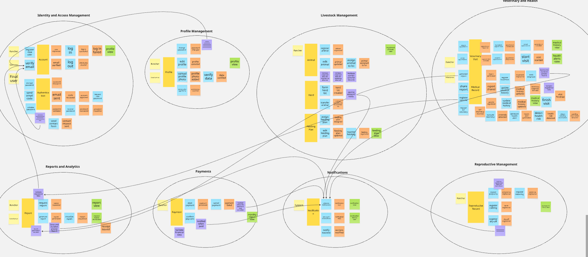

#### 1. IAM Bounded Context
Este contexto abarca la gestión de identidad y accesos. Permite modelar los comandos y eventos involucrados en el registro, autenticación y manejo de roles de los usuarios de la plataforma.
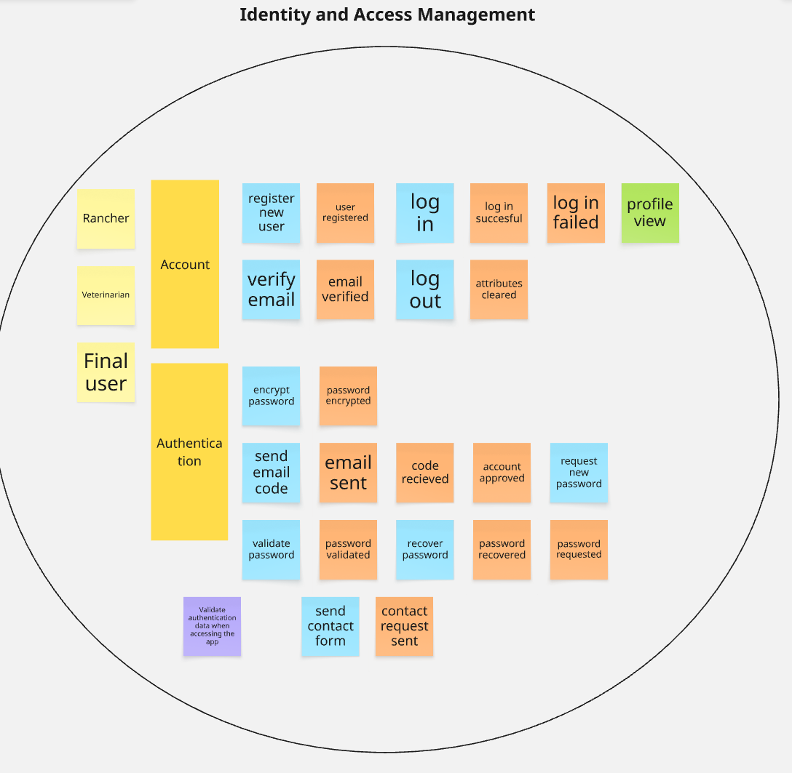

#### 2. Profile Management Bounded Context
Encargado de los eventos relacionados con el manejo de perfiles y la configuración. En este contexto se define cómo los usuarios actualizan su información personal y los datos generales de su ganadería.
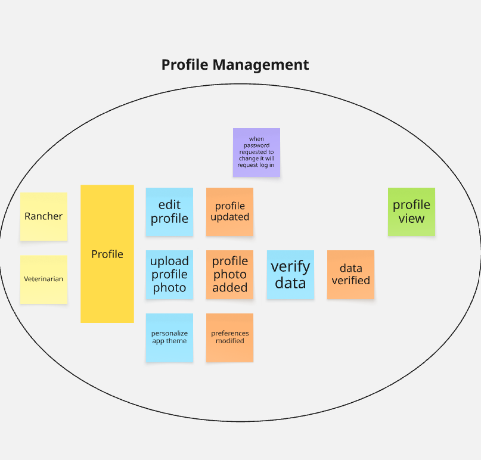

#### 3. Livestock Management Bounded Context
Gestiona el inventario de animales y lotes. Aquí se detallan los eventos para registrar nuevos animales, asignarlos a lotes, actualizar sus características físicas y monitorear su estado a lo largo del tiempo.
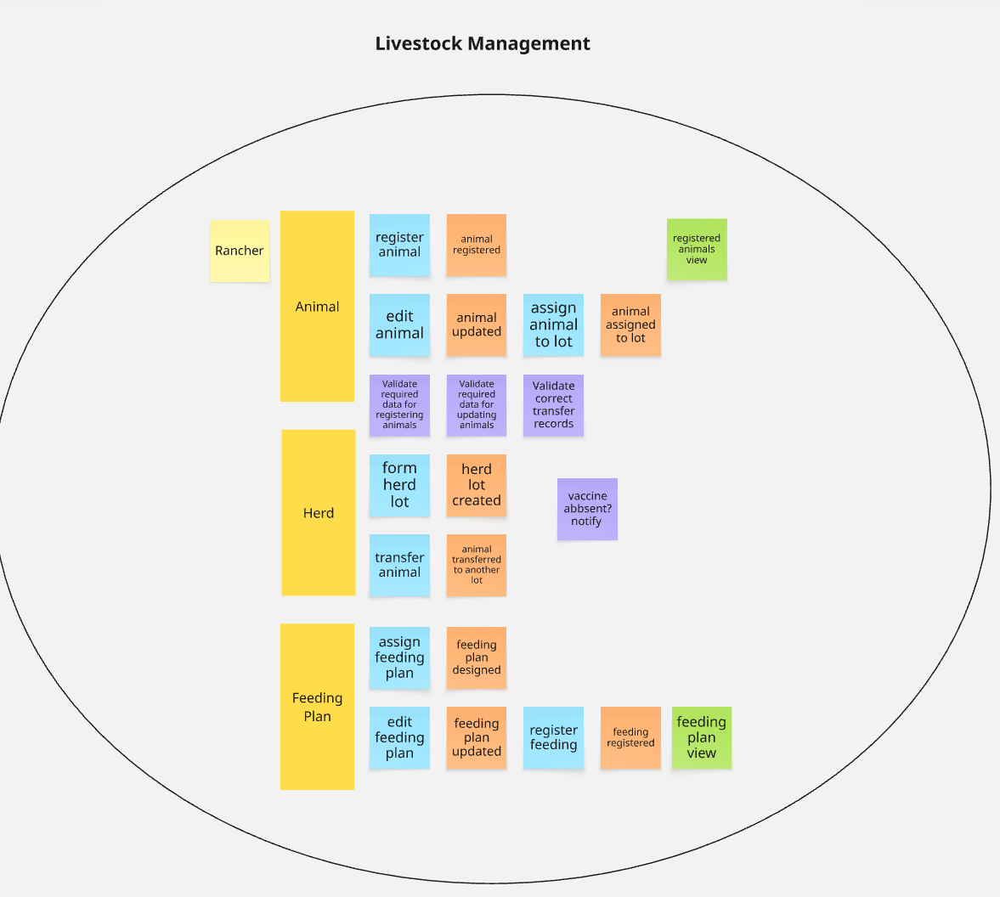

#### 4. Veterinary Health Bounded Context
Se centra en el control sanitario del ganado. Incluye los comandos y eventos para la programación de citas, emisión de diagnósticos, registro de vacunaciones y aplicación de tratamientos.
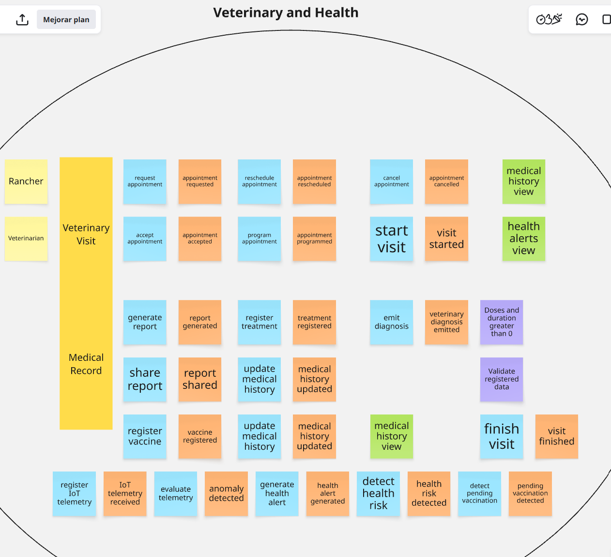

#### 5. Reproductive Management Bounded Context
Modelado en torno al ciclo reproductivo, este contexto captura los eventos clave como el registro de celos, inseminaciones, control de gestaciones y la atención de partos.
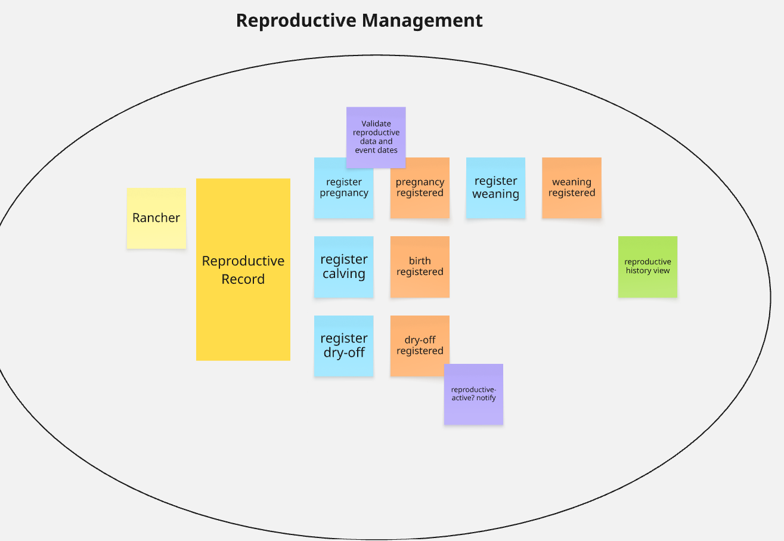

#### 6. Payments Bounded Context
Controla los procesos financieros del sistema. Aquí se manejan los eventos relacionados a la validación de métodos de pago, el cobro de planes de suscripción y la generación de comprobantes.
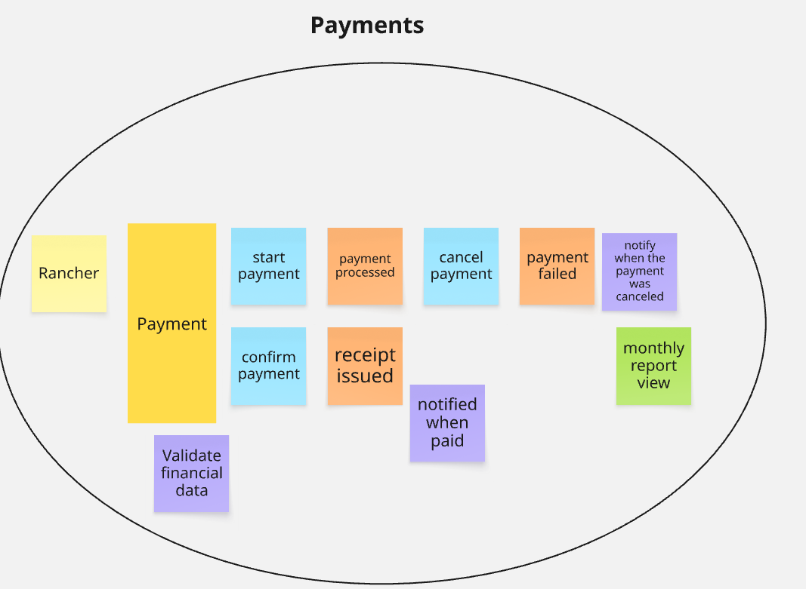

#### 7. Reports & Analytics Bounded Context
Enfocado en la generación de valor a partir de los datos. Contempla los eventos necesarios para procesar información operativa y de salud, generando métricas de productividad y resúmenes estadísticos.
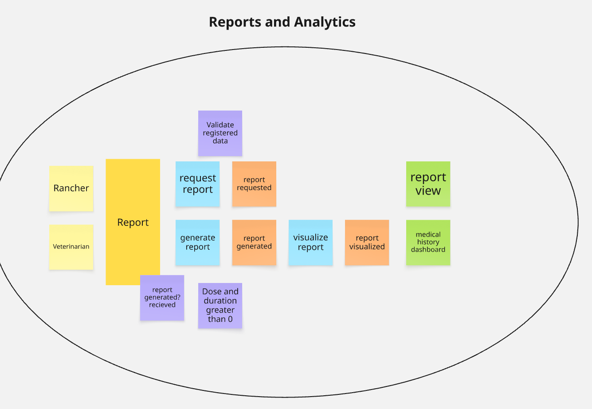

#### 8. Recipes Management Bounded Context
Este contexto administra los planes de alimentación. Refleja los eventos que permiten formular dietas balanceadas, registrar recetas nutricionales y gestionar las raciones para el ganado.
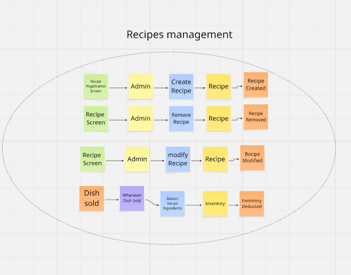
### 4.6.2. Software Architecture Context Diagram

El diagrama de contexto presenta al sistema Vantara y las principales entidades que interactúan con él. El productor ganadero utiliza la plataforma para gestionar el inventario de animales, lotes, planes de alimentación, citas y pagos. El médico veterinario consulta y administra información clínica, diagnósticos, tratamientos, vacunas y certificados de trazabilidad. Además, Vantara se integra mediante HTTPS con un proveedor externo de autenticación, una pasarela de pagos y un servicio de notificaciones push.

La plataforma centraliza la información operativa y clínica, valida la identidad de los usuarios, procesa las transacciones y envía alertas sobre citas y eventos relevantes del sistema.

### 4.6.3. Software Architecture Container Diagrams

### 4.6.4. Software Architecture Components Diagrams

## 4.7. Software Object-Oriented Design

### 4.7.1. Class Diagrams

A continuación se presentan los diagramas de clases correspondientes a cada Bounded Context identificado en la arquitectura de la solución. Cada diagrama detalla las entidades principales, sus atributos, métodos y las relaciones entre ellas.

#### 1. IAM (Identity and Access Management) Bounded Context
Este Bounded Context se encarga de gestionar la seguridad, autenticación y autorización de los usuarios en la plataforma. Sus clases representan las credenciales, roles (como Ganadero o Veterinario) y sesiones de los usuarios.

#### 2. Profile Bounded Context
Gestiona la información personal y la configuración de los perfiles de usuario dentro del sistema, así como la información general de la ganadería. Contiene clases que modelan los datos de contacto y preferencias.

#### 3. Livestock Bounded Context
Este Bounded Context abarca la gestión del inventario animal. Sus clases principales modelan a los animales individuales, sus características físicas, estado, raza y su agrupación en lotes para una gestión más eficiente.

#### 4. Veterinary Bounded Context
Se enfoca en la gestión de la salud y el historial clínico del ganado. Contiene clases que representan diagnósticos, tratamientos, vacunaciones y citas veterinarias, permitiendo un control sanitario riguroso.

#### 5. Reproductive Bounded Context
Encargado de registrar el ciclo reproductivo del ganado. Incluye clases para modelar eventos como celos, inseminaciones, gestaciones y partos, facilitando la planificación y el seguimiento reproductivo.

#### 6. Payments Bounded Context
Maneja la lógica de facturación, transacciones y suscripciones de la plataforma. Sus clases modelan los pagos realizados, los planes de suscripción y el historial de facturación de los usuarios.

#### 7. Reports Bounded Context
Responsable de la recopilación y consolidación de datos. Sus clases estructuran la generación de reportes estadísticos, resúmenes de productividad y exportación de datos operativos y sanitarios para la toma de decisiones.

#### 8. Notifications Bounded Context
Administra las comunicaciones con el usuario. Sus clases estructuran la configuración y el envío de alertas, recordatorios y notificaciones sobre eventos críticos (como tratamientos pendientes o citas).

## 4.8. Database Design

### 4.8.1. Database Diagrams

A continuación, se presentan los Database Diagrams para cada Bounded Context de la solución. Estos diagramas detallan las tablas, columnas, restricciones (como llaves primarias `PK` y foráneas `FK`) y las relaciones que permitirán la persistencia de los objetos del dominio en una base de datos relacional. 

Adicionalmente, al final de la sección se incluye una **vista general de la base de datos** utilizando diagrama UML, que integra todos los Bounded Contexts, dado que representan un esquema consolidado para la plataforma.

#### 1. Identity and Access Management (IAM)
Este esquema gestiona las credenciales de acceso, cuentas y roles. Las tablas principales incluyen la definición de roles y las cuentas de usuario, asegurando que la autenticación sea consistente y segura.

#### 2. Profile Management
Se enfoca en almacenar los perfiles de los usuarios y su asociación con una cuenta del sistema. Permite guardar la información demográfica, de contacto y los datos de las ganaderías.

#### 3. Livestock Management
Este esquema persiste toda la información relacionada con los animales, sus lotes, movimientos y planes de alimentación. Incluye tablas robustas que relacionan a los animales con sus padres (trazabilidad genealógica), su ubicación (lotes) y su dieta.

#### 4. Veterinary Health
Contiene las tablas necesarias para registrar las citas veterinarias, los historiales médicos, los diagnósticos y los tratamientos aplicados a los animales, incluyendo el catálogo de medicamentos.

#### 5. Reproductive Management
Almacena la información del ciclo reproductivo de los animales, incluyendo las gestaciones, fechas estimadas de parto y las crías resultantes, enlazándose directamente con el registro de inventario de animales.

#### 6. Payments
Gestiona el almacenamiento de las transacciones financieras. Sus tablas incluyen los pagos generados, transacciones asociadas a métodos de pago y los recibos de cobro por suscripciones o servicios veterinarios.

#### 7. Reports and Analytics
Estructura la información para generar y compartir reportes. Relaciona quién generó el reporte, sobre qué animales o ganadería trata y con qué usuarios del sistema se han compartido los resultados.

#### 8. Notifications
Persiste las notificaciones y alertas dirigidas a los usuarios. Su tabla principal registra el mensaje, el estado de lectura y el usuario destinatario.

#### Vista General de Base de Datos (Entity-Relationship)

Para integrar las relaciones consolidadas de todos los Bounded Contexts y comprender la estructura completa del sistema Vantara, presentamos el siguiente diagrama unificado modelado en UML (PlantUML).

# Capítulo V: Product Implementation, Validation & Deployment

## 5.1. Software Configuration Management

### 5.1.1. Software Development Environment Configuration

#### Gestión del Proyecto
Para la coordinación del proyecto y el seguimiento del trabajo colaborativo se utilizaron plataformas de comunicación, almacenamiento y gestión ágil. El código fuente de la Landing Page y del informe se centralizó en una organización de GitHub. Las reuniones virtuales del equipo y coordinaciones diarias se realizaron mediante Discord y WhatsApp, mientras que la planificación y asignación de tareas se gestionó a través de Zoho Sprints.

* **Coordinación de código y repositorios:** GitHub
* **Reuniones virtuales y syncs:** Discord
* **Comunicación diaria:** WhatsApp
* **Organización y seguimiento de tareas (Agile):** Zoho Sprints

#### Gestión de Requerimientos
Durante la fase de análisis y estructuración de requerimientos, se empleó UXPressia para diseñar las User Personas, Mapas de Empatía e Impact Maps. Se utilizó Miro para la construcción de escenarios As-Is / To-Be y los tableros de Event Storming.

* **Diseño UX y Mapas de Impacto:** UXPressia
* **Event Storming y Escenarios:** Miro
* **Gestión de User Stories:** Zoho Sprints / GitHub Projects

#### Diseño de Experiencia e Interfaz del Producto
Para la concepción visual de la Landing Page y la maquetación preliminar de las interfaces de la plataforma, el equipo empleó Figma. Se elaboraron wireframes y maquetas de alta fidelidad para validar la estructura visual, paleta de colores y la disposición de las secciones informativas antes de su codificación.

* **Diseño de Interfaz y Prototipado:** Figma

#### Desarrollo de Software
El desarrollo de la Landing Page responsiva se realizó utilizando tecnologías web estándar (HTML5, CSS3, JavaScript / Frameworks Web). El informe del proyecto se redactó en formato Markdown (.md). Para el desarrollo del código y del informe se emplearon editores e IDEs como Visual Studio Code, WebStorm e IntelliJ IDEA, administrados mediante JetBrains ToolBox para mantener la homogeneidad del entorno.

* **IDEs y Editores:** Visual Studio Code, WebStorm, IntelliJ IDEA
* **Gestor de IDEs:** JetBrains ToolBox

#### Documentación de Software
La documentación técnica del informe se gestionó en archivos Markdown (.md) sincronizados con el repositorio central del grupo en GitHub mediante la metodología Git Flow, asegurando un trabajo colaborativo ordenado.

#### Despliegue de Software
Para la publicación de la Landing Page como primer entregable accesible al público, se utilizó GitHub Pages, plataforma que permite el alojamiento continuo desde la rama principal del repositorio.

* **Landing Page:** GitHub Pages / Vercel

---

### 5.1.2. Source Code Management

#### Estructura de Ramas Git Flow
Para mantener un historial de cambios limpio y organizado en el repositorio de la Landing Page e Informe, el equipo aplicó el modelo Git Flow:

* `main`: Mantiene el código estable y listo para publicación final.
* `develop`: Rama de integración donde se unen las características desarrolladas antes de pasar a la versión final.
* `feature/*`: Ramas individuales creadas para desarrollar secciones específicas (ej. `feature/US001-landing-hero`, `feature/capitulo-5`).
* `hotfix/*`: Ramas de corrección rápida para solucionar observaciones de formato o visualización.

#### Versionado Semántico (Semantic Versioning)
Se aplica la nomenclatura **Semantic Versioning 2.0.0** (`MAJOR.MINOR.PATCH`):
* `1.0.0` $\rightarrow$ Release inicial completado para la Entrega 1 (Landing Page publicada e Informe finalizado).

#### Estándar de Commit (Conventional Commits)
El equipo adoptó el estándar Conventional Commits para registrar los avances:
* `feat:` Nueva sección o funcionalidad en la Landing Page (ej. `feat(landing): add contact form section`).
* `docs:` Cambios o avances en la documentación del informe (ej. `docs(cap5): add configuration management section`).
* `style:` Ajustes estéticos, CSS o formato Markdown.
* `fix:` Correcciones de errores visuales o enlaces rotos.

---

### 5.1.3. Source Code Style Guide & Conventions

Se estableció el uso del idioma inglés para las clases CSS, identificadores y nombres de archivos de la Landing Page a fin de preservar estándares de desarrollo profesional.

#### Convenciones de Código Web (HTML5 / CSS3)
* **Nombres de etiquetas y atributos:** Siempre en minúsculas.
* **Archivos y carpetas:** Formato `kebab-case` (ej. `landing-style.css`, `hero-banner.png`).
* **Clases e Identificadores CSS:** Formato `kebab-case` descriptivo (ej. `.navbar-container`, `#contact-form`).
* **Atributos accesibles:** Inclusión obligatoria de atributos `alt` en imágenes y sintaxis semántica (`<header>`, `<section>`, `<footer>`).

---

### 5.1.4. Software Deployment Configuration

#### Despliegue de la Landing Page
1. Verificación de maquetación responsiva en navegador mediante herramientas de inspección web.
2. Fusión de los cambios validados en la rama `develop` hacia la rama `main` mediante Pull Request.
3. Activación de GitHub Pages desde la configuración del repositorio (`Settings > Pages`), estableciendo la rama `main` como origen de despliegue.
4. Generación automática del enlace público por parte de GitHub Pages y verificación de navegación activa.

---

## 5.2. Landing Page, Services & Applications Implementation

### 5.2.1. Sprint 1

#### 5.2.1.1. Sprint Planning 1

| Campo | Detalle |
| :--- | :--- |
| **Sprint #** | Sprint 1 |
| **Date** | 2026-05-05 |
| **Time** | 07:00 PM |
| **Location** | Reunión virtual mediante Discord |
| **Prepared By** | Meza Tataje, David |
| **Attendees** | Linares Rodríguez, Franco Orlando / Ayllón Pauccar, Juan David / Taza Curay, Eduardo Miguel / Asmat Alminco, Martín / Meza Tataje, David |
| **Sprint 0 Review Summary** | No aplica. Corresponde al primer Sprint del proyecto, por lo que no existe un sprint anterior del cual reportar resultados. |
| **Sprint 0 Retrospective Summary** | No aplica. Al ser el Sprint inicial, el equipo realizó una reunión de Kickoff donde se definieron los acuerdos de trabajo, herramientas de comunicación, convenciones de código (Git Flow y Conventional Commits) y la distribución inicial de responsabilidades entre los integrantes. |
| **Sprint 1 Goal** | Diseñar, desarrollar, verificar y desplegar la Landing Page completa y responsiva de Hatarium, e implementar la documentación técnica de los Capítulos I al V del informe para el primer entregable (TB1). |
| **Sprint 1 Velocity** | 12 Story Points |
| **Sum of Story Points** | 12 |

---

#### 5.2.1.2. Aspect Leaders and Collaborators

| Integrante | Rol / Aspecto Líder | Responsabilidades Principales en Sprint 1 |
| :--- | :--- | :--- |
| **Meza Tataje, David** | Team Lead / Frontend Developer | Coordinación del Sprint 1, maquetación CSS/HTML responsiva del Header y Navbar de la Landing Page, y redacción de los Capítulos III y V del informe. |
| **Linares Rodríguez, Franco Orlando** | Frontend Developer / QA | Desarrollo de las secciones Hero y About Us de la Landing Page, elaboración de pruebas Gherkin y redacción del Capítulo I del informe. |
| **Ayllón Pauccar, Juan David** | UX/UI Lead / Frontend Developer | Prototipado en Figma, maquetación de la sección de Funcionalidades y Servicios en la Landing Page, y redacción del Capítulo II del informe. |
| **Taza Curay, Eduardo Miguel** | Frontend Developer / Requirements | Desarrollo de la sección de Contacto, formulario web con validaciones UI, y estructuración de Historias de Usuario y Event Storming. |
| **Asmat Alminco, Martín** | DevOps / Software Architect | Implementación del Footer, configuración del repositorio GitHub (Git Flow), despliegue en GitHub Pages y redacción del Capítulo IV del informe. |

---

#### 5.2.1.3. Sprint Backlog 1

En este primer Sprint, el trabajo del equipo se dividió de manera equitativa entre la maquetación responsiva de la Landing Page de Hatarium y la elaboración técnica de la documentación del informe (Capítulos I al V):

| US / TS / Task ID | Título | Descripción de Tarea | Estimación (Horas) | Integrante Asignado | Estado |
| :--- | :--- | :--- | :---: | :--- | :---: |
| **US001 / CC01** | Header y Navbar Responsivos | Maquetación y estilos responsive del encabezado y menú de navegación. | 4 | Meza Tataje, David | Done |
| **US001 / CC02** | Sección Hero & About Us | Maquetación visual de la sección principal y presentación de la empresa. | 4 | Linares Rodríguez, Franco Orlando | Done |
| **US002 / CC03** | Sección de Servicios y Producto | Maquetación de tarjetas informativas con las funcionalidades del SaaS. | 3 | Ayllón Pauccar, Juan David | Done |
| **US003 / CC04** | Sección de Contacto | Maquetación de la sección informativa de canales de comunicación. | 2 | Taza Curay, Eduardo Miguel | Done |
| **US004 / CC05** | Formulario de Contacto UI | Desarrollo de la interfaz del formulario y validaciones en tiempo real. | 3 | Taza Curay, Eduardo Miguel | Done |
| **TS001 / CC06** | Footer & Enlaces Sociales | Maquetación del pie de página y enlaces a redes de la plataforma. | 2 | Asmat Alminco, Martín | Done |
| **TS001 / CC07** | Despliegue en GitHub Pages | Configuración del pipeline de despliegue continuo desde la rama `main`. | 2 | Asmat Alminco, Martín | Done |
| **DOC01** | Informe Capítulo I | Introducción, problema, objetivos, justificación y restricciones. | 5 | Linares Rodríguez, Franco Orlando | Done |
| **DOC02** | Informe Capítulo II | Análisis del dominio, entrevistas, User Personas, Empathy Maps. | 6 | Ayllón Pauccar, Juan David | Done |
| **DOC03** | Informe Capítulo III | Impact Mapping, Event Storming, 40 US + 12 TS y Product Backlog. | 8 | Meza Tataje, David / Taza Curay, Eduardo M. | Done |
| **DOC04** | Informe Capítulo IV | Arquitectura de Software, Estilo de Arquitectura y Vista de Contexto C4. | 6 | Asmat Alminco, Martín | Done |
| **DOC05** | Informe Capítulo V | Configuration Management, Sprint Planning 1 y Evidencias de Sprint. | 5 | Meza Tataje, David | Done |

---

#### 5.2.1.4. Development Evidence for Sprint Review

Durante el Sprint 1 se establecieron los repositorios centrales del proyecto en GitHub:
* **Repositorio del Informe:** `https://github.com/upc-pre-202620-1asi0729-7800-vantara/vantara-report`
* **Repositorio de la Landing Page:** `https://github.com/upc-pre-202620-1asi0729-7800-vantara/vantara-website`

---

#### 5.2.1.5. Execution Evidence for Sprint Review

Durante el Sprint 1 se implementaron y ejecutaron satisfactoriamente las evidencias de software correspondientes a la **Landing Page de Hatarium**, abarcando la maquetación interactiva, la navegabilidad y la validación de interfaz:

* **Landing Page de Hatarium (US001, US002, US003):**
  Se desarrolló la landing page completa incorporando las secciones principales: *Hero / Inicio*, *About Us / Nosotros*, *Services & Product / Funcionalidades*, *About the Team / Equipo* y *Contact / Contacto*. La plataforma es totalmente responsiva y permite la navegación fluida entre secciones mediante desplazamiento suave (*scroll suave*), facilitando que los visitantes, ganaderos y médicos veterinarios conozcan la propuesta de valor del SaaS antes del lanzamiento del panel web.

* **Formulario de Contacto (US004):**
  Se implementó la interfaz del formulario de contacto con validaciones en tiempo real en el frontend. El sistema detecta automáticamente campos obligatorios vacíos (nombre, correo electrónico, mensaje) y formatos de correo inválidos, desplegando mensajes de alerta descriptivos. Al completar el envío correctamente, la interfaz muestra una notificación de confirmación para el usuario.

  <td>
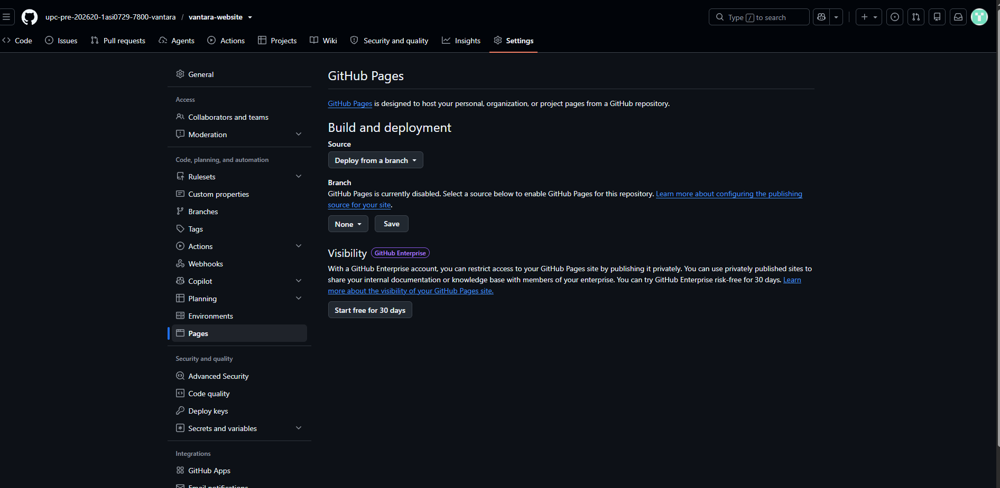
</td>

---

#### 5.2.1.6. Services Documentation Evidence for Sprint Review

#### 5.2.1.7. Software Deployment Evidence for Sprint Review

Durante el Sprint 1 se realizó el despliegue de la **Landing Page de Hatarium** como el primer entregable público de la plataforma SaaS.

* **Plataforma utilizada:** GitHub Pages
* **Pasos realizados para el despliegue:**
  1. Se desarrolló la landing page en el repositorio central de la organización `upc-pre-202620-1asi0729-7800-vantara`.
  2. Se configuró GitHub Pages desde la sección `Settings > Pages` del repositorio, seleccionando la rama `main` como fuente de publicación.
  3. GitHub Pages procesó los archivos estáticos y generó automáticamente la URL pública del sitio.
  4. Se realizó la verificación funcional accediendo a la URL generada desde distintos navegadores y dispositivos móviles para validar el diseño responsivo y la navegación.

* **URL de la Landing Page:** `https://upc-pre-202620-1asi0729-7800-vantara.github.io/vantara-website/`

#### 5.2.1.8. Team Collaboration Insights during Sprint

Durante el Sprint 1, el equipo mantuvo una comunicación fluida y organizada para asegurar el cumplimiento simultáneo del desarrollo de la Landing Page y la consolidación del informe del proyecto:

##### Project Management
* **Discord:** Canal principal para reuniones diarias (Daily Standups), sesiones de pair-programming para la Landing Page y resolución de dudas sobre la documentación.
* **Google Meet:** Plataforma utilizada para las reuniones formales de Sprint Planning 1, revisión del avance y retrospectiva del primer hito (TB1).
* **WhatsApp:** Medio de comunicación rápida para alertas y coordinación inmediata entre integrantes.
* **Zoho Sprints:** Herramienta utilizada para la gestión ágil del tablero Kanban del Sprint 1, control de estados (*To Do*, *In Process*, *Done*) y asignación de tareas por integrante.

##### Source Code Management
Se utilizó **GitHub** como repositorio centralizado bajo la organización del equipo. Se siguió el modelo **Git Flow**, creando ramas de trabajo de tipo `feature/` vinculadas a cada sección del informe o componente de la Landing Page, aplicando estrictamente el estándar de **Conventional Commits** (`feat:`, `docs:`, `style:`, `fix:`).

##### Distribución del trabajo por integrante:

| Integrante | Tareas Principales en Sprint 1 |
| :--- | :--- |
| **Linares Rodríguez, Franco Orlando** | Maquetación de la sección Hero y About Us de la Landing Page; redacción del Capítulo I del informe y diseño de criterios de aceptación Gherkin. |
| **Ayllón Pauccar, Juan David** | Maquetación de la sección de Funcionalidades y Servicios; diseño del prototipo interactivo en Figma y redacción del Capítulo II (Análisis de Dominio). |
| **Taza Curay, Eduardo Miguel** | Implementación de la sección de Contacto y formulario web con validaciones UI; apoyo en el diseño del Event Storming y Product Backlog (Capítulo III). |
| **Asmat Alminco, Martín** | Maquetación del Footer y componentes de pie de página; configuración del repositorio central, Git Flow, despliegue en GitHub Pages y redacción del Capítulo IV (Arquitectura). |
| **Meza Tataje, David** | Coordinación del Sprint 1; maquetación y estilos CSS responsivos del Header y Navbar de la Landing Page; redacción y estructuración técnica del Capítulo III y Capítulo V del informe. |

## 5.3. Validation Interviews

### 5.3.1. Diseño de Entrevistas

### 5.3.2. Registro de Entrevistas

### 5.3.3. Evaluaciones según heurísticas

## 5.4. Video About-the-Product
# Conclusiones y Recomendaciones

## Conclusiones

- Hatarium responde a una necesidad real del sector ganadero, al centralizar la información relacionada con el ganado y su atención veterinaria. A partir de las entrevistas, se identificó que el manejo de información clínica y el seguimiento de los animales pueden resultar dispersos y poco eficientes cuando no existe una herramienta especializada.

- La gestión de historiales clínicos es uno de los principales aportes de la solución. Hatarium permite organizar información relevante de cada animal, facilitando que el veterinario pueda consultar antecedentes y tomar decisiones con mayor información durante una atención.

- El seguimiento de tratamientos y controles veterinarios mejora la continuidad de la atención. La propuesta permite registrar información como tratamientos, vacunas y controles, evitando depender exclusivamente de registros manuales o información dispersa.

- El proyecto se diseñó considerando las necesidades de sus usuarios principales, especialmente veterinarios y productores ganaderos. Las funcionalidades fueron definidas a partir de sus necesidades y posteriormente representadas mediante historias de usuario, flujos, wireframes y mockups.

- El análisis del dominio permitió estructurar mejor la solución. Mediante Event Storming y la identificaación de Bounded Contexts, se logró separar las principales responsabilidades del sistema y representar de manera más clara cómo interactúan los diferentes procesos relacionados con la gestión del ganado y la salud animal.

- El diseño de la interfaz busca facilitar el acceso a información importante sin sobrecargar al usuario. La aplicación de Style Guidelines, jerarquía tipográfica, colores, componentes y principios de diseño permitió construir una propuesta visual consistente y orientada a la usabilidad.

- Los prototipos permiten validar la solución antes de su implementación. Los wireframes muestran la estructura y navegación, mientras que los mockups permiten visualizar la experiencia final con mayor detalle. Los wireflows y user flows complementan esto mostrando cómo el usuario completa tareas concretas dentro del sistema.

- Hatarium tiene potencial para convertirse en una herramienta integral de gestión veterinaria y ganadera. La estructura planteada permite incorporar posteriormente nuevas funcionalidades, como reportes, indicadores de salud, alertas, seguimiento histórico y otras herramientas que ayuden a mejorar la gestión de los animales.

## Recomendaciones

Se recomienda que Vantara priorice el desarrollo y validación de un producto mínimo viable de Hatarium, enfocado inicialmente en las necesidades principales de los ganaderos: registro de animales, organización por lotes, historiales clínicos, control de alimentación, seguimiento reproductivo y alertas sanitarias. Estas funciones deben ser sencillas, accesibles desde dispositivos móviles y adaptadas a contextos donde la conectividad puede ser limitada.

Como siguiente etapa, se recomienda incorporar el módulo para médicos veterinarios, permitiendo consultar historiales autorizados, registrar diagnósticos, tratamientos, vacunas y citas. Antes de ampliar el producto con reportes o funciones avanzadas, se deben realizar entrevistas y pruebas de usabilidad con ganaderos y veterinarios para comprobar que las tareas principales se completan de manera clara y eficiente. Los resultados deben utilizarse para priorizar el backlog y corregir las dificultades encontradas.

Finalmente, se recomienda completar la documentación pendiente de los capítulos de requisitos, diseño, implementación y validación, incluyendo entrevistas, historias de usuario, diagramas, evidencias de desarrollo y resultados de pruebas. También es importante unificar el uso de los nombres AgroCare, Vantara y Hatarium en todo el informe y la página web, además de reforzar la seguridad, los permisos de acceso, las copias de respaldo y la accesibilidad de la plataforma.

# Bibliografía

Agronegocios. (2023, 5 mayo). Cinco apps que le ayudan a gestionar una finca dedicada a las actividades ganaderas. AGRONEGOCIOS. https://www.agronegocios.co/finca/cinco-apps-que-le-ayudan-a-gestionar-una-finca-dedicada-a-las-actividades-ganaderas-3609083

# Anexos

