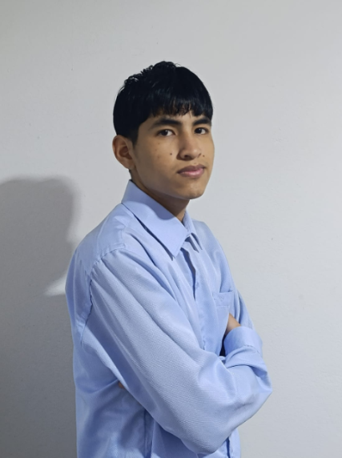

# Capítulo I: Introducción

## 1.1. Startup Profile
En este capítulo se presenta la información general de Vantara como startup, incluyendo su descripción, misión, visión y los perfiles de los integrantes del equipo. Asimismo, se expone el perfil de la solución propuesta, que abarca el análisis de antecedentes y la problemática identificada, el proceso Lean UX aplicado, y la definición de los segmentos objetivo.
### 1.1.1. Descrición de Startup
Vantara es una startup peruana de tecnología agropecuaria fundada por un equipo de estudiantes de
Ingeniería de Software de la Universidad Peruana de Ciencias Aplicadas(UPC). Nace como respuesta a una
problemática real y urgente en el sector ganadero peruano: la ausencia de herramientas digitales accesibles que
permitan a los productores, tanto independientes como empresariales, gestionar su ganado de manera
eficiente, trazable y sostenible.

| Misión                                                                                                                                                                                                                                                                                                                                                                                       | Visión                                                                                                                                                      |
|----------------------------------------------------------------------------------------------------------------------------------------------------------------------------------------------------------------------------------------------------------------------------------------------------------------------------------------------------------------------------------------------|-------------------------------------------------------------------------------------------------------------------------------------------------------------|
| Empoderar a los ganaderos peruanos con una plataforma tecnológica accesible que simplifique la gestión de su ganado, mejore su productividad y promueva una ganadería sostenible y responsable. | Ser la plataforma de gestión ganadera líder en Latinoamérica, impulsando la transformación digital del sector agropecuario con tecnología innovadora al servicio del bienestar animal y el desarrollo rural. |

### 1.1.2. Perfiles de integrantes del equipo
|                                                                                     |Integrantes del equipo|Código de estudiante| Carrera | Conocimientos/Habilidades                                                                                                                                                                                                                                                      |
|-------------------------------------------------------------------------------------| --- | --- | --- |--------------------------------------------------------------------------------------------------------------------------------------------------------------------------------------------------------------------------------------------------------------------------------|
|  | Franco Orlando Linares Rodríguez | U20241B645 | Ingeniería de Software |Soy Franco Linares, estudiante de Ingeniería de Software en el 5 ciclo. Desde el primer momento que elegí mi carrera sabía que había tomado una buena decisión. En los últimos 3 años he aprendido lo apasionado que soy con la programación, específicamente con el lenguaje programación C++ donde he desarrollado mis habilidades durante la carrera. También cuento con conocimientos en básicos en HTML5, CCS3 y JavaScript, además de conocimientos en lenguajes de consulta de bases de datos como SQL. Me considero respetuoso, solidario, trabajador y bueno trabajando en equipo.|
| imagen | nombre2| codigo2 | Ingeniería de Software |  |
|  | Taza Curay, Eduardo Miguel| U20241D483 | Ingeniería de Software |  Soy estudiante de ingenieria de software, tengo 19 años, lso lenguajes que domino son c++, phyton, html y css. Me considero una persona responsable, justa y imperactiva.    |
| imagen | nombre4 | codigo4 | Ingeniería de Software |                                                                                           |
| imagen | Meza Tataje, David | U202516291 | Ingeniería de Software | Soy David Meza estudiante de Ingeniería de Software, tengo 21 años, con conocimientos en C++, Java y C# a nivel intermedio, además de experiencia básica en el desarrollo de aplicaciones web con HTML, CSS, JavaScript y SQL. Me considero una persona colaboradora y responsable, siempre dispuesto a aprender y a trabajar en equipo para lograr los objetivos del proyecto.                                                                                                                                                                                                                                                                               |

## 1.2. Solution Profile
### 1.2. Solution Profile

#### 1.2.1. Antecedentes y problemática

El sector ganadero peruano representa una actividad económica importante para miles de familias rurales. Según EY Perú (2024), el sector agrario aportó el 3,6 % del PBI nacional en 2023 y empleó aproximadamente al 24 % de la Población Económicamente Activa. Sin embargo, muchos productores ganaderos aún gestionan información mediante registros manuales o herramientas poco centralizadas, dificultando el control de datos relacionados con salud, reproducción, vacunación y producción animal. Esta situación se relaciona con las brechas de digitalización existentes en las zonas rurales de América Latina, señaladas por la CEPAL y FAO (2021).

Ante esta problemática, diferentes investigaciones han demostrado la utilidad de las aplicaciones web en la gestión ganadera y veterinaria. Amado Dávila (2021) desarrolló un sistema web para gestionar procesos como registro de animales, preñez, partos, enfermedades y vacunaciones, facilitando el acceso a la información y la toma de decisiones. Asimismo, Ruiz Villanueva y Escobar Saldaña (2024) evidenciaron mejoras en el registro y consulta de información mediante un sistema web para la gestión veterinaria. De manera similar, Machado et al. (2010) demostraron que las plataformas web pueden apoyar el análisis y la toma de decisiones en sistemas de producción ganadera.

Finalmente, el crecimiento de la conectividad rural favorece la implementación de este tipo de soluciones. Según OSIPTEL (2024), el acceso a internet en hogares rurales del Perú aumentó de 41,5 % en 2019 a cerca del 83 % en 2024, generando mejores condiciones para la adopción de herramientas digitales orientadas a productores ganaderos y médicos veterinarios.

Aplicando la técnica de las 5W's y 2H's, se identificaron los siguientes aspectos clave del problema.

### 1.2.1. Antecedentes y problemática

> What(¿Qué?):

> Who (¿Quién?): 

> Where (¿Dónde?): 

> When (¿Cuándo?):

> Why (¿Por qué?): 

> How (¿Cómo?): 

> How Much (¿Cuánto?): 

### 1.2.2. Lean UX Process

### 1.2.2.1. Lean UX Problem Statements
**Domain:** Gestión tecnológica del sector ganadero peruano.

**Customer Segments:** Productores ganaderos peruanos (independientes y empresariales) que buscan digitalizar
y optimizar la gestión de su ganado, y veterinarios especializados que requieren herramientas para brindar
seguimiento clínico remoto y oportuno a sus pacientes.

**Pain points:** 
* Los ganaderos independientes llevan registros manuales dispersos en cuadernos o Excel, lo que genera
pérdida de información, desorganización y demoras en la atención animal.
*  Las empresas ganaderas enfrentan dificultades para coordinar personal, gestionar grandes volúmenes de
datos y mantener trazabilidad del ganado de manera eficiente.
* Ambos segmentos tienen acceso limitado o tardío a servicios veterinarios, lo que incrementa las pérdidas
por enfermedades prevenibles.
* La baja conectividad en zonas rurales limita el uso de soluciones digitales convencionales.

**Gap:** Existe una brecha significativa entre las necesidades de gestión del sector ganadero peruano y la oferta de
soluciones tecnológicas accesibles, adaptadas al contexto rural local y orientadas a la sostenibilidad y el
bienestar animal.

**Visión / Strategy:** Desarrollar una plataforma web intuitiva, funcional en condiciones de baja
conectividad, que centralice la gestión ganadera y empodere a los productores con información en tiempo real
para tomar decisiones fundamentadas.

**Initial Segment:** Productores ganaderos del Perú, mayores de 18 años, ubicados en zonas rurales o
periurbanas, que manejan diversas especies y buscan mejorar la organización y control de sus operaciones con
herramientas digitales accesibles desde cualquier navegador.

### 1.2.2.2. Lean UX Assumptions
### User Assumptions:
1. Los ganaderos, independientemente de su nivel tecnológico, adoptarán una aplicación si es fácil de usar,
intuitiva y les resuelve problemas concretos de su día a día.

2. Los usuarios están dispuestos a incorporar tecnología si perciben beneficios tangibles en ahorro de
tiempo, reducción de pérdidas y mejora en la salud de sus animales.

3. Los ganaderos y veterinarios utilizarán la plataforma web si esta es compatible con los dispositivos que poseen actualmente (computadoras, tablets o smartphones) y permite acceder fácilmente a la información almacenada.

4. Los usuarios confiarán en la plataforma si garantiza la privacidad de su información productiva y
veterinaria.

5. Las funciones más utilizadas deben estar accesibles en pocos pasos, ya que los ganaderos priorizan
soluciones prácticas y rápidas.

6. Los veterinarios especializados adoptarán la plataforma si les permite hacer seguimiento clínico de sus
pacientes de forma remota, registrar tratamientos y coordinar citas de manera organizada.

### Business Assumptions:
1. Si digitalizamos los registros del ganado, los usuarios mejorarán significativamente la organización y
trazabilidad de su inventario animal.

2. Si proporcionamos herramientas de seguimiento sanitario y registro de controles veterinarios, los ganaderos podrán detectar oportunamente problemas de salud en sus animales y reducir pérdidas económicas asociadas a enfermedades prevenibles.

3. Si proporcionamos herramientas de planificación alimentaria, los productores optimizarán el uso de
recursos y reducirán desperdicios.

4. Si permitimos el seguimiento reproductivo eficiente, los ganaderos incrementarán la productividad de sus
hatos.

5. Si desarrollamos una plataforma web accesible desde distintos dispositivos y con una interfaz sencilla, los ganaderos y veterinarios podrán gestionar la información del ganado de manera eficiente, favoreciendo su adopción tecnológica.

6. Si aseguramos la privacidad y seguridad de los datos, los usuarios confiarán en la plataforma y estarán
dispuestos a almacenar información crítica en ella.

7. Si integramos un módulo para veterinarios que les permita gestionar historiales clínicos y coordinar
atención, incrementaremos la confianza de los ganaderos en la plataforma y fidelizaremos a ambos
segmentos simultáneamente

### 1.2.2.3. Lean UX Hypothesis Statements

### 1.2.2.4. Lean UX Canvas

## 1.3. Segmentos objetivo

