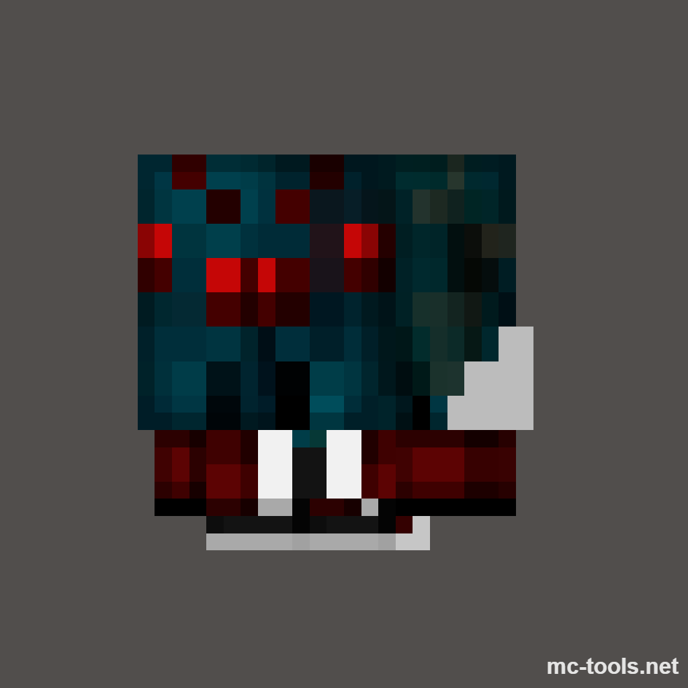

# Capítulo I: Introducción

## 1.1. Startup Profile
En este capítulo se presenta la información general de AgroCare como startup, incluyendo su descripción, misión, visión y los perfiles de los integrantes del equipo. Asimismo, se expone el perfil de la solución propuesta, que abarca el análisis de antecedentes y la problemática identificada, el proceso Lean UX aplicado, y la definición de los segmentos objetivo.
### 1.1.1. Descrición de Startup

| Misión                                                                                                                                                                                                                                                                                                                                                                                       | Visión                                                                                                                                                      |
|----------------------------------------------------------------------------------------------------------------------------------------------------------------------------------------------------------------------------------------------------------------------------------------------------------------------------------------------------------------------------------------------|-------------------------------------------------------------------------------------------------------------------------------------------------------------|
| Empoderar a los ganaderos peruanos con una plataforma tecnológica accesible que simplifique la gestión de su ganado, mejore su productividad y promueva una ganadería sostenible y responsable. | Ser la plataforma de gestión ganadera líder en Latinoamérica, impulsando la transformación digital del sector agropecuario con tecnología innovadora al servicio del bienestar animal y el desarrollo rural. |

### 1.1.2. Perfiles de integrantes del equipo
|                                                                                     |Integrantes del equipo|Código de estudiante| Carrera | Conocimientos/Habilidades                                                                                                                                                                                                                                                      |
|-------------------------------------------------------------------------------------| --- | --- | --- |--------------------------------------------------------------------------------------------------------------------------------------------------------------------------------------------------------------------------------------------------------------------------------|
|  | Franco Orlando Linares Rodríguez | U20241B645 | Ingeniería de Software |  |
| imagen | nombre2| codigo2 | Ingeniería de Software |  |
| imagen | nomnbre3 | codigo3 | Ingeniería de Software |        |
| imagen | nombre4 | codigo4 | Ingeniería de Software |                                                                                           |
| imagen | Meza Tataje, David | U202516291 | Ingeniería de Software | Soy David Meza estudiante de Ingeniería de Software, tengo 21 años, con conocimientos en C++, Java y C# a nivel intermedio, además de experiencia básica en el desarrollo de aplicaciones web con HTML, CSS, JavaScript y SQL. Me considero una persona colaboradora y responsable, siempre dispuesto a aprender y a trabajar en equipo para lograr los objetivos del proyecto.                                                                                                                                                                                                                                                                               |

## 1.2. Solution Profile
### 1.2.1. Antecedentes y problemática

> What(¿Qué?):

> Who (¿Quién?): 

> Where (¿Dónde?): 

> When (¿Cuándo?):

> Why (¿Por qué?): 

> How (¿Cómo?): 

> How Much (¿Cuánto?): 

### 1.2.2. Lean UX Process

### 1.2.2.1. Lean UX Problem Statements
**Domain:** 

**Customer Segments:** 

**Pain points:** 

**Gap:** 

**Visión / Strategy:** 

**Initial Segment:** 

### 1.2.2.2. Lean UX Assumptions
### User Assumptions:

### Business Assumptions:

### 1.2.2.3. Lean UX Hypothesis Statements

### 1.2.2.4. Lean UX Canvas

## 1.3. Segmentos objetivo

