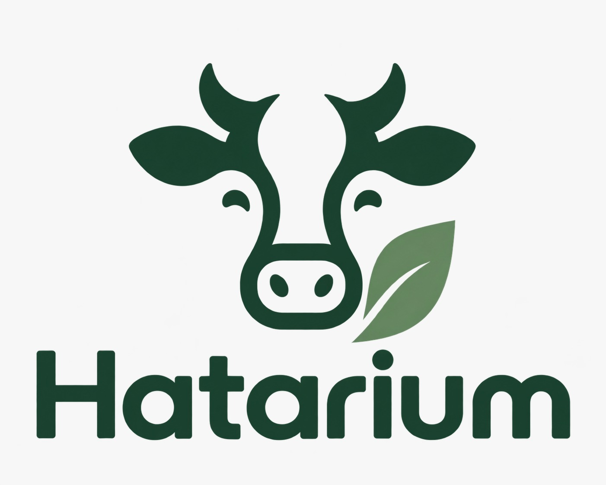
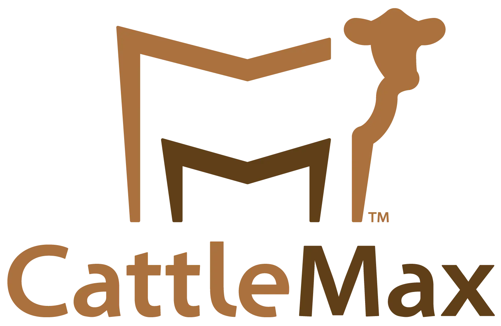
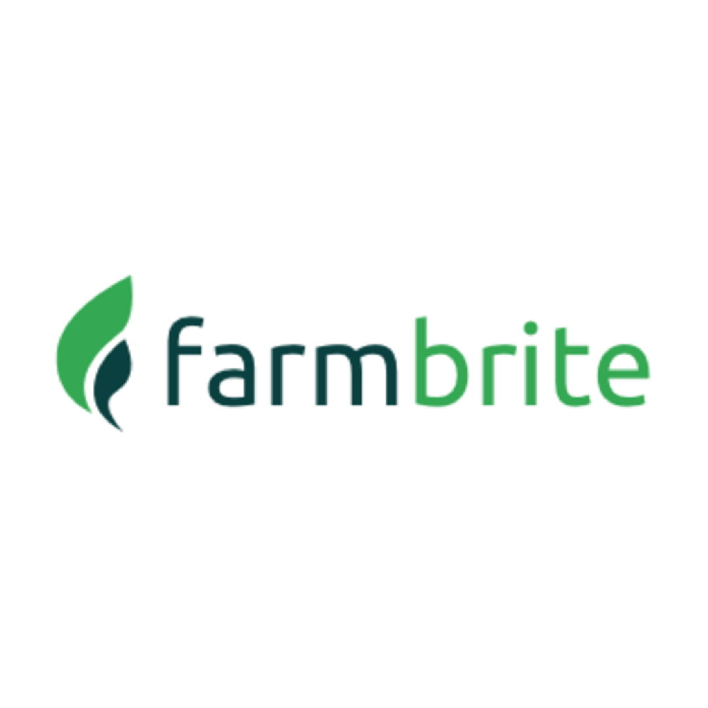

# Capítulo II: Requirements Elicitation & Analysis

## 2.1. Competidores

En esta sección se analiza el panorama competitivo relacionado con las plataformas digitales orientadas a la gestión ganadera. El análisis permite identificar las principales características, fortalezas, debilidades y estrategias de soluciones existentes en el mercado, con el propósito de determinar oportunidades de diferenciación para Vantara.

### 2.1.1. Análisis competitivo

#### Competitive Analysis Landscape

<table border="1" cellspacing="0" cellpadding="7" width="100%">

<tr>
<th colspan="6" align="left">
Competitive Analysis Landscape
</th>
</tr>

<tr>
<th colspan="2" rowspan="2" align="left" valign="middle">
¿Por qué realizar este análisis?
</th>

<th colspan="4" align="left">
Escriba en el recuadro la pregunta que busca responder o el objetivo de este análisis.
</th>
</tr>

<tr>
<td colspan="4" align="left">
El objetivo del análisis es identificar las principales brechas existentes entre las soluciones digitales de gestión ganadera disponibles en el mercado, con el propósito de reconocer oportunidades de diferenciación que permitan posicionar a Vantara como una plataforma accesible y adaptada a las necesidades de los ganaderos y veterinarios del Perú.
</td>
</tr>

<tr>

<th colspan="2" align="left" valign="middle">
(En la cabecera colocar por cada competidor nombre y logo)
</th>

<th align="center" valign="middle">
Vantara
  

</th>

<th align="center" valign="middle">
CattleMax
  

</th>

<th align="center" valign="middle">
Herdwatch
  

</th>

<th align="center" valign="middle">
Farmbrite
  

</th>

</tr>

<tr>

<th rowspan="2" align="center" valign="top">
Perfil
</th>

<th align="center" valign="middle">
Overview
</th>

<td valign="top">
Startup peruana de tecnología agropecuaria enfocada en digitalizar y centralizar la gestión ganadera mediante una plataforma web para productores y veterinarios.
</td>

<td valign="top">
Software especializado en gestión de ganado bovino, orientado al registro y control de información productiva, sanitaria y reproductiva.
</td>

<td valign="top">
Plataforma de gestión ganadera orientada al uso en campo, permitiendo registrar animales, salud, reproducción y productividad.
</td>

<td valign="top">
Plataforma integral para la administración agrícola y ganadera, con herramientas para animales, producción, finanzas e inventarios.
</td>

</tr>

<tr>

<th align="center" valign="middle">
Ventaja competitiva
</th>

<td valign="top">
Adaptación al contexto peruano e integración de ganaderos y veterinarios dentro de una plataforma web centralizada.
</td>

<td valign="top">
Alta especialización en ganado bovino y amplia profundidad en registros reproductivos, productivos y genealógicos.
</td>

<td valign="top">
Facilidad de uso directamente en campo y posibilidad de trabajar en situaciones de conectividad limitada.
</td>

<td valign="top">
Amplia variedad de funcionalidades agrícolas y ganaderas integradas dentro de un mismo sistema.
</td>

</tr>

<tr>

<th rowspan="2" align="center" valign="top">
Perfil de Marketing
</th>

<th align="center" valign="middle">
Mercado Objetivo
</th>

<td valign="top">
Productores ganaderos independientes, empresas ganaderas y médicos veterinarios del Perú.
</td>

<td valign="top">
Productores y criadores de ganado bovino que requieren un control detallado de sus animales.
</td>

<td valign="top">
Pequeños, medianos y grandes productores ganaderos que realizan actividades directamente en campo.
</td>

<td valign="top">
Productores agrícolas y ganaderos de distintos tamaños y con diferentes especies.
</td>

</tr>

<tr>

<th align="center" valign="middle">
Estrategias de Marketing
</th>

<td valign="top">
Posicionamiento basado en accesibilidad, simplicidad, enfoque local y adaptación a las necesidades del sector ganadero peruano.
</td>

<td valign="top">
Promoción de su experiencia en el sector, soporte especializado, capacitación y planes según las necesidades del productor.
</td>

<td valign="top">
Diferenciación mediante facilidad de uso, trabajo en campo y acceso desde distintos dispositivos.
</td>

<td valign="top">
Planes escalonados, recursos educativos y promoción de una solución integral para la administración agropecuaria.
</td>

</tr>

<tr>

<th rowspan="3" align="center" valign="top">
Perfil de Productos
</th>

<th align="center" valign="middle">
Productos y servicios
</th>

<td valign="top">
Registro de ganado. 
Historial sanitario. 
Vacunas y tratamientos. 
Seguimiento reproductivo. 
Gestión de alimentación. 
Reportes. 
Gestión veterinaria.
</td>

<td valign="top">
Inventario bovino. 
Salud y tratamientos. 
Reproducción. 
Partos y destete. 
Pedigrí. 
Pasturas. 
Registros productivos.
</td>

<td valign="top">
Registro de animales. 
Salud y tratamientos. 
Reproducción. 
Partos. 
Control de peso. 
Pasturas. 
Reportes.
</td>

<td valign="top">
Gestión multiespecie. 
Salud. 
Reproducción. 
Alimentación. 
Inventarios. 
Finanzas. 
Reportes y analítica.
</td>

</tr>

<tr>

<th align="center" valign="middle">
Precios y costos
</th>

<td valign="top">
Modelo SaaS de bajo costo orientado al mercado peruano. Precio pendiente de validación.
</td>

<td valign="top">
Planes de suscripción que varían según el número de animales y las necesidades de la operación.
</td>

<td valign="top">
Cuenta con opciones gratuitas y planes de pago según las funcionalidades y tamaño de la explotación.
</td>

<td valign="top">
Planes de suscripción escalonados según las funcionalidades y capacidades requeridas.
</td>

</tr>

<tr>

<th align="center" valign="middle">
Canales de distribución
</th>

<td valign="top">
Plataforma web accesible mediante navegador desde computadoras, laptops, tablets y dispositivos compatibles.
</td>

<td valign="top">
Plataforma web en la nube y acceso mediante dispositivos móviles.
</td>

<td valign="top">
Acceso desde teléfonos, tablets y computadoras.
</td>

<td valign="top">
Plataforma web y aplicaciones para dispositivos móviles.
</td>

</tr>

<tr>

<th rowspan="4" align="center" valign="top">
Análisis SWOT
</th>

<th align="center" valign="middle">
Fortalezas
</th>

<td valign="top">
Adaptación al Perú. 
Integración ganadero-veterinario. 
Información centralizada. 
Interfaz sencilla.
</td>

<td valign="top">
Experiencia en el mercado. 
Especialización bovina. 
Registros detallados. 
Gestión reproductiva avanzada.
</td>

<td valign="top">
Facilidad de uso. 
Trabajo en campo. 
Acceso multiplataforma. 
Soporte para baja conectividad.
</td>

<td valign="top">
Amplia cobertura funcional. 
Soporte multiespecie. 
Gestión financiera. 
Reportes y analítica.
</td>

</tr>

<tr>

<th align="center" valign="middle">
Debilidades
</th>

<td valign="top">
Marca nueva. 
Bajo reconocimiento inicial. 
Menor madurez frente a soluciones consolidadas.
</td>

<td valign="top">
Principalmente orientado a bovinos. 
Poca adaptación específica al mercado peruano.
</td>

<td valign="top">
Orientación principalmente a mercados internacionales. 
Poca adaptación específica al Perú.
</td>

<td valign="top">
Mayor complejidad por su cantidad de funciones. 
Puede resultar excesivo para pequeños productores.
</td>

</tr>

<tr>

<th align="center" valign="middle">
Oportunidades
</th>

<td valign="top">
Digitalización del sector ganadero peruano. 
Mayor conectividad rural. 
Necesidad de centralizar información sanitaria. 
Integración entre productores y veterinarios.
</td>

<td valign="top">
Expansión hacia nuevos mercados. 
Integración con tecnologías de monitoreo ganadero.
</td>

<td valign="top">
Expansión hacia Latinoamérica. 
Crecimiento de la digitalización del trabajo de campo.
</td>

<td valign="top">
Crecimiento de la gestión agropecuaria digital. 
Expansión hacia nuevos mercados y tipos de explotación.
</td>

</tr>

<tr>

<th align="center" valign="middle">
Amenazas
</th>

<td valign="top">
Competidores internacionales. 
Resistencia al cambio tecnológico. 
Limitaciones económicas de algunos productores.
</td>

<td valign="top">
Soluciones más económicas. 
Plataformas multiespecie. 
Nuevos competidores regionales.
</td>

<td valign="top">
Plataformas locales mejor adaptadas. 
Competidores con herramientas analíticas avanzadas.
</td>

<td valign="top">
Soluciones especializadas exclusivamente en ganadería. 
Competidores de menor costo y mayor simplicidad.
</td>

</tr>

</table>

### 2.1.2. Estrategias y tácticas frente a competidores

## 2.2. Entrevistas

### 2.2.1. Diseño de entrevistas

### 2.2.2. Registro de entrevistas

### 2.2.3. Análisis de entrevistas

## 2.3. Needfinding

### 2.3.1. User Personas

### 2.3.2. User Task Matrix

### 2.3.3. User Journey Mapping

### 2.3.4. Empathy Mapping

## 2.4. Big Picture Event Storming

## 2.5. Ubiquitous Language