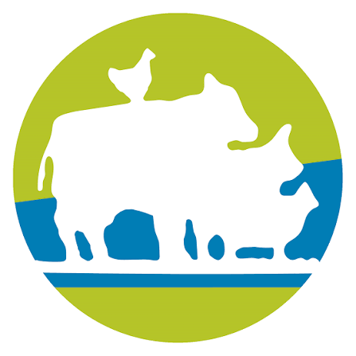
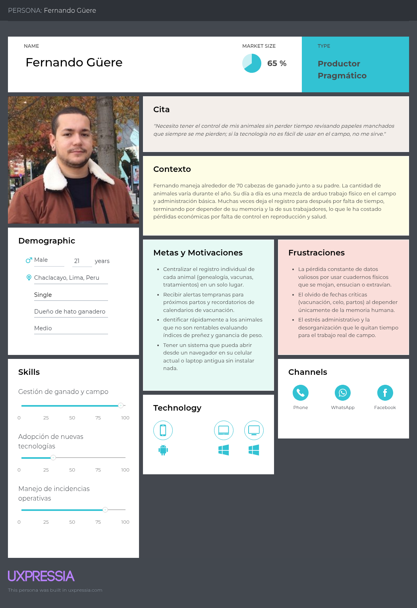
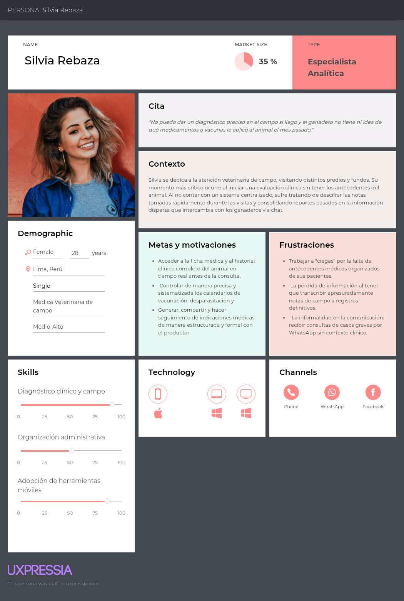
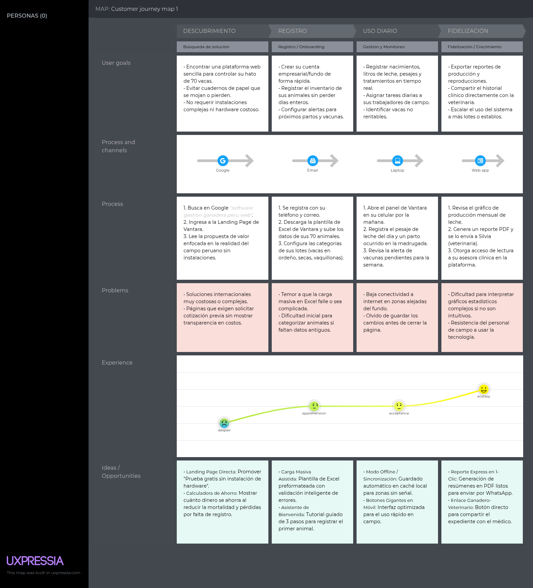
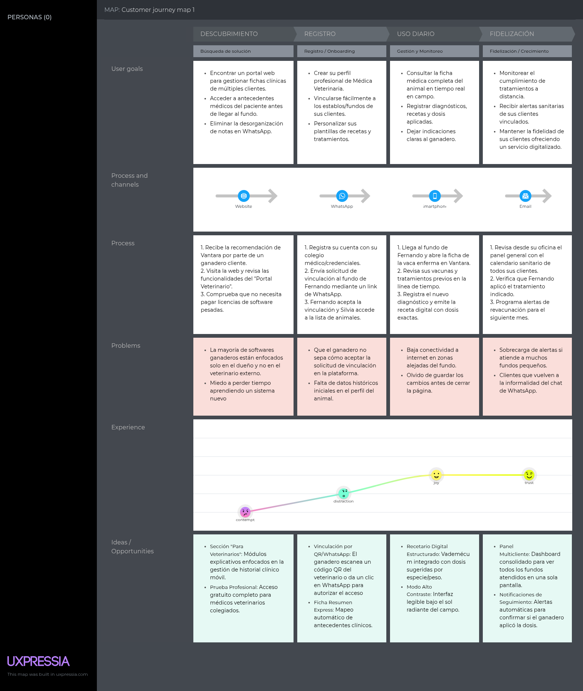
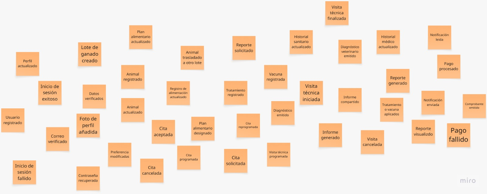
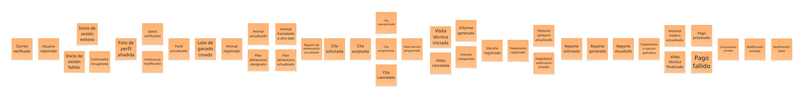
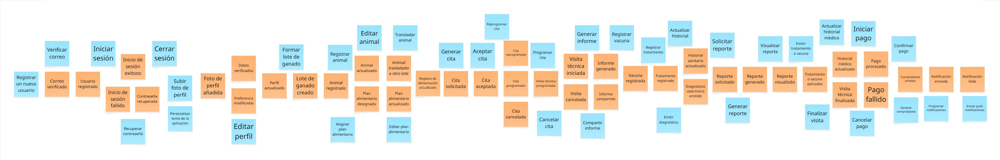
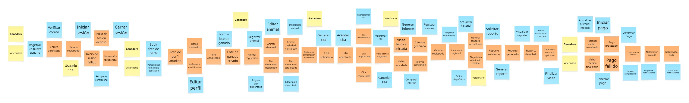
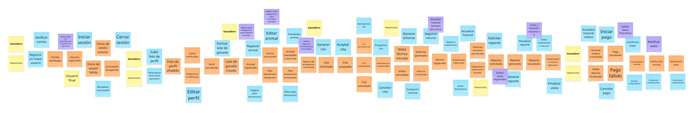

# Capítulo II: Requirements Elicitation & Analysis

## 2.1. Competidores

En esta sección se analiza el panorama competitivo relacionado con las plataformas digitales orientadas a la gestión ganadera. El análisis permite identificar las principales características, fortalezas, debilidades y estrategias de soluciones existentes en el mercado, con el propósito de determinar oportunidades de diferenciación para Vantara.

### 2.1.1. Análisis competitivo

#### Competitive Analysis Landscape

<table border="1" cellspacing="0" cellpadding="7" width="100%">

<tr>
<th colspan="6" align="left">
Competitive Analysis Landscape
</th>
</tr>

<tr>
<th colspan="2" rowspan="2" align="left" valign="middle">
¿Por qué realizar este análisis?
</th>

<th colspan="4" align="left">
Escriba en el recuadro la pregunta que busca responder o el objetivo de este análisis.
</th>
</tr>

<tr>
<td colspan="4" align="left">
El objetivo del análisis es identificar las principales brechas existentes entre las soluciones digitales de gestión ganadera disponibles en el mercado, con el propósito de reconocer oportunidades de diferenciación que permitan posicionar a Vantara como una plataforma accesible y adaptada a las necesidades de los ganaderos y veterinarios del Perú.
</td>
</tr>

<tr>

<th colspan="2" align="left" valign="middle">
(En la cabecera colocar por cada competidor nombre y logo)
</th>

<th align="center" valign="middle">
Vantara
  

</th>

<th align="center" valign="middle">
CattleMax
  

</th>

<th align="center" valign="middle">
Herdwatch
  

</th>

<th align="center" valign="middle">
Farmbrite
  

</th>

</tr>

<tr>

<th rowspan="2" align="center" valign="top">
Perfil
</th>

<th align="center" valign="middle">
Overview
</th>

<td valign="top">
Plataforma web agropecuaria enfocada en digitalizar y centralizar la gestión ganadera mediante una plataforma web para productores y veterinarios.
</td>

<td valign="top">
Software especializado en gestión de ganado bovino, orientado al registro y control de información productiva, sanitaria y reproductiva.
</td>

<td valign="top">
Plataforma de gestión ganadera orientada al uso en campo, permitiendo registrar animales, salud, reproducción y productividad.
</td>

<td valign="top">
Plataforma integral para la administración agrícola y ganadera, con herramientas para animales, producción, finanzas e inventarios.
</td>

</tr>

<tr>

<th align="center" valign="middle">
Ventaja competitiva
</th>

<td valign="top">
Adaptación al contexto peruano e integración de ganaderos y veterinarios dentro de una plataforma web centralizada.
</td>

<td valign="top">
Alta especialización en ganado bovino y amplia profundidad en registros reproductivos, productivos y genealógicos.
</td>

<td valign="top">
Facilidad de uso directamente en campo y posibilidad de trabajar en situaciones de conectividad limitada.
</td>

<td valign="top">
Amplia variedad de funcionalidades agrícolas y ganaderas integradas dentro de un mismo sistema.
</td>

</tr>

<tr>

<th rowspan="2" align="center" valign="top">
Perfil de Marketing
</th>

<th align="center" valign="middle">
Mercado Objetivo
</th>

<td valign="top">
Productores ganaderos independientes, empresas ganaderas y médicos veterinarios del Perú.
</td>

<td valign="top">
Productores y criadores de ganado bovino que requieren un control detallado de sus animales.
</td>

<td valign="top">
Pequeños, medianos y grandes productores ganaderos que realizan actividades directamente en campo.
</td>

<td valign="top">
Productores agrícolas y ganaderos de distintos tamaños y con diferentes especies.
</td>

</tr>

<tr>

<th align="center" valign="middle">
Estrategias de Marketing
</th>

<td valign="top">
Posicionamiento basado en accesibilidad, simplicidad, enfoque local y adaptación a las necesidades del sector ganadero peruano.
</td>

<td valign="top">
Promoción de su experiencia en el sector, soporte especializado, capacitación y planes según las necesidades del productor.
</td>

<td valign="top">
Diferenciación mediante facilidad de uso, trabajo en campo y acceso desde distintos dispositivos.
</td>

<td valign="top">
Planes escalonados, recursos educativos y promoción de una solución integral para la administración agropecuaria.
</td>

</tr>

<tr>

<th rowspan="3" align="center" valign="top">
Perfil de Productos
</th>

<th align="center" valign="middle">
Productos y servicios
</th>

<td valign="top">
Registro de ganado. 
Historial sanitario. 
Vacunas y tratamientos. 
Seguimiento reproductivo. 
Gestión de alimentación. 
Reportes. 
Gestión veterinaria.
</td>

<td valign="top">
Inventario bovino. 
Salud y tratamientos. 
Reproducción. 
Partos y destete. 
Pedigrí. 
Pasturas. 
Registros productivos.
</td>

<td valign="top">
Registro de animales. 
Salud y tratamientos. 
Reproducción. 
Partos. 
Control de peso. 
Pasturas. 
Reportes.
</td>

<td valign="top">
Gestión multiespecie. 
Salud. 
Reproducción. 
Alimentación. 
Inventarios. 
Finanzas. 
Reportes y analítica.
</td>

</tr>

<tr>

<th align="center" valign="middle">
Precios y costos
</th>

<td valign="top">
Modelo SaaS de bajo costo orientado al mercado peruano. Precio pendiente de validación.
</td>

<td valign="top">
Planes de suscripción que varían según el número de animales y las necesidades de la operación.
</td>

<td valign="top">
Cuenta con opciones gratuitas y planes de pago según las funcionalidades y tamaño de la explotación.
</td>

<td valign="top">
Planes de suscripción escalonados según las funcionalidades y capacidades requeridas.
</td>

</tr>

<tr>

<th align="center" valign="middle">
Canales de distribución
</th>

<td valign="top">
Plataforma web accesible mediante navegador desde computadoras, laptops, tablets y dispositivos compatibles.
</td>

<td valign="top">
Plataforma web en la nube y acceso mediante dispositivos móviles.
</td>

<td valign="top">
Acceso desde teléfonos, tablets y computadoras.
</td>

<td valign="top">
Plataforma web y aplicaciones para dispositivos móviles.
</td>

</tr>

<tr>

<th rowspan="4" align="center" valign="top">
Análisis SWOT
</th>

<th align="center" valign="middle">
Fortalezas
</th>

<td valign="top">
Adaptación al Perú. 
Integración ganadero-veterinario. 
Información centralizada. 
Interfaz sencilla.
</td>

<td valign="top">
Experiencia en el mercado. 
Especialización bovina. 
Registros detallados. 
Gestión reproductiva avanzada.
</td>

<td valign="top">
Facilidad de uso. 
Trabajo en campo. 
Acceso multiplataforma. 
Soporte para baja conectividad.
</td>

<td valign="top">
Amplia cobertura funcional. 
Soporte multiespecie. 
Gestión financiera. 
Reportes y analítica.
</td>

</tr>

<tr>

<th align="center" valign="middle">
Debilidades
</th>

<td valign="top">
Marca nueva. 
Bajo reconocimiento inicial. 
Menor madurez frente a soluciones consolidadas.
</td>

<td valign="top">
Principalmente orientado a bovinos. 
Poca adaptación específica al mercado peruano.
</td>

<td valign="top">
Orientación principalmente a mercados internacionales. 
Poca adaptación específica al Perú.
</td>

<td valign="top">
Mayor complejidad por su cantidad de funciones. 
Puede resultar excesivo para pequeños productores.
</td>

</tr>

<tr>

<th align="center" valign="middle">
Oportunidades
</th>

<td valign="top">
Digitalización del sector ganadero peruano. 
Mayor conectividad rural. 
Necesidad de centralizar información sanitaria. 
Integración entre productores y veterinarios.
</td>

<td valign="top">
Expansión hacia nuevos mercados. 
Integración con tecnologías de monitoreo ganadero.
</td>

<td valign="top">
Expansión hacia Latinoamérica. 
Crecimiento de la digitalización del trabajo de campo.
</td>

<td valign="top">
Crecimiento de la gestión agropecuaria digital. 
Expansión hacia nuevos mercados y tipos de explotación.
</td>

</tr>

<tr>

<th align="center" valign="middle">
Amenazas
</th>

<td valign="top">
Competidores internacionales. 
Resistencia al cambio tecnológico. 
Limitaciones económicas de algunos productores.
</td>

<td valign="top">
Soluciones más económicas. 
Plataformas multiespecie. 
Nuevos competidores regionales.
</td>

<td valign="top">
Plataformas locales mejor adaptadas. 
Competidores con herramientas analíticas avanzadas.
</td>

<td valign="top">
Soluciones especializadas exclusivamente en ganadería. 
Competidores de menor costo y mayor simplicidad.
</td>

</tr>

</table>

### 2.1.2. Estrategias y tácticas frente a competidores

**1. Estrategia de Cercanía y Confianza**  
Generar confianza inicial mostrando acompañamiento directo y humano, reduciendo la curva de aprendizaje tecnológica en el entorno web.

* **Tácticas:**
  * Ofrecer sesiones 1:1 gratuitas de inducción y demostración del portal web para cada nuevo cliente o asociación ganadera.
  * Crear un servicio de soporte directo vía WhatsApp/Telegram con tiempos de respuesta cortos y asistencia en el uso del sistema web.

**2. Estrategia de Transparencia y Justicia en Costos**  
Posicionar a **Hatarium** como una marca honesta, justa y alineada a la realidad económica de los productores locales y médicos veterinarios.

* **Tácticas:**
  * Diseñar un esquema de precios SaaS simple y transparente (modelo "lo que ves es lo que pagas" con opción freemium).
  * Publicar comparativas abiertas en la Landing Page frente a competidores globales costosos, destacando el valor diferencial de la plataforma web.
  * Elaborar campañas de comunicación que destaquen el compromiso con la transparencia, la accesibilidad y el desarrollo local del sector pecuario.

**3. Estrategia de Comunidad y Educación Tecnológica**  
Transformar a los usuarios en promotores de la digitalización mediante una comunidad activa e informada sobre herramientas web.

* **Tácticas:**
  * Crear la **Comunidad Hatarium AgroTech** con foros de discusión, webinars sobre gestión ganadera y espacios de intercambio técnico.
  * Publicar guías prácticas, tutoriales de uso del portal y casos de éxito de productores y veterinarios peruanos.
  * Organizar eventos virtuales e híbridos para compartir aprendizajes sobre la gestión digital de hatos y promover la innovación colaborativa.

**4. Estrategia de Adaptación a la Cultura y Contexto Peruano**  
Diferenciar a **Hatarium** al construir una experiencia de uso profundamente conectada con el contexto, la terminología y los flujos de trabajo locales.

* **Tácticas:**
  * Desarrollar contenidos de capacitación con ejemplos y casos de uso de sectores ganaderos típicos de las regiones del Perú.
  * Usar un lenguaje amigable y cercano en la interfaz del portal web y en los canales de atención.
  * Buscar alianzas con instituciones y asociaciones pecuarias locales para respaldar el cumplimiento normativo y promover la adopción digital en el campo.

## 2.2. Entrevistas

### 2.2.1. Diseño de entrevistas

#### Segmento 1: Productores Ganaderos (Independientes y Empresariales)
Hatarium ha desarrollado preguntas específicas para conocer las necesidades, experiencias y expectativas de los productores ganaderos, tanto independientes como empresariales. Se busca ayudarlos a gestionar sus operaciones, optimizar el cuidado de sus animales y evaluar su impacto productivo y comercial. A través de una plataforma web intuitiva, Hatarium ofrece herramientas que mejoran la eficiencia, el control sanitario y la toma de decisiones, simplificando los procesos diarios del productor.

**Preguntas para las entrevistas:**
1. ¿Cuántos animales maneja actualmente en su operación ganadera y cómo varía esa cantidad durante el año?
2. Si tuviera acceso a una plataforma web centralizada para la gestión ganadera, ¿qué funciones considera indispensables para mejorar la eficiencia productiva?
3. ¿Cuáles son los mayores retos que enfrenta en el registro y seguimiento de la información ganadera y cómo los aborda hoy en día?
4. En su día a día, ¿cuáles son los datos de su ganado que más revisa o que considera más importantes para saber si su negocio está yendo bien? 
5. ¿Qué funcionalidades le gustaría tener dentro de un panel web para facilitar la planificación de tareas y asignación de actividades al personal?
6. ¿Qué tipo de informes o análisis visuales (gráficos de producción, reproductivos o sanitarios) considera importantes para evaluar el desempeño de su local donde se encuentra su ganado?
7. ¿Cómo le gustaría interactuar y compartir información del ganado con médicos veterinarios o consultores externos a través de un portal web?
8. ¿Qué tan importante es que una plataforma web como Hatarium se adapte a los flujos de trabajo actuales de su empresa sin requerir instalaciones complejas?
9. ¿Qué aspectos de la gestión ganadera considera que deberían ser completamente personalizables dentro de los paneles de la plataforma?
10. ¿Qué mejoras operativas y económicas espera obtener al integrar una solución web como Hatarium en su gestión ganadera diaria?

---

#### Segmento 2: Veterinarios Especializados
Hatarium ha formulado un conjunto de preguntas orientadas a comprender los métodos de trabajo, los desafíos de campo y las necesidades técnicas de los veterinarios especializados. El propósito es facilitar la gestión del historial clínico, el seguimiento reproductivo y el control de tratamientos en los rebaños atendidos. Mediante un portal web colaborativo, Hatarium busca agilizar el registro de diagnósticos y optimizar la comunicación directa con los productores.

**Preguntas para las entrevistas:**
1. ¿Cómo registra y gestiona actualmente los historiales clínicos y fichas médicas de los animales que atiende?
2. ¿Qué información clínica o antecedentes del paciente le suelen faltar al momento de realizar una consulta o diagnostico en campo?
3. ¿Cómo se comunica y coordina habitualmente con los productores ganaderos para hacer seguimiento a los tratamientos emitidos?
4. ¿Qué datos previos del animal considera obligatorios antes de realizar una evaluación clínica o reproductiva?
5. ¿Cómo lleva el control y recordatorio de los calendarios de vacunación y desparasitación de sus clientes?
6. ¿Qué dificultades enfrenta actualmente al consolidar notas de campo en sus registros médicos definitivos?
7. ¿De qué manera le beneficiaría tener acceso a una plataforma web donde pueda consultar y actualizar la ficha médica del paciente en tiempo real?
8. ¿Qué tres herramientas o módulos serían indispensables para usted dentro de un portal web de trabajo veterinario?
9. ¿Cómo le resultaría más cómodo emitir, revisar y controlar las recetas médicas o indicaciones de tratamiento para los ganaderos?
10. ¿Cuál considera que sería el mayor beneficio profesional al adoptar una plataforma web abierta como Hatarium para la gestión de sus clientes?

### 2.2.2. Registro de entrevistas

**Segmento 1: Productores Ganaderos (Independiente y Empresariales)**

Entrevista 1

**Entrevistado:** Josué laurente Castrejón

**Edad:** 28

**Distrito:** San juan de Lurigancho

**Link de la entrevista:** [Entrevista](https://youtu.be/Zn316X1kxeM)

**Resumen:** En la entrevista, el productor ganadero explica cómo actualmente gestiona la información de sus animales mediante registros manuales y herramientas digitales, como hojas de cálculo y el celular. Entre las principales dificultades menciona mantener organizada la información relacionada con la salud, vacunación, reproducción y producción del ganado. Frente a estas necesidades, considera beneficioso contar con una plataforma web como Vantara, donde pueda centralizar la información de su ganado, consultar historiales, organizar tareas y recibir recordatorios. Finalmente, destaca que una herramienta de este tipo podría ayudarle a ahorrar tiempo, reducir errores en los registros y mantener un mayor control sobre la gestión de sus animales.

Entrevista 2

**Entrevistado:** Fernando Güere Calero

**Edad:** 21

**Link de la entrevista:** [Entrevista](https://upcedupe-my.sharepoint.com/:v:/g/personal/u20241a860_upc_edu_pe/IQCQpil_VSW7R4MvEA7hu3-NAVlPq4y7z1F8C8Vl0e8Ksik?nav=eyJyZWZlcnJhbEluZm8iOnsicmVmZXJyYWxBcHAiOiJPbmVEcml2ZUZvckJ1c2luZXNzIiwicmVmZXJyYWxBcHBQbGF0Zm9ybSI6IldlYiIsInJlZmVycmFsTW9kZSI6InZpZXciLCJyZWZlcnJhbFZpZXciOiJNeUZpbGVzTGlua0NvcHkifX0&e=dQOkwq)

**Resumen:** En la entrevista, el productor ganadero explica que actualmente maneja aproximadamente 70 cabezas de ganado junto con su padre. La cantidad de animales varía durante el año debido a los periodos de reproducción y a la temporada seca o de escasez, cuando suelen vender algunos animales para reducir los gastos de alimentación. Entre las funciones indispensables para una plataforma web, considera el registro individual de cada animal, su fecha de nacimiento, genealogía, vacunas, tratamientos y estado reproductivo, además de alertas para próximas vacunaciones y partos. Asimismo, señala que uno de los principales problemas actuales es la desorganización y pérdida de información en los registros físicos, ya que los formatos pueden mancharse, mojarse o extraviarse. Aunque en ocasiones intenta trasladar los datos a Excel, la falta de tiempo provoca que termine dependiendo de su memoria y la de sus trabajadores, lo que puede generar errores. Para evaluar el desempeño de su operación, considera importantes el índice de preñez, la mortalidad, la ganancia de peso y, cuando corresponde, la producción diaria de leche. Finalmente, destaca que la plataforma debe funcionar directamente desde un navegador, tanto en el celular como en una laptop antigua, sin instalaciones complejas ni equipos especiales. También considera necesario poder crear grupos personalizados de animales según la edad, el propósito o el sector donde se encuentren. Entre los principales beneficios esperados menciona el ahorro de tiempo administrativo, la reducción del estrés y la identificación rápida de los animales que no resultan rentables para tomar decisiones de venta.

Entrevista 3

**Entrevistado:** Harold Benji

**Edad:** 23

**Segmento:** Ganadero

**Link de la entrevista:** Pendiente

**Resumen:** Harold es un profesional de 23 años el cual ha estado en este rubro por un par de años en el mercado. Considera importante el uso de una aplicación que le ahorre el tiempo, sin embargo, cree que es un poco complicado debido a que el control con respecto a vacunas y contacto con profesionales como podría ser veterinarios es un poco tedioso y al ser una solución un poco ambiciosa cree que requiere bastante trabajo para que esté bien implementado. Por otro lado, considera que es una buena oportunidad de mejora, ya que normalmente utilizaban hojas de cálculo para registros e incluso escrituras de hoja a mano para recuerdos breves.

**Segmento 2: Veterinarios Especializados**

Entrevista 1

**Entrevistado:** Silvia Cecilia Rebaza Rosas

**Edad:** 22

**Distrito:** Santiago de Surco

**Link de la entrevista:** [Entrevista](https://upcedupe-my.sharepoint.com/:v:/g/personal/u20241b645_upc_edu_pe/IQDjJ1AJEoN9RoUmc-FRGPIiAW9hdNFEv_dCkrFlJzxrtVw?nav=eyJyZWZlcnJhbEluZm8iOnsicmVmZXJyYWxBcHAiOiJPbmVEcml2ZUZvckJ1c2luZXNzIiwicmVmZXJyYWxBcHBQbGF0Zm9ybSI6IldlYiIsInJlZmVycmFsTW9kZSI6InZpZXciLCJyZWZlcnJhbFZpZXciOiJNeUZpbGVzTGlua0NvcHkifX0&e=7SmNTc)

**Resumen:** En la entrevista, el veterinario explica cómo actualmente gestiona la atención de los animales mediante fichas físicas, archivos digitales y notas tomadas durante las visitas de campo. Entre las principales dificultades se encuentra la falta de información clínica relevante al momento de realizar un diagnóstico, como antecedentes médicos, vacunaciones, desparasitaciones y tratamientos previos. Asimismo, el seguimiento con los productores ganaderos se realiza principalmente mediante llamadas y WhatsApp, lo que puede ocasionar que información importante se pierda o quede desorganizada. También señala dificultades para consolidar posteriormente las notas tomadas en campo, ya que deben ser transcritas a los registros definitivos y pueden quedar incompletas. Frente a esta situación, considera beneficioso contar con una plataforma web como Hatarium que permita centralizar y actualizar los historiales clínicos, controlar tratamientos y medicamentos, y gestionar recordatorios de vacunación y desparasitación. Finalmente, destaca la importancia de poder generar y compartir indicaciones médicas de manera organizada, manteniendo un registro de los tratamientos para mejorar el seguimiento y brindar un servicio veterinario más eficiente.

Entrevista 2

**Entrevistado:** Angélica Abarca Véliz

**Edad:** 24

**Distrito:** San Juan de Lurigancho

**Link de la entrevista:** [Entrevista](https://youtu.be/r_-vTECQoUg)

**Resumen:** En la entrevista, la veterinaria explica que actualmente gestiona la información clínica de los animales mediante anotaciones, archivos digitales y comunicación directa con los productores. Entre las principales dificultades menciona la falta de antecedentes completos de los animales y la organización del seguimiento de vacunas, tratamientos y controles reproductivos.

Frente a estas necesidades, considera útil contar con una plataforma web como Vantara que permita centralizar los historiales clínicos, registrar tratamientos y facilitar el seguimiento de los animales. También destaca que una herramienta de este tipo podría mejorar la comunicación con los productores y hacer más eficiente su trabajo veterinario.

### Entrevista 3

**Entrevistado:** Carlos Mendoza Ramos

**Edad:** 30

**Distrito:** Los Olivos

**Link de la entrevista:** [Entrevista](https://upcedupe-my.sharepoint.com/:v:/g/personal/u202516291_upc_edu_pe/IQBak1UMR0r5S6eGRClIBDkGAQGiBR58b0leDMZCOfGtOnA?e=c95f8d&nav=eyJyZWZlcnJhbEluZm8iOnsicmVmZXJyYWxBcHAiOiJTdHJlYW1XZWJBcHAiLCJyZWZlcnJhbFZpZXciOiJTaGFyZURpYWxvZy1MaW5rIiwicmVmZXJyYWxBcHBQbGF0Zm9ybSI6IldlYiIsInJlZmVycmFsTW9kZSI6InZpZXcifX0%3D)

**Resumen:** En la entrevista, el médico veterinario Carlos Mendoza Ramos, con 6 años de experiencia en sanidad de ganado bovino, explica que actualmente gestiona las fichas e historiales médicos mediante anotaciones en libretas de papel en el establo, las cuales intenta traspasar a tablas de Excel al llegar a casa. Entre los principales problemas de este proceso manual destaca el deterioro del papel por humedad o barro, la pérdida de detalles clave, la fatiga de consolidar datos en el ordenador y la falta de conectividad móvil en fincas muy alejadas. Asimismo, señala que frecuentemente falta información sobre tratamientos o antibióticos aplicados previamente por los propios ganaderos, fechas exactas entre celos y partos, y la verificación del cumplimiento real de las dosis e indicaciones recetadas. Como datos indispensables previa evaluación considera el número de identificación (arete), la edad, el número de partos, el estado reproductivo actual y los antecedentes de vacunación. Para la comunicación y coordinación utiliza llamadas y WhatsApp, respaldándose en agendas físicas y alarmas en su celular para programar los ciclos sanitarios. Entre las herramientas o módulos indispensables para una plataforma web veterinaria (como Atariun), considera fundamentales una ficha sanitaria integrada con historial clínico y tratamientos, un módulo de control reproductivo para el seguimiento de inseminaciones, palpaciones, gestación y partos, y un calendario específico de fármacos con alertas sanitarias y periodos de retiro de leche. Adicionalmente, prefiere un formulario web rápido para emitir recetas digitales con cronogramas de aplicación y notificaciones automáticas para los productores. Finalmente, resalta como principales beneficios esperados la optimización del tiempo en las consultas de campo, la toma de decisiones clínicas rápidas e informadas, la reducción de errores por interacciones farmacológicas, el fortalecimiento de la trazabilidad sanitaria y la proyección de una imagen más estructurada que genere confianza y profesionalismo en sus clientes.

### 2.2.3. Análisis de entrevistas

### 2.2.3. Análisis de entrevistas

A continuación, se presenta un análisis detallado de cada una de las sesiones de validación realizadas. En este apartado se describen los comportamientos detectados, los puntos de dolor específicos de cada sector, las limitaciones operativas actuales y la recepción de la propuesta de valor de la plataforma (Vantara).

**Segmento 1: Productores Ganaderos (Independientes y Empresariales)**

**1. Josué Laurente Castrejón**  
Josué, de 28 años y residente en San Juan de Lurigancho, es un productor ganadero que actualmente gestiona la información de sus animales combinando registros manuales, hojas de cálculo y el uso de su celular. Su principal punto de dolor es la dificultad para mantener organizada la información vital de su ganado, especialmente los datos de salud, vacunación, reproducción y producción. Al presentarle la propuesta, Josué considera muy beneficioso contar con una plataforma web centralizada que le permita consultar historiales de forma rápida, organizar tareas y recibir recordatorios. Destaca que la principal ventaja de la solución sería el ahorro de tiempo, la reducción de errores humanos en los registros y la obtención de un mayor control gerencial sobre sus animales.

**2. Fernando Güere Calero**  
Fernando, de 21 años, maneja junto a su padre un hato de aproximadamente 70 cabezas de ganado, cuya cantidad fluctúa según la temporada del año. Actualmente, sufre graves deficiencias con sus registros físicos, los cuales suelen mancharse, mojarse o extraviarse en el entorno de trabajo. Aunque intenta usar Excel, la falta de tiempo lo obliga a depender de su memoria y la de sus trabajadores, generando errores costosos. Para Fernando, una plataforma ideal debe ofrecer un registro individual detallado (genealogía, vacunas, tratamientos), alertas de partos y métricas clave como índices de preñez y mortalidad. Su principal requisito técnico es la accesibilidad: la plataforma debe funcionar sin instalaciones complejas directamente desde un navegador, siendo compatible tanto con celulares como con laptops antiguas.

**3. Harold Benji**  
La entrevista con Harold, joven profesional del sector ganadero, revela la necesidad de optimizar los tiempos de gestión y la oportunidad de mejora frente al uso tradicional de hojas de cálculo y apuntes a mano. Si bien la idea de una aplicación le parece importante y valiosa, resalta los retos operativos en su sector, tales como el control detallado de vacunas y la interacción con profesionales como veterinarios. Desde su perspectiva, al tratarse de un sistema con funcionalidades ambiciosas, requerirá de un desarrollo minucioso para garantizar que su implementación se adapte correctamente a las tareas tediosas y específicas que enfrentan a diario.

**Segmento 2: Veterinarios Especializados**

**3. Silvia Cecilia Rebaza Rosas**  
Silvia, de 22 años y residente en Santiago de Surco, es una veterinaria que gestiona sus atenciones de campo mediante fichas físicas, algunos archivos digitales y notas rápidas. Su mayor frustración profesional es la "ceguera clínica" al momento de realizar un diagnóstico, ya que a menudo carece de los antecedentes médicos, tratamientos previos o calendarios de vacunación del animal. Además, coordina los seguimientos médicos vía llamadas o WhatsApp, lo que provoca desorganización y pérdida de datos. Silvia percibe un inmenso valor en la plataforma propuesta, destacando como funcionalidades vitales la centralización de historiales clínicos en tiempo real, el control de medicamentos y la capacidad de emitir y compartir indicaciones médicas de manera estructurada con el productor.

**4. Angélica Abarca Véliz**  
Angélica, de 24 años y residente en San Juan de Lurigancho, es una especialista veterinaria cuyo flujo de trabajo actual depende fuertemente de anotaciones sueltas y comunicación verbal y directa con los productores. Comparte el mismo desafío crítico que sus colegas: la falta de antecedentes clínicos completos antes de intervenir a un animal, así como la enorme dificultad para organizar el seguimiento de controles reproductivos y tratamientos a largo plazo. Para ella, adoptar una plataforma web unificada solucionaría estos vacíos, permitiéndole registrar tratamientos de forma permanente y, sobre todo, facilitando una comunicación mucho más transparente y eficiente con los dueños del ganado.

**Síntesis de hallazgos (Insights principales)**

*   **Insight 1 (Vulnerabilidad y desorganización de los registros físicos):** Tanto los productores ganaderos como los veterinarios coinciden en que los sistemas de registro tradicionales (cuadernos, fichas de papel o la memoria misma) son altamente ineficientes en el entorno de campo. La pérdida de información por daños físicos (clima, humedad) o por transcripciones incompletas es el principal causante de errores operativos y diagnósticos deficientes.
*   **Insight 2 (Necesidad de accesibilidad web sin fricciones tecnológicas):** Existe un fuerte rechazo a las instalaciones complejas o a la necesidad de adquirir hardware especializado. El productor ganadero requiere que el sistema sea un software ligero (SaaS) que funcione directamente desde el navegador, adaptándose a las limitaciones tecnológicas del campo, como el uso de teléfonos móviles estándar o computadoras antiguas.
*   **Insight 3 (Ruptura en la comunicación Productor-Veterinario):** Se ha identificado un vacío crítico en el flujo de información entre el dueño del ganado y el especialista de la salud. Las coordinaciones actuales dependen de canales informales como WhatsApp o llamadas telefónicas, lo que impide al veterinario acceder a antecedentes previos al llegar al campo, y al ganadero hacer un seguimiento correcto de las recetas médicas. La centralización de este historial compartido es el principal gatillador de interés en la plataforma.

## 2.3. Needfinding

### 2.3.1. User Personas
En esta sección se presentan las fichas de User Persona desarrolladas para los dos segmentos clave de Vantara. La creación de estos arquetipos no es arbitraria; surge directamente del análisis de las entrevistas realizadas a los productores y veterinarios. 

De las entrevistas, identificamos que la principal fricción es la dependencia de registros manuales (cuadernos que se mojan o pierden) y la desconexión de la información clínica, lo que nos llevó a priorizar la accesibilidad web sin fricciones tecnológicas. Para la elaboración de estos artefactos, se utilizó la estructura de la herramienta UXPressia, asegurando que cada ficha incluya dimensiones demográficas, contexto, metas, frustraciones y el entorno tecnológico del usuario.

#### Segmento 1: Productores Ganaderos (Independientes y Empresariales)
Fernando representa nuestro segmento de productores en campo. Es el tomador de decisiones diario que busca optimizar su producción sin enredarse en sistemas tecnológicos complejos, priorizando la accesibilidad y el control de su ganado.

---

#### Segmento 2: Veterinarios Especializados
Silvia representa nuestro segmento clínico especializado. Su necesidad no radica en la gestión de un solo establo, sino en la capacidad de tener historiales médicos portátiles, confiables y organizados para múltiples clientes ganaderos.

### 2.3.2. User Task Matrix

En esta sección se presenta el User Task Matrix, una herramienta que permite mapear las actividades críticas que nuestros arquetipos realizan para alcanzar sus objetivos operacionales, productivos y sanitarios. Este artefacto es el resultado directo de la síntesis entre el análisis de las entrevistas a profundidad y el estudio del dominio ganadero, permitiéndonos identificar qué procesos son rutinarios y cuáles son de vital importancia para el éxito del negocio y la salud del hato.

Para este análisis, consideramos a nuestros dos segmentos objetivo representados por:

*   **Fernando Guere:** Productor Ganadero (Segmento 1: Productores Ganaderos Independientes y Empresariales).
*   **Silvia Rebaza:** Médica Veterinaria de campo (Segmento 2: Veterinarios Especializados).

A continuación, se detallan las tareas identificadas, evaluando su Frecuencia (F) y su Importancia (I) en una escala de Bajo, Medio y Alto.

| Tareas (Tasks) | Fernando: Frecuencia | Fernando: Importancia | Silvia: Frecuencia | Silvia: Importancia |
| :--- | :---: | :---: | :---: | :---: |
| Registro e identificación individual del ganado (nacimientos, arete, genealogía) | Alta | Alta | Media | Alta |
| Registro y control de vacunación y desparasitación | Media | Alta | Alta | Alta |
| Seguimiento reproductivo (celos, inseminaciones, diagnósticos de gestación y partos) | Alta | Alta | Media | Alta |
| Monitoreo de producción diaria (pesaje y/o litros de leche) | Alta | Alta | Baja | Media |
| Consulta de antecedentes e historial clínico individual | Media | Alta | Alta | Alta |
| Emisión y registro de diagnósticos, tratamientos y recetas médicas | Baja | Media | Alta | Alta |
| Planificación y asignación de tareas diarias al personal de campo | Alta | Alta | Baja | Baja |
| Generación y análisis de reportes e indicadores (preñez, mortalidad, rentabilidad) | Media | Alta | Baja | Media |
| Categorización y organización de animales por lotes o sectores | Media | Media | Baja | Baja |
| Compartido de fichas médicas y coordinación directa ganadero-veterinario | Media | Alta | Alta | Alta |

#### Explicación del Cuadro

Al analizar la matriz, se observan coincidencias estratégicas y diferencias operativas marcadas por el rol y la responsabilidad de cada arquetipo en el entorno pecuario:

*   **Tareas Críticas (Coincidencias):** El *Registro e identificación individual*, el *Control de vacunas/desparasitaciones*, el *Seguimiento reproductivo* y la *Consulta de historiales clínicos* representan las tareas con mayor coincidencia en alta importancia para ambos perfiles. Esto valida que el núcleo funcional de Vantara debe ser el expediente único digital por animal, garantizando la trazabilidad desde su nacimiento hasta su producción o descarte.
*   **Diferencias en Frecuencia y Enfoque:** Para Fernando (productor), el *Monitoreo de producción diaria* y la *Planificación de tareas al personal* son de alta frecuencia e importancia, ya que impactan directamente en el flujo de caja diario y la operatividad de su hato. En cambio, para Silvia (veterinaria), la tarea de mayor frecuencia e importancia es la *Emisión de diagnósticos y tratamientos* junto con la *Consulta rápida de antecedentes clínicos* antes de intervenir médicamente a un animal.
*   **Puntos de Dolor e Intersección Operativa:** La tarea de *Compartido de fichas médicas y coordinación directa* posee una frecuencia e importancia Alta para la veterinaria y Media/Alta para el ganadero. Este punto de contacto es crítico: actualmente se realiza de forma desorganizada mediante llamadas o mensajes de WhatsApp. Vantara resuelve esta fricción al actuar como un canal centralizado donde el veterinario registra la indicación médica y el productor la recibe y ejecuta en campo sin pérdida de información.

### 2.3.3. User Journey Mapping

En esta sección se presentan los User Journey Maps para los dos arquetipos de usuario definidos en Vantara: Fernando Guere (Productor Ganadero) y Silvia Rebaza (Médica Veterinaria). Estos mapas detallan la experiencia del usuario a lo largo de cuatro fases clave: **Descubrimiento**, **Registro / Onboarding**, **Uso Diario** y **Fidelización / Crecimiento**, analizando sus metas, procesos, puntos de dolor, estado emocional y las oportunidades de diseño para la plataforma.

---

#### A. User Journey Map: Fernando Guere (Segmento Productor Ganadero)

---

#### B. User Journey Map: Silvia Rebaza (Segmento Veterinario Especializado)

### 2.3.4. Empathy Mapping

## 2.4. Big Picture Event Storming

Con el fin de plantear una aproximación del modelado de nivel general para el dominio del problema, se aplicó la técnica de EventStorming. Este proceso permitió al equipo comprender el flujo de eventos que ocurren dentro del dominio y definir las interacciones principales entre los actores, comandos y políticas del sistema.

Pasos del proceso:
  1. Eventos de Dominio (Tormenta de ideas): Identificar qué ha sucedido en el negocio, usando notas adhesivas naranjas escritas en pasado.
  

  2. Ordenar Eventos: Organizar los eventos cronológicamente de izquierda a derecha, eliminando duplicados.
  

  3.  Identificar Comandos (Acciones): Añadir notas azules que representan acciones que provocan los eventos.
  

  4. Actores y Sistemas: Determinar quién realiza la acción (persona) o qué sistema externo (API, pago) participa.
  

  5. Políticas (Reglas de Negocio): Identificar reacciones automáticas o reglas que siguen a un evento, usando notas moradas.
  

  6. Agregados y Contextos Delimitados: Agrupar comandos y eventos relacionados para definir límites lógicos o microservicios.

## 2.5. Ubiquitous Language