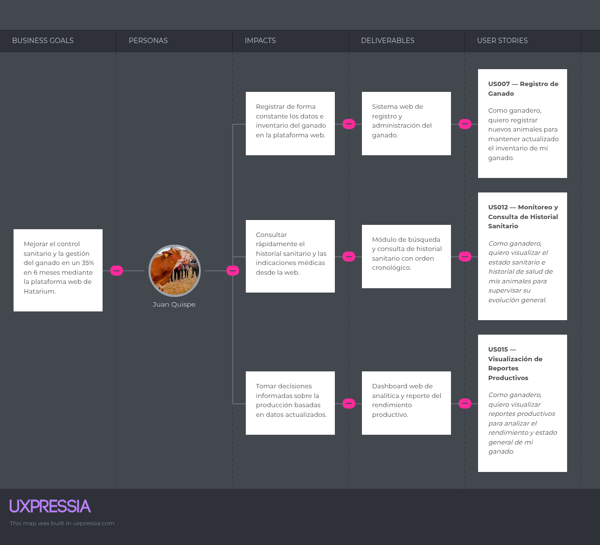
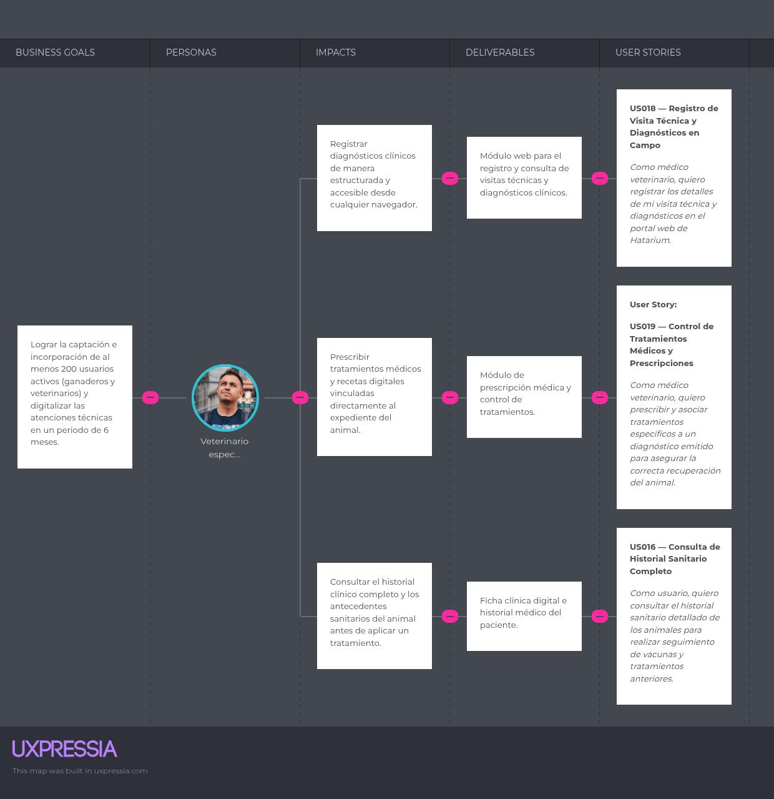

# Capítulo III: Requirements Specification

## 3.1. User Stories

## 3.1. User Stories

<table border="1" cellspacing="0" cellpadding="8">
  <tr>
    <th>Epic / Story ID</th>
    <th>Título</th>
    <th>Descripción</th>
    <th>Criterios de Aceptación</th>
    <th>Relacionado con (Epic ID)</th>
  </tr>

  <!-- ======================= EP001 ======================= -->

  <tr>
    <td><strong>EP001</strong></td>
    <td>Informarse sobre el Producto</td>
    <td>Como visitante, deseo explorar la landing page de Hatarium para conocer las funcionalidades, beneficios y servicios que ofrece la plataforma para la gestión ganadera.</td>
    <td></td>
    <td></td>
  </tr>

  <tr>
    <td><strong>US001</strong></td>
    <td>Explorar Landing Page</td>
    <td>Como visitante, quiero explorar la landing page para conocer las funcionalidades, características y beneficios que ofrece Hatarium.</td>
    <td>
      <strong>E01: Visualización de contenido principal</strong> 
      Dado que el visitante accede a la landing page. 
      Cuando navega por las diferentes secciones. 
      Entonces el sistema muestra información clara y organizada sobre Hatarium.
      

      <strong>E02: Navegación responsiva</strong> 
      Dado que el visitante utiliza distintos dispositivos. 
      Cuando accede a la landing page. 
      Entonces el contenido se adapta correctamente al tamaño de pantalla.
      

      <strong>E03: Navegación entre secciones</strong> 
      Dado que el visitante interactúa con el menú de navegación. 
      Cuando selecciona una sección específica. 
      Entonces el sistema desplaza correctamente hacia la sección correspondiente.
    </td>
    <td>EP001 (Informarse sobre el Producto)</td>
  </tr>

  <tr>
    <td><strong>US002</strong></td>
    <td>Visualización de Funcionalidades y Servicios</td>
    <td>Como visitante, quiero visualizar las funcionalidades y servicios de Hatarium para comprender cómo la plataforma puede ayudar en la gestión ganadera.</td>
    <td>
      <strong>E01: Visualización de funcionalidades</strong> 
      Dado que el visitante accede a la sección de funcionalidades. 
      Cuando revisa el contenido disponible. 
      Entonces el sistema muestra información detallada sobre los servicios de Hatarium.
      

      <strong>E02: Información organizada</strong> 
      Dado que el visitante navega por la sección informativa. 
      Cuando consulta las funcionalidades del sistema. 
      Entonces el contenido se presenta de manera clara y estructurada.
    </td>
    <td>EP001 (Informarse sobre el Producto)</td>
  </tr>

  <tr>
    <td><strong>US003</strong></td>
    <td>Consultar Información de Contacto</td>
    <td>Como visitante, quiero consultar la información de contacto de Hatarium para conocer los medios disponibles para comunicarme con el equipo.</td>
    <td>
      <strong>E01: Visualización de información de contacto</strong> 
      Dado que el visitante accede a la sección de contacto. 
      Cuando revisa la información disponible. 
      Entonces el sistema muestra los medios de comunicación disponibles de Hatarium.
      

      <strong>E02: Información de contacto disponible</strong> 
      Dado que el visitante desea comunicarse con Hatarium. 
      Cuando consulta la sección de contacto. 
      Entonces puede visualizar la información necesaria para establecer comunicación.
    </td>
    <td>EP001 (Informarse sobre el Producto)</td>
  </tr>

  <tr>
    <td><strong>US004</strong></td>
    <td>Enviar Formulario de Contacto</td>
    <td>Como visitante, quiero enviar una consulta mediante el formulario de contacto para comunicarme con el equipo de Hatarium desde la plataforma.</td>
    <td>
      <strong>E01: Envío exitoso del formulario</strong> 
      Dado que el visitante completa correctamente el formulario de contacto. 
      Cuando envía información válida. 
      Entonces el sistema confirma correctamente el envío del mensaje.
      

      <strong>E02: Validación de campos obligatorios</strong> 
      Dado que el visitante intenta enviar una consulta. 
      Cuando omite información obligatoria. 
      Entonces el sistema muestra los mensajes de validación correspondientes.
    </td>
    <td>EP001 (Informarse sobre el Producto)</td>
  </tr>

  <tr>
    <td><strong>TS001</strong></td>
    <td>Desarrollo de Landing Page Responsiva</td>
    <td>Como developer, necesito implementar la landing page responsiva de Hatarium para mostrar información del producto y permitir la navegación entre secciones.</td>
    <td>
      <strong>E01: Implementación de estructura visual</strong> 
      Dado que el desarrollo de la landing page ha iniciado. 
      Cuando se implementan las secciones principales. 
      Entonces el sistema muestra correctamente el contenido visual del producto.
      

      <strong>E02: Adaptación responsive</strong> 
      Dado que la landing page es visualizada en distintos dispositivos. 
      Cuando el usuario accede desde móvil, tablet o desktop. 
      Entonces el diseño se adapta correctamente.
      

      <strong>E03: Navegación funcional</strong> 
      Dado que el menú de navegación está implementado. 
      Cuando el usuario selecciona una opción. 
      Entonces el sistema dirige correctamente a la sección correspondiente.
    </td>
    <td>EP001 (Informarse sobre el Producto)</td>
  </tr>

  <tr>
    <td><strong>TS002</strong></td>
    <td>Desarrollo de Formulario de Contacto</td>
    <td>Como developer, necesito implementar el formulario de contacto para permitir que los visitantes envíen consultas al equipo de Hatarium.</td>
    <td>
      <strong>E01: Validación de campos</strong> 
      Dado que el visitante completa el formulario. 
      Cuando omite campos obligatorios. 
      Entonces el sistema muestra mensajes de validación.
      

      <strong>E02: Envío exitoso</strong> 
      Dado que el visitante ingresa información válida. 
      Cuando envía el formulario. 
      Entonces el sistema confirma correctamente el envío del mensaje.
    </td>
    <td>EP001 (Informarse sobre el Producto)</td>
  </tr>

  <!-- ======================= EP002 ======================= -->

  <tr>
    <td><strong>EP002</strong></td>
    <td>Gestión de Acceso y Autenticación</td>
    <td>Como ganadero, deseo registrarme e iniciar sesión en la plataforma Hatarium para acceder de manera segura a las funcionalidades del sistema.</td>
    <td></td>
    <td></td>
  </tr>

  <tr>
    <td><strong>US005</strong></td>
    <td>Registro de Usuario</td>
    <td>Como ganadero, quiero crear una cuenta en Hatarium para acceder a las funcionalidades de gestión ganadera.</td>
    <td>
      <strong>E01: Registro exitoso</strong> 
      Dado que el ganadero completa correctamente el formulario de registro. 
      Cuando envía la información solicitada. 
      Entonces el sistema crea la cuenta correctamente.
      

      <strong>E02: Campos obligatorios incompletos</strong> 
      Dado que el usuario intenta registrarse. 
      Cuando omite información obligatoria. 
      Entonces el sistema muestra mensajes de validación.
      

      <strong>E03: Correo electrónico inválido</strong> 
      Dado que el usuario ingresa un correo incorrecto. 
      Cuando intenta completar el registro. 
      Entonces el sistema rechaza la operación y muestra un mensaje de error.
    </td>
    <td>EP002 (Gestión de Acceso y Autenticación)</td>
  </tr>

  <tr>
    <td><strong>US006</strong></td>
    <td>Inicio de Sesión</td>
    <td>Como ganadero, quiero iniciar sesión en la plataforma para acceder a mi información y funcionalidades personalizadas.</td>
    <td>
      <strong>E01: Inicio de sesión exitoso</strong> 
      Dado que el usuario posee una cuenta registrada. 
      Cuando ingresa credenciales válidas. 
      Entonces el sistema permite el acceso correctamente.
      

      <strong>E02: Credenciales incorrectas</strong> 
      Dado que el usuario intenta iniciar sesión. 
      Cuando ingresa datos inválidos. 
      Entonces el sistema muestra un mensaje de error.
      

      <strong>E03: Persistencia de sesión</strong> 
      Dado que el usuario inicia sesión correctamente. 
      Cuando navega por la aplicación. 
      Entonces el sistema mantiene activa la sesión del usuario.
    </td>
    <td>EP002 (Gestión de Acceso y Autenticación)</td>
  </tr>

  <tr>
    <td><strong>US007</strong></td>
    <td>Cerrar Sesión</td>
    <td>Como ganadero, quiero cerrar sesión de manera segura para proteger la información de mi cuenta.</td>
    <td>
      <strong>E01: Cierre de sesión exitoso</strong> 
      Dado que el usuario mantiene una sesión activa. 
      Cuando selecciona la opción de cerrar sesión. 
      Entonces el sistema finaliza correctamente la sesión.
      

      <strong>E02: Redirección posterior</strong> 
      Dado que el usuario cerró sesión correctamente. 
      Cuando finaliza el proceso. 
      Entonces el sistema redirige a la pantalla principal o login.
    </td>
    <td>EP002 (Gestión de Acceso y Autenticación)</td>
  </tr>

  <tr>
    <td><strong>TS003</strong></td>
    <td>API de Registro de Usuarios</td>
    <td>Como developer, necesito implementar el endpoint de registro para permitir la creación segura de cuentas de usuario.</td>
    <td>
      <strong>E01: Registro exitoso mediante API</strong> 
      Dado que el endpoint de registro está disponible. 
      Cuando se envía información válida. 
      Entonces el sistema retorna una respuesta exitosa.
      

      <strong>E02: Validación de datos</strong> 
      Dado que el usuario envía información incompleta o inválida. 
      Cuando el sistema procesa la solicitud. 
      Entonces el endpoint rechaza la operación y muestra errores de validación.
      

      <strong>E03: Seguridad de contraseña</strong> 
      Dado que el usuario crea una cuenta. 
      Cuando la contraseña es almacenada. 
      Entonces el sistema aplica hash de seguridad antes de persistirla.
    </td>
    <td>EP002 (Gestión de Acceso y Autenticación)</td>
  </tr>

  <tr>
    <td><strong>TS004</strong></td>
    <td>Sistema de Autenticación JWT</td>
    <td>Como developer, necesito implementar autenticación basada en JWT para gestionar sesiones seguras dentro de Hatarium.</td>
    <td>
      <strong>E01: Generación de token</strong> 
      Dado que el usuario inicia sesión correctamente. 
      Cuando el sistema valida las credenciales. 
      Entonces se genera un token JWT válido.
      

      <strong>E02: Validación de sesión</strong> 
      Dado que el usuario realiza solicitudes autenticadas. 
      Cuando el token JWT es válido. 
      Entonces el sistema permite el acceso a los recursos protegidos.
      

      <strong>E03: Rechazo de token inválido</strong> 
      Dado que el usuario utiliza un token inválido o expirado. 
      Cuando intenta acceder a recursos protegidos. 
      Entonces el sistema rechaza la solicitud.
    </td>
    <td>EP002 (Gestión de Acceso y Autenticación)</td>
  </tr>

  <!-- ======================= EP003 ======================= -->

  <tr>
    <td><strong>EP003</strong></td>
    <td>Gestión de Ganado</td>
    <td>Como ganadero, deseo registrar y administrar la información de mis animales para mantener un control organizado y actualizado del ganado.</td>
    <td></td>
    <td></td>
  </tr>

  <tr>
    <td><strong>US008</strong></td>
    <td>Registro de Ganado</td>
    <td>Como ganadero, quiero registrar nuevos animales para mantener actualizado el inventario de mi ganado.</td>
    <td>
      <strong>E01: Registro exitoso de animal</strong> 
      Dado que el ganadero accede al formulario de registro. 
      Cuando ingresa correctamente los datos del animal. 
      Entonces el sistema almacena la información exitosamente.
      

      <strong>E02: Validación de campos obligatorios</strong> 
      Dado que el usuario intenta registrar un animal. 
      Cuando omite campos requeridos. 
      Entonces el sistema muestra mensajes de validación.
      

      <strong>E03: Registro inválido</strong> 
      Dado que el usuario ingresa datos incorrectos. 
      Cuando envía el formulario. 
      Entonces el sistema rechaza el registro y muestra un mensaje de error.
    </td>
    <td>EP003 (Gestión de Ganado)</td>
  </tr>

  <tr>
    <td><strong>US009</strong></td>
    <td>Buscar Animal</td>
    <td>Como ganadero, quiero buscar un animal registrado para localizar rápidamente el ejemplar que deseo consultar.</td>
    <td>
      <strong>E01: Búsqueda exitosa</strong> 
      Dado que existen animales registrados. 
      Cuando el ganadero realiza una búsqueda utilizando información válida. 
      Entonces el sistema muestra los animales que coinciden con los criterios ingresados.
      

      <strong>E02: Búsqueda sin resultados</strong> 
      Dado que el ganadero realiza una búsqueda. 
      Cuando no existen coincidencias registradas. 
      Entonces el sistema informa que no se encontraron resultados.
    </td>
    <td>EP003 (Gestión de Ganado)</td>
  </tr>

  <tr>
    <td><strong>US010</strong></td>
    <td>Consultar Información de un Animal</td>
    <td>Como ganadero, quiero consultar la información de un animal para acceder a los datos registrados del ejemplar seleccionado.</td>
    <td>
      <strong>E01: Consulta exitosa</strong> 
      Dado que el animal se encuentra registrado en Hatarium. 
      Cuando el ganadero selecciona el animal. 
      Entonces el sistema muestra su información registrada.
      

      <strong>E02: Información disponible</strong> 
      Dado que el ganadero accede a la ficha de un animal. 
      Cuando el sistema carga la información correspondiente. 
      Entonces muestra los datos asociados al ejemplar de manera organizada.
    </td>
    <td>EP003 (Gestión de Ganado)</td>
  </tr>

  <tr>
    <td><strong>US011</strong></td>
    <td>Actualización de Información del Ganado</td>
    <td>Como ganadero, quiero actualizar la información de mis animales para mantener datos precisos y actualizados dentro del sistema.</td>
    <td>
      <strong>E01: Actualización exitosa</strong> 
      Dado que el animal existe en el sistema. 
      Cuando el usuario modifica correctamente la información. 
      Entonces el sistema actualiza los datos exitosamente.
      

      <strong>E02: Validación de datos</strong> 
      Dado que el usuario edita información del animal. 
      Cuando ingresa datos inválidos. 
      Entonces el sistema rechaza la operación y muestra un mensaje de error.
    </td>
    <td>EP003 (Gestión de Ganado)</td>
  </tr>

  <tr>
    <td><strong>US012</strong></td>
    <td>Crear Lote de Ganado</td>
    <td>Como ganadero, quiero crear lotes de ganado para organizar mis animales de acuerdo con las necesidades de manejo de la explotación.</td>
    <td>
      <strong>E01: Creación de lote exitosa</strong> 
      Dado que el ganadero accede al módulo de lotes. 
      Cuando registra información válida del nuevo lote. 
      Entonces el sistema crea correctamente el lote.
      

      <strong>E02: Validación de información</strong> 
      Dado que el ganadero intenta crear un lote. 
      Cuando omite información obligatoria. 
      Entonces el sistema muestra los mensajes de validación correspondientes.
    </td>
    <td>EP003 (Gestión de Ganado)</td>
  </tr>

  <tr>
    <td><strong>US013</strong></td>
    <td>Asignar Animal a un Lote</td>
    <td>Como ganadero, quiero asignar un animal a un lote para mantener organizada la distribución de mi ganado.</td>
    <td>
      <strong>E01: Asignación exitosa</strong> 
      Dado que existen animales y lotes registrados. 
      Cuando el ganadero asigna un animal a un lote. 
      Entonces el sistema actualiza correctamente la asociación.
      

      <strong>E02: Validación de animal y lote</strong> 
      Dado que el ganadero intenta realizar una asignación. 
      Cuando el animal o lote seleccionado no se encuentra disponible. 
      Entonces el sistema informa que la asignación no puede realizarse.
    </td>
    <td>EP003 (Gestión de Ganado)</td>
  </tr>

  <tr>
    <td><strong>TS005</strong></td>
    <td>Implementación de Endpoint para Registro de Ganado</td>
    <td>Como developer, necesito implementar el endpoint de registro de animales para almacenar la información del ganado dentro de la plataforma.</td>
    <td>
      <strong>E01: Registro exitoso mediante API</strong> 
      Dado que el endpoint se encuentra disponible. 
      Cuando se envían datos válidos del animal. 
      Entonces el sistema retorna una respuesta exitosa.
      

      <strong>E02: Validación de datos</strong> 
      Dado que se reciben datos inválidos. 
      Cuando el sistema procesa la solicitud. 
      Entonces el endpoint rechaza la operación con un mensaje de error.
      

      <strong>E03: Persistencia de información</strong> 
      Dado que el registro es válido. 
      Cuando la operación finaliza. 
      Entonces el sistema almacena correctamente la información en la base de datos.
    </td>
    <td>EP003 (Gestión de Ganado)</td>
  </tr>

  <tr>
    <td><strong>TS006</strong></td>
    <td>Implementación de Endpoints de Consulta y Edición</td>
    <td>Como developer, necesito implementar endpoints de consulta y actualización para gestionar la información registrada del ganado.</td>
    <td>
      <strong>E01: Consulta de información</strong> 
      Dado que existen animales registrados. 
      Cuando el usuario realiza una solicitud GET válida. 
      Entonces el sistema devuelve la información correspondiente.
      

      <strong>E02: Actualización de registros</strong> 
      Dado que el animal existe en el sistema. 
      Cuando el usuario envía información válida para editar. 
      Entonces el sistema actualiza correctamente los datos.
      

      <strong>E03: Manejo de errores</strong> 
      Dado que se realiza una solicitud inválida. 
      Cuando el sistema procesa la operación. 
      Entonces el endpoint devuelve mensajes de error apropiados.
    </td>
    <td>EP003 (Gestión de Ganado)</td>
  </tr>

  <tr>
    <td><strong>TS007</strong></td>
    <td>Implementación de Gestión de Lotes</td>
    <td>Como developer, necesito implementar funcionalidades para la creación y administración de lotes de ganado.</td>
    <td>
      <strong>E01: Creación de lotes</strong> 
      Dado que el usuario registra información válida. 
      Cuando solicita crear un lote. 
      Entonces el sistema almacena correctamente el lote.
      

      <strong>E02: Asociación de animales</strong> 
      Dado que existen animales registrados. 
      Cuando el usuario asigna animales a un lote. 
      Entonces el sistema actualiza correctamente las relaciones correspondientes.
    </td>
    <td>EP003 (Gestión de Ganado)</td>
  </tr>

  <!-- ======================= EP004 ======================= -->

  <tr>
    <td><strong>EP004</strong></td>
    <td>Gestión de Alimentación y Salud Animal</td>
    <td>Como ganadero, deseo gestionar la alimentación y monitorear la salud de mis animales para mantener un mejor control sanitario y productivo dentro de Hatarium.</td>
    <td></td>
    <td></td>
  </tr>

  <tr>
    <td><strong>US014</strong></td>
    <td>Registro de Alimentación</td>
    <td>Como ganadero, quiero registrar la alimentación de mis animales para controlar su consumo y mejorar su productividad.</td>
    <td>
      <strong>E01: Registro exitoso de alimentación</strong> 
      Dado que el ganadero accede al módulo de alimentación. 
      Cuando registra correctamente la información alimentaria. 
      Entonces el sistema almacena el registro y confirma la operación.
      

      <strong>E02: Datos inválidos</strong> 
      Dado que el ganadero registra información alimentaria. 
      Cuando existen campos vacíos o datos incorrectos. 
      Entonces el sistema muestra un mensaje de validación.
    </td>
    <td>EP004 (Gestión de Alimentación y Salud Animal)</td>
  </tr>

  <tr>
    <td><strong>US015</strong></td>
    <td>Planificar Alimentación</td>
    <td>Como ganadero, quiero planificar la alimentación de mis animales para organizar anticipadamente las raciones y periodos de alimentación.</td>
    <td>
      <strong>E01: Creación de plan alimentario</strong> 
      Dado que el ganadero accede al módulo de alimentación. 
      Cuando establece la alimentación correspondiente para un animal o lote. 
      Entonces el sistema registra correctamente el plan alimentario.
      

      <strong>E02: Validación del plan</strong> 
      Dado que el ganadero está creando un plan alimentario. 
      Cuando omite información obligatoria. 
      Entonces el sistema solicita completar los datos requeridos.
    </td>
    <td>EP004 (Gestión de Alimentación y Salud Animal)</td>
  </tr>

  <tr>
    <td><strong>US016</strong></td>
    <td>Consultar Plan Alimentario</td>
    <td>Como ganadero, quiero consultar el plan alimentario de mis animales para conocer las raciones y periodos de alimentación establecidos.</td>
    <td>
      <strong>E01: Consulta de plan alimentario</strong> 
      Dado que existe un plan alimentario registrado. 
      Cuando el ganadero consulta la alimentación de un animal o lote. 
      Entonces el sistema muestra la información del plan correspondiente.
      

      <strong>E02: Plan no disponible</strong> 
      Dado que el animal o lote no posee un plan alimentario. 
      Cuando el ganadero realiza la consulta. 
      Entonces el sistema informa que no existe planificación registrada.
    </td>
    <td>EP004 (Gestión de Alimentación y Salud Animal)</td>
  </tr>

  <tr>
    <td><strong>US017</strong></td>
    <td>Visualizar Estado Sanitario Actual</td>
    <td>Como ganadero, quiero visualizar el estado sanitario actual de mis animales para supervisar su condición de salud.</td>
    <td>
      <strong>E01: Consulta de estado sanitario</strong> 
      Dado que existen registros médicos o notas preventivas del animal. 
      Cuando el ganadero consulta su información sanitaria. 
      Entonces el sistema muestra el estado de salud actualizado.
      

      <strong>E02: Estado sanitario no disponible</strong> 
      Dado que el animal no posee información sanitaria registrada. 
      Cuando el ganadero realiza la consulta. 
      Entonces el sistema informa que no existen datos disponibles.
    </td>
    <td>EP004 (Gestión de Alimentación y Salud Animal)</td>
  </tr>

  <tr>
    <td><strong>US018</strong></td>
    <td>Visualizar Vacunas Aplicadas</td>
    <td>Como ganadero, quiero visualizar las vacunas aplicadas a mis animales para verificar los controles preventivos realizados.</td>
    <td>
      <strong>E01: Visualización de vacunas aplicadas</strong> 
      Dado que el médico veterinario ha registrado la aplicación de una vacuna. 
      Cuando el ganadero accede al módulo sanitario de Hatarium. 
      Entonces el sistema muestra el detalle de la vacuna y su fecha de aplicación.
      

      <strong>E02: Vacunas no registradas</strong> 
      Dado que un animal no posee vacunas registradas. 
      Cuando el ganadero consulta su información preventiva. 
      Entonces el sistema informa que no existen vacunas aplicadas registradas.
    </td>
    <td>EP004 (Gestión de Alimentación y Salud Animal)</td>
  </tr>

  <tr>
    <td><strong>US019</strong></td>
    <td>Consultar Próximas Vacunaciones</td>
    <td>Como ganadero, quiero consultar las próximas vacunaciones de mis animales para anticiparme al cumplimiento del calendario sanitario.</td>
    <td>
      <strong>E01: Consulta de próximas vacunaciones</strong> 
      Dado que existen vacunas programadas en el calendario sanitario. 
      Cuando el ganadero revisa el módulo de prevención. 
      Entonces el sistema muestra las fechas proyectadas para las siguientes dosis.
      

      <strong>E02: Vacunaciones no programadas</strong> 
      Dado que no existen próximas vacunaciones registradas. 
      Cuando el ganadero consulta el calendario sanitario. 
      Entonces el sistema informa que no existen vacunaciones pendientes programadas.
    </td>
    <td>EP004 (Gestión de Alimentación y Salud Animal)</td>
  </tr>

  <tr>
    <td><strong>US020</strong></td>
    <td>Detectar Riesgo Sanitario</td>
    <td>Como ganadero, quiero que el sistema detecte condiciones de riesgo sanitario para identificar oportunamente posibles problemas de salud en mis animales.</td>
    <td>
      <strong>E01: Detección automática de riesgo sanitario</strong> 
      Dado que el sistema procesa la información sanitaria del ganado. 
      Cuando identifica una condición que cumple los criterios definidos como riesgo. 
      Entonces registra el evento sanitario correspondiente.
      

      <strong>E02: Animal sin riesgo detectado</strong> 
      Dado que el sistema evalúa la información sanitaria de un animal. 
      Cuando los datos no cumplen ninguna condición de riesgo. 
      Entonces no registra un nuevo evento de riesgo sanitario.
    </td>
    <td>EP004 (Gestión de Alimentación y Salud Animal)</td>
  </tr>

  <tr>
    <td><strong>US021</strong></td>
    <td>Detectar Vacunación Pendiente</td>
    <td>Como ganadero, quiero que el sistema identifique vacunaciones pendientes para conocer cuándo un animal requiere una próxima dosis.</td>
    <td>
      <strong>E01: Detección de vacunación pendiente</strong> 
      Dado que existe una vacuna próxima a cumplir su fecha programada. 
      Cuando el sistema compara la fecha establecida con el calendario actual. 
      Entonces marca la vacunación como pendiente.
      

      <strong>E02: Vacunación dentro del plazo</strong> 
      Dado que existe una vacuna programada. 
      Cuando su fecha todavía no corresponde al periodo definido como pendiente. 
      Entonces el sistema mantiene el evento como programado.
    </td>
    <td>EP004 (Gestión de Alimentación y Salud Animal)</td>
  </tr>

  <!-- ======================= EP005 ======================= -->

  <tr>
    <td><strong>EP005</strong></td>
    <td>Reportes y Seguimiento Ganadero</td>
    <td>Como ganadero, deseo visualizar reportes, estadísticas y seguimiento sanitario del ganado para mejorar la toma de decisiones y mantener un mejor control productivo y de salud animal.</td>
    <td></td>
    <td></td>
  </tr>

  <tr>
    <td><strong>US022</strong></td>
    <td>Generar Reporte Productivo</td>
    <td>Como ganadero, quiero generar reportes productivos para obtener información consolidada sobre el rendimiento de mi ganado.</td>
    <td>
      <strong>E01: Generación de reporte</strong> 
      Dado que existen registros productivos almacenados. 
      Cuando el ganadero solicita generar un reporte. 
      Entonces el sistema procesa la información y genera el reporte correspondiente.
      

      <strong>E02: Información insuficiente</strong> 
      Dado que el ganadero solicita generar un reporte. 
      Cuando no existen registros suficientes. 
      Entonces el sistema informa que no es posible generar el reporte.
    </td>
    <td>EP005 (Reportes y Seguimiento Ganadero)</td>
  </tr>

  <tr>
    <td><strong>US023</strong></td>
    <td>Visualizar Reporte Productivo</td>
    <td>Como ganadero, quiero visualizar un reporte productivo generado para analizar el rendimiento y estado general de mi ganado.</td>
    <td>
      <strong>E01: Visualización de reporte</strong> 
      Dado que existe un reporte productivo generado. 
      Cuando el ganadero accede al reporte. 
      Entonces el sistema muestra la información consolidada de manera organizada.
      

      <strong>E02: Reporte no disponible</strong> 
      Dado que el ganadero intenta consultar un reporte. 
      Cuando el reporte solicitado no se encuentra disponible. 
      Entonces el sistema informa que no existe información para mostrar.
    </td>
    <td>EP005 (Reportes y Seguimiento Ganadero)</td>
  </tr>

  <tr>
    <td><strong>US024</strong></td>
    <td>Consulta de Historial Sanitario Completo</td>
    <td>Como ganadero, quiero consultar el historial sanitario detallado de mis animales para realizar seguimiento de vacunas, tratamientos anteriores y estado clínico de cada ejemplar.</td>
    <td>
      <strong>E01: Consulta exitosa del historial</strong> 
      Dado que el animal posee registros sanitarios. 
      Cuando el ganadero consulta la información. 
      Entonces el sistema muestra el historial actualizado del animal.
      

      <strong>E02: Historial no disponible</strong> 
      Dado que el usuario consulta un animal sin registros. 
      Cuando el sistema procesa la solicitud. 
      Entonces el sistema informa que no existen datos sanitarios registrados.
    </td>
    <td>EP005 (Reportes y Seguimiento Ganadero)</td>
  </tr>

  <tr>
    <td><strong>US025</strong></td>
    <td>Visualizar Estadísticas Sanitarias</td>
    <td>Como ganadero, quiero visualizar estadísticas sanitarias para analizar de manera consolidada la situación de salud de mi ganado.</td>
    <td>
      <strong>E01: Visualización de estadísticas sanitarias</strong> 
      Dado que existen registros sanitarios almacenados. 
      Cuando el ganadero accede al módulo estadístico. 
      Entonces el sistema muestra información consolidada y actualizada.
      

      <strong>E02: Información insuficiente</strong> 
      Dado que el ganadero accede al módulo estadístico. 
      Cuando no existen suficientes datos sanitarios registrados. 
      Entonces el sistema informa que no existen estadísticas disponibles.
    </td>
    <td>EP005 (Reportes y Seguimiento Ganadero)</td>
  </tr>

  <tr>
    <td><strong>US026</strong></td>
    <td>Visualizar Alertas Sanitarias</td>
    <td>Como ganadero, quiero visualizar las alertas sanitarias generadas para identificar eventos importantes relacionados con la salud de mis animales.</td>
    <td>
      <strong>E01: Visualización de alerta sanitaria</strong> 
      Dado que existe una condición de riesgo o vacunación pendiente detectada. 
      Cuando el ganadero accede al panel de alertas. 
      Entonces el sistema muestra la alerta sanitaria correspondiente.
      

      <strong>E02: Ausencia de alertas</strong> 
      Dado que no existen condiciones sanitarias pendientes. 
      Cuando el ganadero consulta el panel de alertas. 
      Entonces el sistema informa que no existen alertas activas.
    </td>
    <td>EP005 (Reportes y Seguimiento Ganadero)</td>
  </tr>

  <!-- ======================= EP006 ======================= -->

  <tr>
    <td><strong>EP006</strong></td>
    <td>APIs y Servicios Backend</td>
    <td>Como developer, deseo implementar APIs REST, servicios backend y mecanismos de persistencia para soportar las funcionalidades principales de la plataforma Hatarium.</td>
    <td></td>
    <td></td>
  </tr>

  <tr>
    <td><strong>TS008</strong></td>
    <td>Implementación de Endpoints para Alimentación y Control Sanitario</td>
    <td>Como developer, necesito implementar endpoints sanitarios y alimentarios para registrar consumos, consultar el historial clínico y permitir la lectura del calendario de vacunas.</td>
    <td>
      <strong>E01: Registro alimentario exitoso</strong> 
      Dado que el endpoint de alimentación está disponible. 
      Cuando se envía información válida. 
      Entonces el sistema almacena correctamente el registro.
      

      <strong>E02: Consulta de historial sanitario</strong> 
      Dado que existen registros sanitarios. 
      Cuando el usuario consulta el historial del animal. 
      Entonces el sistema devuelve la información actualizada.
    </td>
    <td>EP006 (APIs y Servicios Backend)</td>
  </tr>

  <tr>
    <td><strong>TS009</strong></td>
    <td>Implementación de Generación de Reportes y Estadísticas</td>
    <td>Como developer, necesito implementar servicios backend para consolidar reportes productivos y estadísticas sanitarias del ganado.</td>
    <td>
      <strong>E01: Generación de reportes</strong> 
      Dado que existen registros almacenados. 
      Cuando el usuario solicita un reporte. 
      Entonces el sistema genera información consolidada correctamente.
      

      <strong>E02: Generación de estadísticas sanitarias</strong> 
      Dado que existen datos sanitarios registrados. 
      Cuando el sistema procesa la información. 
      Entonces se generan estadísticas actualizadas.
    </td>
    <td>EP006 (APIs y Servicios Backend)</td>
  </tr>

  <!-- ======================= EP007 ======================= -->

  <tr>
    <td><strong>EP007</strong></td>
    <td>Atención Veterinaria Especializada e Integración IoT</td>
    <td>Como Médico Veterinario Especializado, deseo acceder a herramientas avanzadas para registrar visitas técnicas, diagnósticos, tratamientos, vacunaciones y monitorear constantes vitales mediante sensores IoT.</td>
    <td></td>
    <td></td>
  </tr>

  <tr>
    <td><strong>US027</strong></td>
    <td>Registrar Visita Técnica</td>
    <td>Como médico veterinario, quiero registrar los detalles de una visita técnica para mantener evidencia de las atenciones realizadas al ganado.</td>
    <td>
      <strong>E01: Registro exitoso de visita</strong> 
      Dado que el veterinario accede al módulo de atención veterinaria. 
      Cuando registra correctamente los datos de la visita. 
      Entonces el sistema almacena la atención realizada.
      

      <strong>E02: Validación de información</strong> 
      Dado que el veterinario intenta registrar una visita. 
      Cuando omite información obligatoria. 
      Entonces el sistema solicita completar los datos requeridos.
    </td>
    <td>EP007 (Atención Veterinaria Especializada e Integración IoT)</td>
  </tr>

  <tr>
    <td><strong>US028</strong></td>
    <td>Registrar Diagnóstico Clínico</td>
    <td>Como médico veterinario, quiero registrar el diagnóstico clínico de un animal para documentar su condición médica después de una evaluación.</td>
    <td>
      <strong>E01: Registro de diagnóstico</strong> 
      Dado que el veterinario ha realizado la evaluación del animal. 
      Cuando registra la descripción y severidad del diagnóstico. 
      Entonces el sistema incorpora el diagnóstico al historial sanitario.
      

      <strong>E02: Validación de diagnóstico</strong> 
      Dado que el veterinario está registrando un diagnóstico. 
      Cuando omite la descripción o información obligatoria. 
      Entonces el sistema bloquea la operación y solicita completar los campos.
    </td>
    <td>EP007 (Atención Veterinaria Especializada e Integración IoT)</td>
  </tr>

  <tr>
    <td><strong>US029</strong></td>
    <td>Prescribir Tratamiento Médico</td>
    <td>Como médico veterinario, quiero prescribir un tratamiento médico para registrar las indicaciones necesarias para la recuperación del animal.</td>
    <td>
      <strong>E01: Prescripción de tratamiento</strong> 
      Dado que existe un diagnóstico registrado. 
      Cuando el veterinario especifica el medicamento, dosificación y duración. 
      Entonces el sistema anexa el tratamiento al historial médico del animal.
      

      <strong>E02: Validación de prescripción</strong> 
      Dado que el veterinario registra un tratamiento. 
      Cuando omite información obligatoria de la prescripción. 
      Entonces el sistema solicita completar los campos requeridos.
    </td>
    <td>EP007 (Atención Veterinaria Especializada e Integración IoT)</td>
  </tr>

  <tr>
    <td><strong>US030</strong></td>
    <td>Monitorear Telemetría de Sensores IoT</td>
    <td>Como médico veterinario, quiero monitorear la telemetría obtenida mediante sensores IoT para supervisar las constantes vitales del animal.</td>
    <td>
      <strong>E01: Visualización de telemetría IoT</strong> 
      Dado que el animal cuenta con un dispositivo IoT vinculado. 
      Cuando el veterinario accede al panel de monitoreo. 
      Entonces el sistema muestra las lecturas disponibles de los sensores.
      

      <strong>E02: Sensor sin información</strong> 
      Dado que el animal posee un dispositivo vinculado. 
      Cuando no existen lecturas recientes disponibles. 
      Entonces el sistema informa que no existen datos de telemetría para mostrar.
    </td>
    <td>EP007 (Atención Veterinaria Especializada e Integración IoT)</td>
  </tr>

  <tr>
    <td><strong>US031</strong></td>
    <td>Recibir Alerta por Anomalía en Signos Vitales</td>
    <td>Como médico veterinario, quiero recibir una alerta cuando los sensores detecten valores anormales para identificar oportunamente posibles riesgos de salud.</td>
    <td>
      <strong>E01: Generación de alerta por anomalía</strong> 
      Dado que un sensor IoT registra un valor fuera de los parámetros establecidos. 
      Cuando la plataforma procesa la lectura de telemetría. 
      Entonces el sistema genera una alerta en el panel correspondiente.
      

      <strong>E02: Lecturas dentro del rango normal</strong> 
      Dado que los sensores transmiten información del animal. 
      Cuando los valores se encuentran dentro de los parámetros definidos. 
      Entonces el sistema no genera una nueva alerta crítica.
    </td>
    <td>EP007 (Atención Veterinaria Especializada e Integración IoT)</td>
  </tr>

  <tr>
    <td><strong>US032</strong></td>
    <td>Registrar Vacuna Aplicada</td>
    <td>Como médico veterinario, quiero registrar una vacuna aplicada a un animal para mantener actualizado su historial preventivo.</td>
    <td>
      <strong>E01: Registro de vacuna aplicada</strong> 
      Dado que el veterinario administra una vacuna a un animal. 
      Cuando registra la vacuna y la fecha de aplicación. 
      Entonces el sistema incorpora la información al historial sanitario.
      

      <strong>E02: Validación de información de vacuna</strong> 
      Dado que el veterinario registra una aplicación. 
      Cuando omite información obligatoria. 
      Entonces el sistema solicita completar los campos requeridos.
    </td>
    <td>EP007 (Atención Veterinaria Especializada e Integración IoT)</td>
  </tr>

  <tr>
    <td><strong>US033</strong></td>
    <td>Programar Cita Veterinaria</td>
    <td>Como ganadero, quiero programar una cita veterinaria para coordinar la atención médica de mis animales.</td>
    <td>
      <strong>E01: Programación de cita</strong> 
      Dado que el ganadero necesita atención veterinaria. 
      Cuando selecciona una fecha disponible y registra la información requerida. 
      Entonces el sistema almacena la cita correctamente.
      

      <strong>E02: Horario no disponible</strong> 
      Dado que el ganadero intenta programar una cita. 
      Cuando selecciona un horario que no se encuentra disponible. 
      Entonces el sistema solicita elegir otra fecha u horario.
    </td>
    <td>EP007 (Atención Veterinaria Especializada e Integración IoT)</td>
  </tr>

  <tr>
    <td><strong>US034</strong></td>
    <td>Consultar Citas Veterinarias</td>
    <td>Como ganadero, quiero consultar mis citas veterinarias para conocer las atenciones programadas para mis animales.</td>
    <td>
      <strong>E01: Consulta de citas</strong> 
      Dado que existen citas veterinarias registradas. 
      Cuando el ganadero accede al módulo de citas. 
      Entonces el sistema muestra las atenciones programadas.
      

      <strong>E02: Ausencia de citas</strong> 
      Dado que el ganadero no posee citas registradas. 
      Cuando consulta el módulo correspondiente. 
      Entonces el sistema informa que no existen citas programadas.
    </td>
    <td>EP007 (Atención Veterinaria Especializada e Integración IoT)</td>
  </tr>

  <tr>
    <td><strong>US035</strong></td>
    <td>Reprogramar Cita Veterinaria</td>
    <td>Como ganadero, quiero reprogramar una cita veterinaria para modificar la fecha u hora de una atención previamente coordinada.</td>
    <td>
      <strong>E01: Reprogramación exitosa</strong> 
      Dado que existe una cita veterinaria programada. 
      Cuando el ganadero selecciona una nueva fecha disponible. 
      Entonces el sistema actualiza la cita correctamente.
      

      <strong>E02: Nueva fecha no disponible</strong> 
      Dado que el ganadero intenta reprogramar una cita. 
      Cuando selecciona un horario no disponible. 
      Entonces el sistema mantiene la programación anterior y solicita seleccionar otra opción.
    </td>
    <td>EP007 (Atención Veterinaria Especializada e Integración IoT)</td>
  </tr>

  <tr>
    <td><strong>TS010</strong></td>
    <td>API REST para Gestión Veterinaria y Telemetría IoT</td>
    <td>Como developer, necesito exponer los endpoints para el registro de visitas médicas, prescripciones y la ingesta de telemetría proveniente de dispositivos IoT.</td>
    <td>
      <strong>E01: Ingesta de datos de sensores IoT</strong> 
      Dado que un dispositivo collar IoT transmite lecturas de temperatura y pulso. 
      Cuando el endpoint de telemetría procesa el paquete de datos. 
      Entonces valida los identificadores del sensor y almacena las lecturas en la base de datos.
      

      <strong>E02: Validación de seguridad por JWT y Roles</strong> 
      Dado que se envía una petición para prescribir un tratamiento médico. 
      Cuando la API evalúa el token JWT del usuario. 
      Entonces permite la operación únicamente si el rol corresponde a VETERINARIO.
    </td>
    <td>EP007 (Atención Veterinaria Especializada e Integración IoT)</td>
  </tr>

  <!-- ======================= EP008 ======================= -->

  <tr>
    <td><strong>EP008</strong></td>
    <td>Gestión Reproductiva</td>
    <td>Como ganadero, deseo registrar y consultar los eventos reproductivos de mis animales para mantener un seguimiento organizado de su ciclo productivo y reproductivo.</td>
    <td></td>
    <td></td>
  </tr>

  <tr>
    <td><strong>US036</strong></td>
    <td>Registrar Preñez</td>
    <td>Como ganadero, quiero registrar la preñez de un animal para mantener actualizado su estado reproductivo.</td>
    <td>
      <strong>E01: Registro exitoso de preñez</strong> 
      Dado que el animal se encuentra registrado en Hatarium. 
      Cuando el ganadero registra la confirmación y fecha correspondiente. 
      Entonces el sistema actualiza el estado reproductivo del animal.
      

      <strong>E02: Validación de información</strong> 
      Dado que el ganadero intenta registrar una preñez. 
      Cuando omite información obligatoria. 
      Entonces el sistema solicita completar los datos requeridos.
    </td>
    <td>EP008 (Gestión Reproductiva)</td>
  </tr>

  <tr>
    <td><strong>US037</strong></td>
    <td>Registrar Parto</td>
    <td>Como ganadero, quiero registrar el parto de un animal para mantener actualizado su historial reproductivo.</td>
    <td>
      <strong>E01: Registro exitoso de parto</strong> 
      Dado que el animal posee seguimiento reproductivo. 
      Cuando el ganadero registra la fecha y datos correspondientes al parto. 
      Entonces el sistema incorpora el evento al historial reproductivo.
      

      <strong>E02: Validación del registro</strong> 
      Dado que el ganadero intenta registrar un parto. 
      Cuando omite información obligatoria. 
      Entonces el sistema solicita completar los datos requeridos.
    </td>
    <td>EP008 (Gestión Reproductiva)</td>
  </tr>

  <tr>
    <td><strong>US038</strong></td>
    <td>Registrar Secado</td>
    <td>Como ganadero, quiero registrar el secado de un animal para mantener actualizado su seguimiento productivo y reproductivo.</td>
    <td>
      <strong>E01: Registro exitoso de secado</strong> 
      Dado que el animal se encuentra registrado. 
      Cuando el ganadero registra el evento de secado. 
      Entonces el sistema incorpora el evento al historial del animal.
      

      <strong>E02: Validación del registro</strong> 
      Dado que el ganadero intenta registrar un secado. 
      Cuando omite la información requerida. 
      Entonces el sistema solicita completar los datos obligatorios.
    </td>
    <td>EP008 (Gestión Reproductiva)</td>
  </tr>

  <tr>
    <td><strong>US039</strong></td>
    <td>Registrar Destete</td>
    <td>Como ganadero, quiero registrar el destete de un animal para mantener actualizado su seguimiento productivo.</td>
    <td>
      <strong>E01: Registro exitoso de destete</strong> 
      Dado que el animal se encuentra registrado en Hatarium. 
      Cuando el ganadero registra la fecha de destete. 
      Entonces el sistema incorpora el evento al historial correspondiente.
      

      <strong>E02: Validación de información</strong> 
      Dado que el ganadero intenta registrar el destete. 
      Cuando omite los datos requeridos. 
      Entonces el sistema solicita completar la información obligatoria.
    </td>
    <td>EP008 (Gestión Reproductiva)</td>
  </tr>

  <tr>
    <td><strong>US040</strong></td>
    <td>Consultar Historial Reproductivo</td>
    <td>Como ganadero, quiero consultar el historial reproductivo de un animal para conocer los eventos registrados durante su ciclo reproductivo.</td>
    <td>
      <strong>E01: Consulta exitosa del historial reproductivo</strong> 
      Dado que el animal posee eventos reproductivos registrados. 
      Cuando el ganadero consulta su historial reproductivo. 
      Entonces el sistema muestra cronológicamente los eventos disponibles.
      

      <strong>E02: Historial reproductivo no disponible</strong> 
      Dado que el animal no posee eventos reproductivos registrados. 
      Cuando el ganadero realiza la consulta. 
      Entonces el sistema informa que no existe información reproductiva disponible.
    </td>
    <td>EP008 (Gestión Reproductiva)</td>
  </tr>

  <tr>
  <td><strong>TS011</strong></td>
  <td>Implementación de Registro de Eventos Reproductivos</td>
  <td>Como developer, necesito implementar los servicios backend para registrar eventos reproductivos del ganado, permitiendo almacenar de manera estructurada la información asociada al ciclo reproductivo de cada animal.</td>
  <td>
    <strong>E01: Registro de evento reproductivo</strong> 
    Dado que un usuario registra un evento reproductivo válido. 
    Cuando el sistema procesa la solicitud. 
    Entonces almacena correctamente la información asociada al animal.
    

    <strong>E02: Validación de información</strong> 
    Dado que se intenta registrar un evento reproductivo. 
    Cuando faltan datos obligatorios o estos son inválidos. 
    Entonces el sistema rechaza la operación y devuelve los mensajes de validación correspondientes.
    

    <strong>E03: Asociación con el animal</strong> 
    Dado que el evento reproductivo contiene un identificador de animal. 
    Cuando el sistema procesa el registro. 
    Entonces verifica que el animal exista antes de almacenar el evento.
  </td>
  <td>EP008 (Gestión Reproductiva)</td>
</tr>

<tr>
  <td><strong>TS012</strong></td>
  <td>Implementación de Consulta del Historial Reproductivo</td>
  <td>Como developer, necesito implementar el servicio de consulta del historial reproductivo para recuperar los eventos registrados de cada animal de manera organizada.</td>
  <td>
    <strong>E01: Consulta exitosa del historial</strong> 
    Dado que un animal posee eventos reproductivos registrados. 
    Cuando se solicita su historial reproductivo. 
    Entonces el sistema devuelve los eventos asociados al animal.
    

    <strong>E02: Ordenamiento de eventos</strong> 
    Dado que existen varios eventos reproductivos registrados. 
    Cuando el sistema devuelve el historial. 
    Entonces presenta los eventos ordenados cronológicamente.
    

    <strong>E03: Historial sin registros</strong> 
    Dado que un animal no posee eventos reproductivos registrados. 
    Cuando se consulta su historial. 
    Entonces el sistema devuelve una respuesta indicando que no existen registros disponibles.
  </td>
  <td>EP008 (Gestión Reproductiva)</td>
</tr>

</table>

## 3.2. Impact Mapping

A continuación se presentan los dos Impact Maps elaborados para los principales objetivos de negocio de
Hatarium. Esta técnica permite visualizar la relación entre los goals del negocio, los actores involucrados, los
impactos esperados en su comportamiento y las funcionalidades del producto necesarias para alcanzarlos. Los
mapas guiaron la priorización del Product Backlog y aseguraron que cada funcionalidad responda a un objetivo
de valor concreto.

#### Impact Map 1

#### Impact Map 2

## 3.3. Product Backlog

El Product Backlog es un elemento esencial en la gestión ágil de proyectos, ya que representa una lista priorizada de funcionalidades, mejoras y tareas necesarias para el desarrollo del producto. Este backlog fue construido a partir de las necesidades identificadas para **Hatarium**, el To-Be Scenario Mapping y las User Stories, permitiendo organizar y planificar el trabajo del equipo de forma estructurada y alineada con los objetivos del proyecto. Cada ítem del backlog está enfocado en generar valor para el usuario final y facilitar una entrega incremental y efectiva de la solución.

| Orden | User Story ID / Technical Story ID | Título | Story Points |
| :--- | :--- | :--- | :---: |
| 1 | US001 | Explorar Landing Page | 2 |
| 2 | US002 | Visualización de Funcionalidades y Servicios | 2 |
| 3 | US003 | Contacto con Hatarium | 1 |
| 4 | US004 | Registro de Usuario | 3 |
| 5 | US005 | Inicio de Sesión | 3 |
| 6 | US006 | Cerrar Sesión | 1 |
| 7 | US007 | Registro de Ganado | 5 |
| 8 | US008 | Consulta de Información del Ganado | 3 |
| 9 | US009 | Actualización de Información del Ganado | 3 |
| 10 | US010 | Gestión de Lotes de Ganado | 3 |
| 11 | US011 | Registro de Alimentación | 3 |
| 12 | US012 | Monitoreo y Consulta de Historial Sanitario | 5 |
| 13 | US013 | Visualización de Vacunas y Controles Preventivos | 5 |
| 14 | US014 | Procesamiento de Eventos y Alertas Sanitarias | 5 |
| 15 | US015 | Visualización de Reportes Productivos | 2 |
| 16 | US016 | Consulta de Historial Sanitario Completo | 3 |
| 17 | US017 | Visualización de Alertas y Estadísticas Sanitarias | 2 |
| 18 | US018 | Registro de Visita Técnica y Diagnósticos en Campo | 5 |
| 19 | US019 | Monitoreo con Sensores IoT y Control de Tratamientos Médicos | 3 |
| 20 | TS001 | Desarrollo de Landing Page Responsiva | 3 |
| 21 | TS002 | Desarrollo de Formulario de Contacto | 2 |
| 22 | TS003 | API de Registro de Usuarios | 5 |
| 23 | TS004 | Sistema de Autenticación JWT | 5 |
| 24 | TS005 | Implementación de Endpoint para Registro de Ganado | 5 |
| 25 | TS006 | Implementación de Endpoints de Consulta y Edición | 5 |
| 26 | TS007 | Implementación de Gestión de Lotes | 3 |
| 27 | TS008 | Implementación de Endpoints para Alimentación y Control Sanitario | 5 |
| 28 | TS009 | Implementación de Generación de Reportes y Estadísticas | 3 |
| 29 | TS010 | API REST para Gestión Veterinaria y Telemetría IoT | 5 |